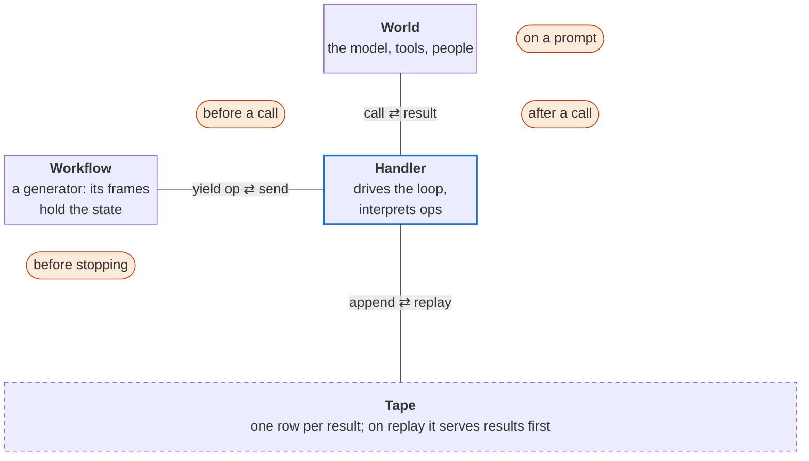
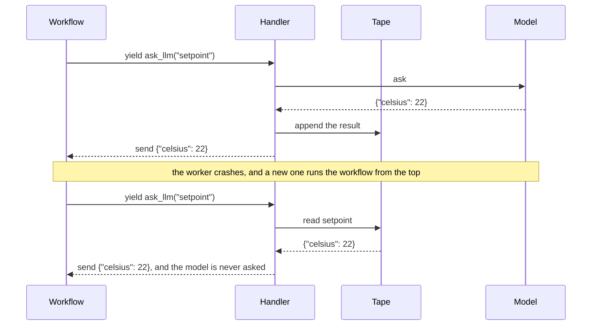

# Effective

Build agentic workflows from composable Python generators. A handler records each model call, Jev judgment, tool, and human approval, so a run is replayable and durable.

An agent loop is a state machine. A workflow writes it as a plain Python generator whose frames
hold the state, and which **yields an op** for each effect: call a model, call a tool, wait for a
human, append to the ledger, the run's append-only record. A **handler** interprets each op, so
the same generator is recorded in a test, replayed from that recording, or run durably, where a
crashed worker resumes by replaying the steps it already took.

The prompts are **t-strings**. A prompt is a `t"..."` whose interpolations are typed channels:
inputs render in, and outputs declare the schema the response must parse into. A `Gated` output runs a
check over the response, which is a guardrail on the data boundary.

## An agent loop is a state machine

A ReAct agent reasons, acts and observes, and something drives it: it calls the model, runs the
tool, and sends the result back. Agent frameworks let you customize that machine with hooks on its
edges: before a call, after a call, on a prompt, before stopping. Claude Code calls them
`PreToolUse`, `PostToolUse`, `UserPromptSubmit` and `Stop`.



The orange tags name those hooks: a call's two hooks flank the edge to the world, and "before
stopping" sits by the workflow, whose return ends the run. The tape is how a run survives a
crash, below.

Python already has a construct that holds a state machine's state for you: a generator. Each
`yield` is an edge, and the suspended frame is the state.

<!-- source: examples/react_toy.py -->
```python
def react(goal: str) -> Generator[Request, str]:
    observation = None
    while True:
        action = yield Reason(goal, observation)
        observation = yield Act(action)
```

`Reason` and `Act` are frozen dataclasses that describe a request. The loop performs no I/O, so
whatever calls `send` decides what they mean: a test script, a live model, or the tape of an
earlier run. `examples/react_toy.py` drives it with a script. In Effective, the code that calls
`send` is a handler.

| | a state machine with hooks | a generator |
|---|---|---|
| where the state lives | fields you declare and keep current | the frame's locals and the line it is paused on |
| a check before a call | a hook function on an event the framework offers | an expression at the `yield`, or a layer |
| a nested workflow | the framework's subagent, if it has one; else a nested machine, forwarded by hand | `yield from` another workflow, or spawn it as a child task |
| a new check | a new hook function, or a new phase with its arm and fields | a new line, which in-flight runs meet on replay |
| what a type checker proves | a total transition table over a closed set of phases | a total match over the closed set of ops; control flow only as far as the tests reach |
| durability | checkpoint the state object | replay the tape through the same code |
| changing code while runs are in flight | load the stored state into the new code, migrating its shape if it changed | the new code yields the recorded ops under their recorded names; an op it renames runs again |
| inspecting a paused run | read the state object | read the tape; the frame's locals are never stored |

Effective's hooks are generators too. A layer sees each model call, tool call, sleep and ledger
append on its way out and its result on the way back, and keeps whatever it needs between the two
in its own frame:

<!-- source: examples/hooks_as_layers.py -->
```python
@op_layer
def audit(op: WorkflowOp) -> Generator[WorkflowOp, Any, Any]:
    print("before a call:", describe(op))
    result = yield op
    print("after a call: ", describe(op), "->", result)
    return result
```

A layer runs again when a run replays: it sees each replayed op and its recorded result, so a side
effect that must happen once belongs in an op. A layer that yields an `AwaitEvent` parks the run
until a person answers. `govern` composes
several checks into one gate that proceeds, parks or refuses. Retry belongs one level down, in
`retry_domain` on the interpreter that interprets the op
(`MeteredInterpreter(..., domain_layers=[retry_domain()])`): it retries inside the op's one
checkpoint, where a re-yielded op would take a new checkpoint name and a crash would run it again.

## A first workflow

```bash
git clone https://github.com/jimbaker/effective && cd effective
uv sync                                    # Python 3.14 and the development environment
uv run python examples/first_workflow.py   # a durable run, a resume after an outage, a guardrail
```

The workflow asks a model for a thermostat setpoint, checks it, and sets it:

<!-- source: examples/first_workflow.py -->
```python
def set_temperature(request_id: str, request: str, ceiling: float = 30) -> Effect[float | Repair]:
    celsius = Gated(float, lambda c: 10 <= c <= ceiling, "celsius outside the allowed range")
    prompt = t"The occupant said: {request}\nSet the thermostat to {celsius}"
    setpoint = render(prompt, output=Setpoint)
    response = yield from ask_llm("setpoint", setpoint.messages, dict)
    match setpoint.resolve(response):
        case Repair() as repair:
            return repair
        case Setpoint(celsius=target):
            yield from call_tool("thermostat", {"celsius": target}, str)
            ...
```

It runs as a task on the embedded SQLite engine, in a temporary file, and prints three lines;
`docs/first-workflow.md` walks through it line by line:

| line | what it shows |
|---|---|
| `run` | each op is a checkpointed step, and the keys printed are the checkpoints |
| `resume` | the thermostat is offline on the first attempt; the retry replays the setpoint from the file and asks the model nothing more |
| `guardrail` | the model responds with 45°C, the `Gated` check fails, and the workflow returns a `Repair` before it reaches the thermostat |

`resolve` returns `Repair(reason)` when a check fails; the workflow decides what to do with it:
return it, as here, or re-prompt with the reason.

## Durability is a tape

A durable handler writes each result down before the workflow sees it. After a crash, a new worker
runs the workflow from the top, and the tape serves every op it holds a result for:



Nothing is captured from a frame: suspension is replay. A durable handler finds each recorded
result **by the op's name**. It serves an op it has a result for and runs an op it has none for.
A changed prompt or tool argument keeps the name, so it is served the recorded result; a changed
result type validates that result against the new type, and fails the run if it does not fit.
A test is where a change in which ops are yielded, under which names, or in what order is caught:
`wiki/concepts/testing.md`.

## The handler and its engines

`DurableHandler` runs a workflow: each model call, tool call and ledger append is a checkpointed
step of a task, and a wait is the engine's own await. The engine holds the tape:

| engine | for |
|---|---|
| [Absurd](https://github.com/earendil-works/absurd) on Postgres | many workers over one queue (vendored and pinned in `infra/absurd`) |
| embedded SQLite (`effective.sqlite`) | one process and one file, with no service to run |

The two engines run one conformance suite through the same handler (`tests/_conformance.py`), and
the durable tests crash a run at every op and resume it. Testing a workflow needs neither: two
in-memory handlers serve canned results and replay a recording (`wiki/concepts/testing.md`).

## What's in the box

All under `src/effective/` unless noted.

| capability | where |
|---|---|
| the op set and the authoring API: `step`, `ask_llm`, `call_tool`, `await_event`, `await_until`, `sleep_until`, `append_ledger` | `ops.py`, `domain.py`, `api.py` |
| typed prompt channels: `render`, `Gated`, `Repair`, cache and role directives, skill disclosure | `channels.py`, `skills.py` |
| identity: every op key composed from a t-string by one injective grammar | `keys/` |
| concurrency: `gather`, `race`, `quorum` | `api.py`, `choice.py` |
| combinators: `recurse`, `route`, `descend`, and sandboxed code as an effect (`run_code`, on Pydantic Monty) | `combinators.py`, `code.py`, `monty.py` |
| judgments: `judge` and `select` ask typed questions from a t-string | `judgment.py`, `api.py` |
| layers: retry, permission, budgets and telemetry as generator middleware, and `govern` to compose them | `layers.py`, `govern.py` |
| the ReAct agent loop, with interrupts, steering and in-flight cancellation | `react.py`, `interrupts.py`, `steering.py`, `cancel.py` |
| child tasks, and a parent that hears how its child ended | `spawning.py` |
| permission: a fail-closed cascade of rules and a human | `permission.py`, `parked.py` |
| cost: metered model calls, spend caps that survive a crash, a cache | `cost.py`, `budget.py`, `spend.py`, `cache.py` |
| telemetry: OTLP/JSON spans under the OpenTelemetry GenAI conventions, joined to the run by key | `telemetry.py` |
| counterfactuals: fork a recorded run at an op, change one result, replay the rest | `fork.py`, `counterfactual.py` |
| optimization: `improve` (reflective prompt evolution) over a Pareto frontier of cost, quality and latency | `improve.py`, `pareto.py`, and the benches in `src/agent/` |
| the read side: a run as a graph, cards, a dashboard, a terminal viewer | `graphview.py`, `cards/`, `dashboard.py`, `runview.py`, `src/tui/` |
| interpreters for ops: OpenAI, the `claude -p` and `codex exec` CLIs, a judge service, a shell, the web | `interpreters/` |

## Examples

| run | what it is | needs |
|---|---|---|
| `uv run python examples/react_toy.py` | the agent loop above, driven by a script | nothing |
| `uv run python examples/hooks_as_layers.py` | the `audit` layer above, around the first workflow | nothing |
| `uv run python examples/first_workflow.py` | the first workflow | nothing |
| `uv run examples/smol_agent.py <url>` | a whole agent in a few lines, ported from Thomas Schranz's `smol.clj` | an OpenAI-compatible Responses endpoint |
| `uv run python examples/smol_durable.py` | the same house agent, durable and interruptible, with a judge guarding the door (`examples/smol_door.py`) | nothing: offline without keys; `OPENAI_API_KEY` and `JEV_API_KEY` for a real model and judge |
| `uv run python -m examples.coder <dir> "<task>"` | a small coding agent whose test suite decides when the work is done (`src/examples/coder/README.md`) | `OPENAI_API_KEY`, Podman |
| `uv run python -m examples.deep_research "<question>" cell="..."` | a frontier search over web leads, stopped when two hosts agree on every cell (`src/examples/deep_research/README.md`) | `BRAVE_SEARCH_API_KEY`, `JEV_API_KEY`, the `claude` CLI |
| `just tui-demo`, `just dashboard` | the terminal viewer and the run dashboard over a demo run | the `tui` extra for the viewer |

## Learn more

| read | for |
|---|---|
| `docs/intro.md` | the model in ten minutes: generator, handler, tape, layers, combinators |
| `docs/first-workflow.md` | the first workflow, line by line |
| `wiki/concepts/testing.md` | testing a workflow: canned results, replay as the determinism oracle, crash at every op |
| `docs/effective-101.md` | the concepts in depth: the op set, the combinator algebra, the temporal shapes |
| `wiki/index.md` | one concept a page, and the index of architecture decisions |
| `wiki/references.md` | the work Effective builds on: Recursive Language Models, GEPA, ReAct, Absurd, tdom and more |

## Requirements

| need | for |
|---|---|
| [uv](https://docs.astral.sh/uv/) and git | everything; uv installs the pinned Python 3.14 (`.python-version`) |
| [just](https://github.com/casey/just) | the recipes; `just` alone lists them |
| rootless [Podman](https://podman.io/) | the durable lane (a digest-pinned Postgres), the coder's sandbox, rendering diagrams, the sandboxed formal checks |
| [elan](https://github.com/leanprover/elan) (Lean), node and npm, a JDK 17+ | the formal gates only (`just formal-setup`, `just formal`) |

| extra | for |
|---|---|
| `tui` | the terminal viewer (textual, rich) |
| `judge` | the Jev judge interpreter |
| `bridge` | the arrivals bridge (redis) |

## Contributing

```bash
just check        # the gate: lint, ty, the docs and key checks, the suite
just pgt-up       # the test Postgres under Podman, for the durable lane
just formal       # Lean proofs and the Quint typecheck
```

Run `just check` from a git clone: its docs gate reads `git ls-files`. Without a test Postgres, it
skips the Postgres-backed tests and runs everything else.
`CLAUDE.md` is the contributor guide, for people and coding agents alike: the layout, every
recipe, the invariants and the code-prose rules.

## License

MIT. See `LICENSE`. Copyright (c) 2026 Jim Baker.
