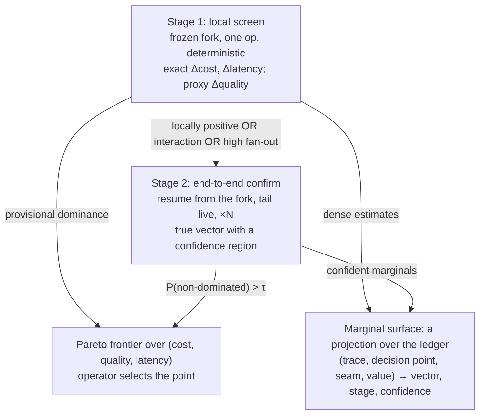

# ADR-0006: The marginal selection rule is a two-stage, replay-asymmetric pipeline promoted by Pareto dominance

- **Date:** 2026-06-18
- **Status:** Proposed. The mechanism it composes over is built: the fork driver
  ([`src/effective/fork.py`](../../src/effective/fork.py): `fork_at`, `live_drive`, `run_fork`, and `marginal_sweep`, which
  forks one base N ways as durable child tasks), the counterfactual lineage's genesis and seal
  (`Forked`, `ForkSealed` in [`src/effective/counterfactual.py`](../../src/effective/counterfactual.py)), and Pareto dominance over
  objective vectors (`dominates` and `frontier` in [`src/effective/pareto.py`](../../src/effective/pareto.py), driven by `improve`
  in [`src/effective/improve.py`](../../src/effective/improve.py)). The selection machinery this ADR names is unbuilt: no stage-1
  screen, no divergence detector, no replicated stage-2 confirm with a confidence region, no
  promotion rule.
- **Relates to:** [ADR-0005](0005-optimizer-agent-in-the-loop.md) (the optimizer whose Stage 2 this ADR specifies), [ADR-0008](0008-dynamic-workflows-as-ops-applicative-parallelism.md) (`fork` is
  reserved for counterfactuals).

## Context

[ADR-0005](0005-optimizer-agent-in-the-loop.md) makes optimization a staged capability whose Stage 2 mechanizes marginal moves as scored
forks. It leaves open which forks to score and how to decide a winner. For a fixed pipeline with
one knob the omission is harmless. For a branchy, coupled chain it is the whole problem. An
agentic retrieval loop (route, search, a recover gate, grep, read, answer) is the canonical
case: final quality depends on a sequence of interacting decisions, none individually labeled,
and the seam × value × trace candidate space is far too large to score end to end.

A fork is `replay(trace[:at])` followed by `interpret(tail under delta)`, so the substrate offers
a marginal no stateless harness has. Pin everything downstream of a decision point to its
recorded values, perturb one op, and the change in cost and latency is exact and free of model
re-sampling. That signal is cheap enough to screen with and too local to decide with.

The asymmetry is a corollary of the determinism invariant:

| marginal | what the fork pins | cost | noise |
|---|---|---|---|
| local | the prefix, and the tail's decisions and I/O | about one op | none |
| end to end | the prefix's I/O only; the tail runs live | N full forward runs | sampled |

## Decision

**The optimizer selects marginal moves by a two-stage pipeline whose stages differ only in what
the fork pins, and whose promotion verdict is Pareto dominance on a `(Δcost, Δquality,
Δlatency)` vector.**

| stage | fork | yields | verdict |
|---|---|---|---|
| 1, local screen | replay the prefix; pin the tail's decisions and I/O; perturb one op | exact `Δcost` and `Δlatency`; a proxy `Δquality` from the adjacent `Gated` outcome | provisional partial dominance: discard the provably dominated, promote the rest |
| 2, end-to-end confirm | replay the prefix; apply the delta; interpret the tail live, replicated N times | the true vector with a confidence region | probabilistic dominance: promote iff `P(non-dominated) > τ` |
| rollup, population frontier | stage-2 survivors across a population of traces | a policy edit, pareto-positive across the population | enacted as [ADR-0005](0005-optimizer-agent-in-the-loop.md)'s coding agent edits a typed seam and confirms the frontier moved on held-out traces |

The marginal surface supplies the rollup a directed mutation (which seam, which direction) in
place of a blind one.

Three sub-decisions are rules:

- **The promotion rule is a disjunction.** Promote from stage 1 to stage 2 iff the move is
  locally pareto-positive, OR an interaction is suspected, OR the seam is structurally
  high-fan-out. A route decision and a recover gate carry a standing prior to reach stage 2
  whatever their local signal. A move whose payoff lands three ops downstream looks flat locally,
  and this rule keeps it.
- **The divergence detector is conservative by contract.** Stage 1 may pin downstream decisions
  only where the perturbation leaves the downstream op sequence unchanged. It tests whether the
  perturbed op's output changed at the positions the next decision reads; any change flags an
  interaction and defers to stage 2. It errs toward over-deferral: a false positive costs stage-2
  compute, never correctness.
- **The optimizer extends the frontier; the operator selects the point.** The pipeline publishes
  frontier points; choosing the operating point (the cost/quality tolerance) is a deployment
  decision.

- **Two stages are forced.** Stage 1 costs about a replay; stage 2 costs N forward runs. Were the
  costs equal the screen would be skipped; because the screen is nearly free, screen-then-confirm
  is optimal.
- **Stage 2 adds no durability machinery.** Replay to `at` and then live execution is the fork
  driver's own shape. Stage 2 adds replication and the dominance test.
- **The marginal surface is derived.** Stage 1 fills it densely, stage 2 overwrites survivors,
  and the rollup reads trace-marginalized slices. It is rebuilt from the ledger and never read
  back as truth.
- **Frontier movement decomposes by seam.** Per-seam vectors let the optimizer report that the
  frontier moved by Δ, with a stated share attributable to each edited seam.

## Consequences

- [ADR-0005](0005-optimizer-agent-in-the-loop.md)'s Stage 3 (full automation) has a target: a bandit allocates replication budget across
  stage-2 survivors, and the screen keeps the arm set small enough for sequential allocation to be
  sound.
- The guardrail doubles as the screen's reward. Stage 1's proxy `Δquality` is the `Gated`
  constraint outcome, so the screen needs no annotation.
- Replication is non-optional and is itself a frontier point: tighter error bars cost more
  compute.
- The cheap exact screen, with typed seams as the regularizer, spends end-to-end budget only
  where it can pay off. The type, lint and channel-validator gates stay the hard constraint on
  any accepted candidate.

## Invariants

- **Both stages are forks; neither captures a continuation.** Stage 2 resumes by replay and then
  live interpretation of the tail. The fork point is a deterministic replay boundary.
- **The marginal surface is a projection.** It is rebuilt from the ledger, and the ledger is never
  derived from it.
- **The verdict is a vector.** No stage collapses `(cost, quality, latency)` to a scalar to decide
  promotion or frontier membership. A scalar is allowed only as a view for an operator selecting
  a point.
- **`just check` green is a hard constraint on any enacted candidate.** A policy edit that fails
  type, lint, channel validation or tests is rejected whatever its marginal.

## Alternatives rejected

| alternative | why it lost |
|---|---|
| one stage, end to end only | correct but unaffordable on a branchy chain, and it discards the exact signal replay provides |
| one stage, local only | misses interactions and downstream-only payoffs, and has only a proxy quality axis |
| a scalarized reward (weighted sum) | presupposes the operating point the operator is meant to choose, and hides the trade the frontier exists to expose |
| promote on "locally good" alone | discards downstream-only wins; the disjunctive rule with the high-fan-out prior keeps them |

## Open questions

- **Local and end-to-end marginals answer different questions** (immediate effect against realized
  effect). Is the local marginal ever reported as a quantity of its own?
- **An empirical stage 0.** An estimator over observational ledger lineages needs no
  re-execution and covers the whole population. It could precede stage 1 once the ledger holds
  enough variety, as a structural-against-empirical cross-check.
- **Operating-point selection.** A config dimension, a cascade-gated choice, or a view over the
  projected frontier.
- **A tighter divergence detector** that defers fewer false positives without risking
  correctness.
- **Replication budget N as an optimized variable.**
