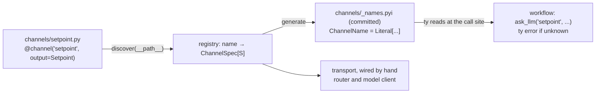

# ADR-0007: Channel discovery is a filesystem convention backed by a generated typed manifest

- **Date:** 2026-06-18
- **Status:** Proposed. The mechanism it composes on is built: `render` → `Prompt[S]`, `Gated`,
  `FormGate`, `Repair` and `check_channels` in `src/effective/channels.py`, and the lint rules in
  `src/effective/lint.py`. Nothing this ADR adds is built: no `discover` loader, no `@channel`
  declaration, no stub generator, no directory-to-registry lint. `ask_llm` takes `name: str`
  (`src/effective/api.py`).
- **Relates to:** ADR-0001 (the channel processor this discovers over), ADR-0002 (the
  `effective.lint` rule surface, extended here), ADR-0010 (the same inspectable-manifest
  principle, applied to the view).

## Context

A channel is authored as a function that builds a `render(t"...", output=S)` template, and an
assembly site wires the set by hand to the interpreter that answers `AskLLM`. The workflow names
each channel by a bare op-name string: `examples/first_workflow.py` yields
`ask_llm("setpoint", setpoint.messages, dict)`, and no checker binds `"setpoint"` to the template
that declares `Setpoint`. Adding a channel means editing the central wiring site.

Agent frameworks built on a filesystem convention show the authoring win: the capability surface
is one directory listing, and a capability is added by dropping in a file. The common enforcement
removes capabilities at runtime and keys them by filename or a directive string the type checker
cannot model, so a misspelled or misplaced file fails silently. This ADR takes the
discoverability and keeps every binding visible to a checker.

Great DX is adjudicated by the reader, human and agent, and the discriminator for each choice
below is what the reader sees. Two facts make the bridge cheap:

- **A channel is already type-bearing.** `render[S](template, *, output: type[S]) -> Prompt[S]`
  makes `S` the channel's contract, and `check_channels` reconciles template against model. Only
  the registry name is a bare string.
- **Python discovery rides the import system.** `pkgutil.walk_packages` yields an imported,
  `ty`-checked module object where a path scan yields a string.

So a generated **typed manifest**, a stub `ty` reads at the call site, binds the one string. It
is a reader artifact, it is diffable (a capability change is a reviewable stub diff), and it
puts the check in the checker that already gates the repo.

## Decision

**Channels are discovered from a `channels/` package by an explicit `discover(__path__)` call,
declared with `@channel("<name>", output=..., repairs=..., gates=...)`, and bound at the workflow
call site through a generated, committed typed manifest stub that `ty` enforces.**

| piece | decision |
|---|---|
| discovery | the package's `__init__.py` calls `discover(__path__)`, which walks the submodules, imports each, and fills a registry `name → ChannelSpec[S]`. An explicit call, never an import side effect |
| declaration | `@channel("setpoint", output=Setpoint, ...)` carries the name as a string in the file: greppable, lintable, rename-safe. A filename is never identity |
| manifest (L0) | `discover()` or a generation recipe emits `channels/_names.pyi` with `ChannelName = Literal[...]`, and `ask_llm` takes `channel: ChannelName`. An unknown name is a `ty` error at the call site, with editor completion. The stub is committed and CI checks it is fresh |
| lint | `effective.lint` gains a directory-to-registry reconciliation: a `channels/*.py` that registered nothing, or a filename that differs from its declared name, is a located error. This is the one bespoke check; the call-site binding lives in `ty` |

Two rules follow:

- **The reader is the adjudicator.** `@channel` puts the name in the file; `discover` makes the
  capability surface one listing; the committed stub is a typed manifest shared by reader and
  checker; the lint covers the one fact `ty` cannot see. Writer ergonomics follow from getting
  the reader artifact right.
- **The manifest cannot silently lie.** CI regenerates the stub and runs `git diff --exit-code`;
  a stale stub fails the build.

- **The stub pins the one string.** `Prompt[S]`'s `S` is already checked by `ty` and reconciled
  by `check_channels`.
- **Transport stays explicit.** Routing among model clients and the client binding stay wired by
  hand at the assembly site. A channel file declares a contract and a guardrail.
- **Discovery is import-time, outside the determinism boundary.** `render` is pure; the workflow
  still yields `ask_llm(name, ...)`; a workflow module never imports the loader, which the
  `no-io-import` rule guards.

## Consequences

- The thesis-bearing primitive becomes the discoverable unit: dropping in `channels/x.py` drops
  in a guardrailed `Gated` seam, its output contract statically visible.
- The capability surface is a typed, diffable manifest: one file shows every channel, `ty`
  enforces it, and a change shows as a stub diff.
- An L1 upgrade is open: generated name-to-output-type overloads make `ask_llm("setpoint", ...)`
  infer `Effect[Setpoint]`. Deferred until re-passing the model is friction.
- The pattern extends across packages: namespace packages and `importlib.metadata` entry points
  let a third party contribute channels or ops, with the stub as the cross-package contract.

## Invariants

- **A filename is never identity.** The channel name is the `@channel("...")` string; renaming a
  file changes nothing.
- **Discovery is an explicit call.** The reader sees where the capability set is assembled.
- **Transport is not discovered.** Routers and model-client bindings stay hand-wired.
- **The committed manifest is CI-verified fresh.** A reader artifact that can diverge from reality
  is worse than none.
- **`just check` green is a hard constraint.** A new channel that fails type, lint,
  `check_channels` or tests is rejected however cleanly it dropped in.

## Alternatives rejected

| alternative | why it lost |
|---|---|
| filename identity and a bare conventional symbol | the name lives nowhere in the file, a rename silently changes behavior, the op is untyped, and a discovery typo is silent |
| discovery as an import side effect | the reader cannot see where the capability set is built |
| a bespoke lint alone, no stub | it reports in a parallel checker, CI only, with no editor completion and no type flow; the lint stays for the directory facts `ty` cannot see |
| an L2 generated facade (`channels.setpoint`) | real codegen, a runtime surface to maintain; deferred |
| discover tools first | channels carry the data-axis thesis and are already `Prompt[S]`-typed, so they are the easier case to make legible |

## Open questions

- **How far up the stub ladder.** L0 (names) is the smallest step; L1 (the output type flows from
  the name) is what makes the binding visibly typed.
- **Whether routing belongs in the channel file.** A per-channel `accepts`/`select` hook could fold
  some dispatch into the unit without making transport implicit.
- **The generation trigger.** At `discover()` time, or an explicit recipe run before `ty` in CI.
  The committed-and-diffed recipe is favored because it is reviewable.
- **One manifest or one per axis.** Channels first; tools and op layers later, as one `_names.pyi`
  of unioned `Literal`s or a stub per axis.
