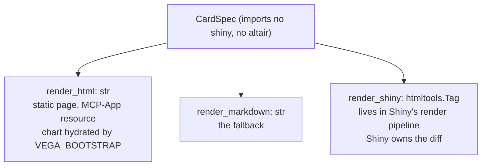

# ADR-0011: A Shiny-native render target for the card IR

- **Date:** 2026-06-21
- **Status:** Accepted. Built: `render_shiny` and `action_id`
  ([`src/effective/cards/render_shiny.py`](../../src/effective/cards/render_shiny.py)), the `Slot` cell ([`src/effective/cards/spec.py`](../../src/effective/cards/spec.py)), and
  the altitude guard ([`tests/test_cards_altitude.py`](../../tests/test_cards_altitude.py)). The app-shell half (the action
  dispatcher, the reactive projection, the chart widgets) and any `reactive_board` helper belong
  to a host application.
- **Relates to:** [ADR-0010](0010-card-ir-view-axis.md) (the `CardSpec` IR and its render targets).

## Context

[ADR-0010](0010-card-ir-view-axis.md) renders a `CardSpec` to an HTML string. Inside a Shiny app that string is wrapped in
`ui.HTML(...)`, and three things follow:

| symptom | cause |
|---|---|
| a card is an opaque leaf to Shiny | Shiny can replace the whole string and cannot diff inside it, so one changed metric re-emits the region and destroys client state in it (chart instances, scroll, focus) |
| the page carries a hand-written JS bridge | a `MutationObserver` re-runs the chart bootstrap after every paint, to repair what the wholesale replacement destroyed: the framework's own job, done by hand |
| `Action` is inert | `render_html` emits `<button data-cmd data-target>` with no input binding, so a click never reaches the reactive graph |

Shiny's reactivity is server-side: a reactive value invalidates, dependent outputs re-run, and
Shiny sends a targeted DOM patch. The patch is fine-grained only when the output is a tag tree it
can diff.

## Decision

**Add a third render target, `render_shiny(spec) -> htmltools.Tag`, so Shiny owns the diffing,
and keep the IR as the firewall between the card vocabulary and the framework.** Shiny UI is
htmltools throughout, so the tree drops into a `@render.ui` return.

| element | lowering on the Shiny target |
|---|---|
| structure | `article.ev-card` with the same `ev-...` classes as `render_html`, so one stylesheet serves both |
| `Action` | a `button` with class `action-button`, which is Shiny's input binding, and the id `action_id(card_id, action)` = `act__{card_id}__{cmd}__{target}`. The id is deterministic and includes `card_id`, so two cards with one `cmd` and `target` do not collide |
| `VegaChart` | not emitted. On the Shiny surface a chart is an app-level widget Shiny owns, so it survives re-render and needs no observer. The static lowering keeps its self-contained chart div |
| `Slot` | `div.shiny-html-output` with the slot's id, which Shiny fills from the author's ordinary `@render.ui` or `@render_widget` of that name |

The class names are the binding hooks, so `render_shiny` imports `htmltools` and never `shiny`.

**One dispatcher, in the app shell.** The host registers one reactive effect that reconstructs
each action's id with `action_id`, and maps a fired input to a ledger append carrying `cmd`,
`target` and `risk`. The card author never writes `@reactive` or an input id. Because the click
becomes a ledger event, it honors the rule that an authoritative change is a new ledger event.
The `risk` tier routes a high-risk action through a confirm or HITL gate before the append.

**Cards are pure functions of a reactive projection.** With the ledger projection held as a
reactive value, a new event invalidates the projection, the projector re-runs, `render_shiny`
lowers the cards, and Shiny patches the changed nodes. The loop from action to ledger to
projection to re-render closes inside Shiny's own graph.

### Easy things easy, hard things doable

A closed IR tends to make the common case pleasant and the rare case impossible, at which point
the author abandons it and hand-writes the framework. The Shiny target provides the gradient:

| tier | what the author does | framework knowledge |
|---|---|---|
| easy | writes a projector that returns `CardSpec`s; a host-side board helper owns the `@render.ui`, the ids and the dispatcher | none |
| medium | enriches the typed vocabulary: a `Cell` variant, a `Badge` tone, a `risk` tier. Every target understands it, so the change also renders statically and in an MCP App | none |
| hard | places a `Slot` in the spec and writes ordinary Shiny for that one region (a live table, a map, a cross-filter brush); the static target renders the slot's `fallback` | Shiny, in one named region |

`Slot` lets the IR stay closed and typed for the common case while conceding that some boards
need raw reactive power, and reaching for it is visible in the spec.

### Versatility is preserved

| concern | `render_html` (static, MCP App) | `render_shiny` (live board) |
|---|---|---|
| output | HTML string | `htmltools.Tag` tree |
| chart | `data-vega-spec` div and `VEGA_BOOTSTRAP` | a widget the app owns |
| reactivity | none, or host-driven in an MCP App | Shiny diff and patch |
| `Action` | inert `data-cmd` button | a live Shiny input, dispatched to the ledger |
| `Slot` | its `fallback` text | a Shiny output region |
| server | none | the Shiny app |

The Vega-Lite `dict` stays the portable artifact across every surface; a widget is only the Shiny
lowering of it.

## Consequences

- **The Shiny lowering needs no JS bridge.** It emits no chart div, so the surface needs neither
  the bootstrap nor an observer, and the card vocabulary needs one cell for it, `Slot`. That is the
  success metric: delegating to Shiny makes the bridge smaller, and glue that makes it larger is
  the signal of a wrong turn.
- **The altitude holds by test.** [`tests/test_cards_altitude.py`](../../tests/test_cards_altitude.py) asserts that nothing in
  `src/effective/cards/` imports `shiny`, that only `render_shiny` imports `htmltools`, and that
  [`src/effective/cards/spec.py`](../../src/effective/cards/spec.py) imports neither. If `Action` ever has to know an input id, the levels have leaked.
- **`htmltools` is a runtime dependency of the substrate** (`pyproject.toml`). It is Shiny's
  standalone tag library and carries no server.
- **Every render target lives in `src/effective/cards/`.** How a card becomes reactive UI is a
  property of the IR; which cards a board shows and how its app is wired belong to the host.
