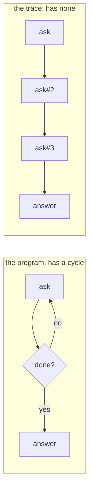
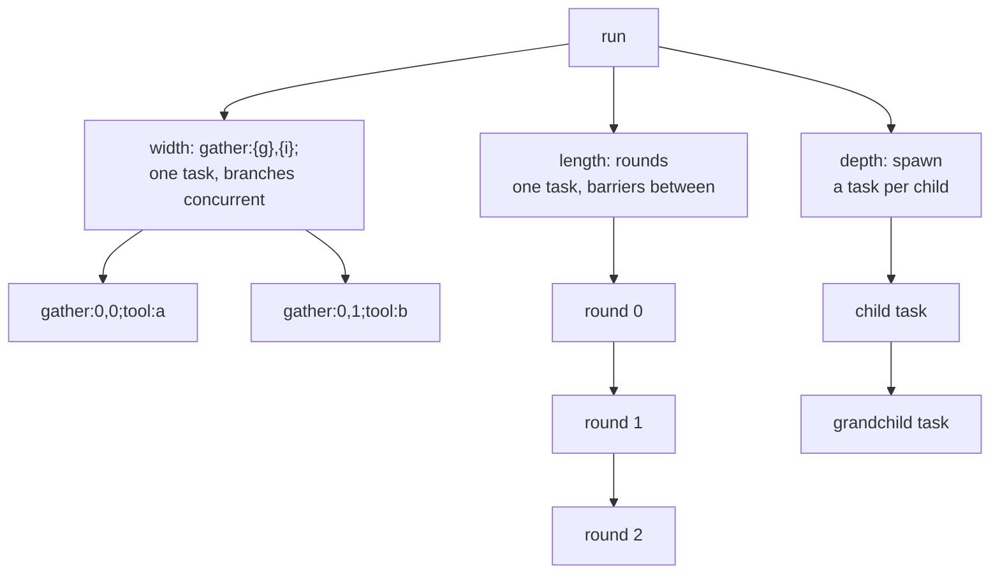
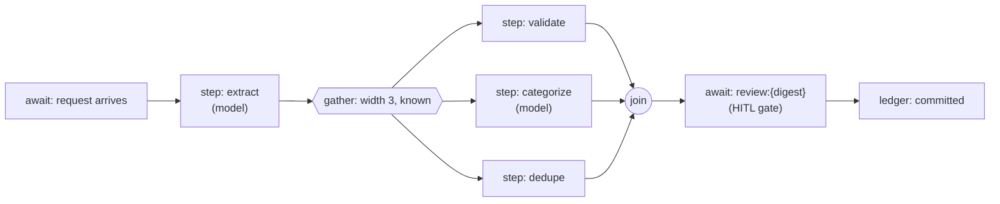
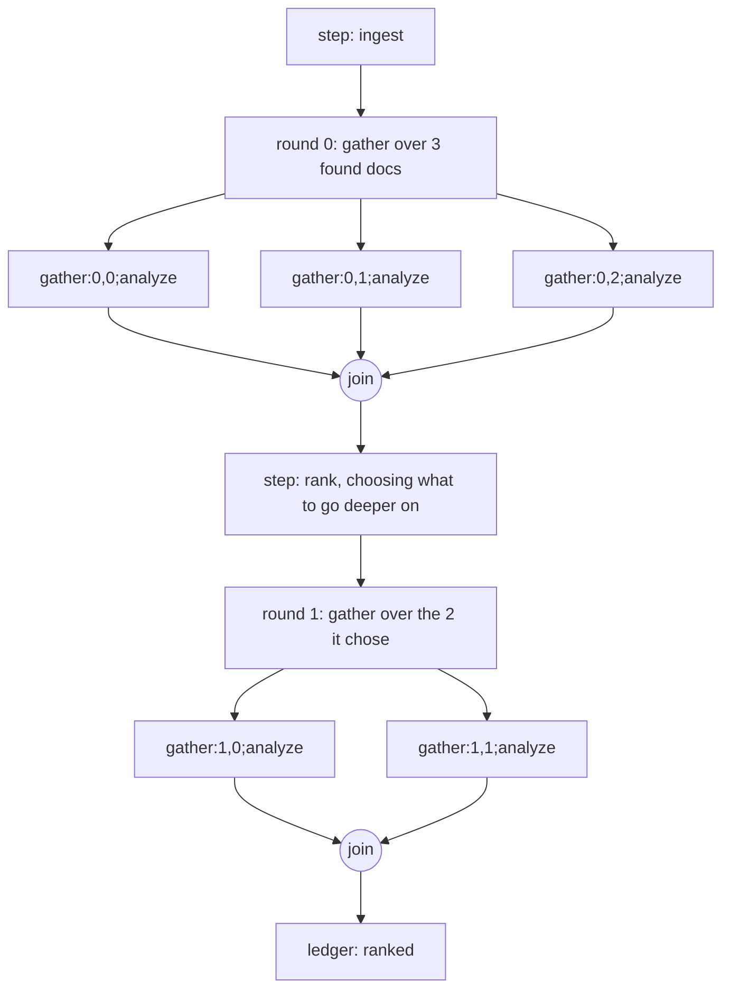
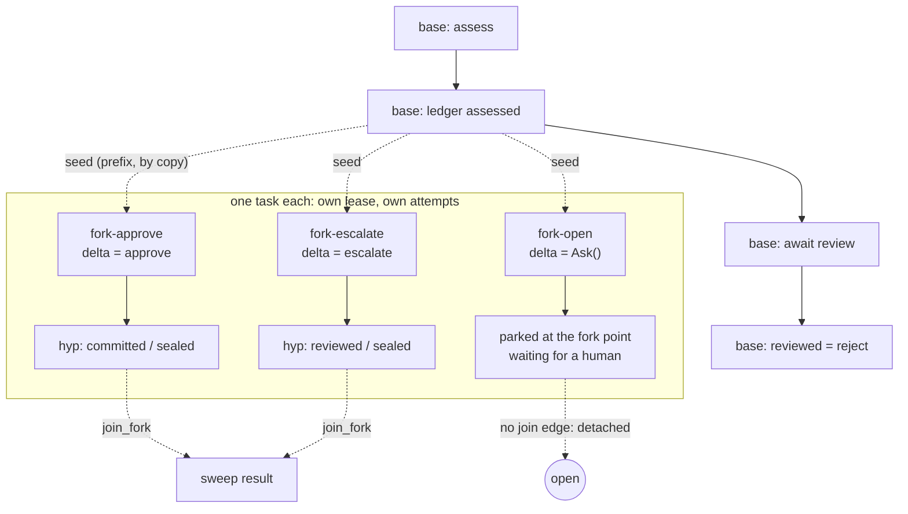
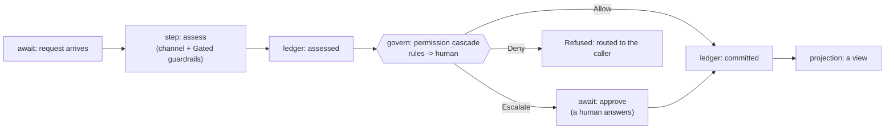
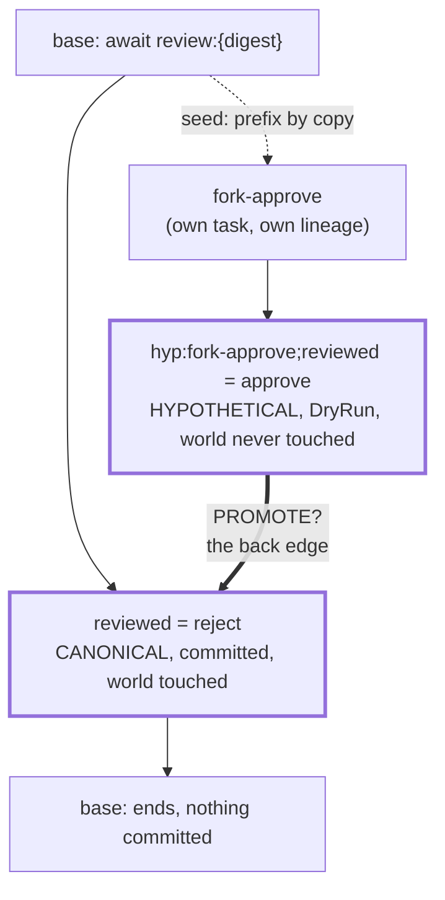
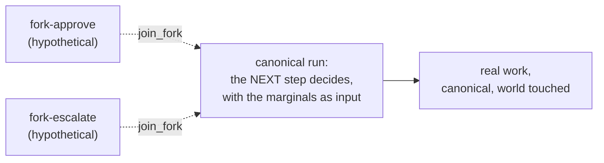

# ADR-0021: Dynamic graphs: three growth axes, one projection

- **Date:** 2026-07-25
- **Status:** Accepted, and built. `spawn_fork`, `join_fork` and `marginal_sweep` live in
  [`src/effective/fork.py`](../../src/effective/fork.py), with the sweep pinned on both engines ([`tests/test_fork_sweep.py`](../../tests/test_fork_sweep.py),
  [`tests/test_fork_sweep_absurd.py`](../../tests/test_fork_sweep_absurd.py)). The graph object is `effective.graphview` (§5).
- **Relates to:** [ADR-0008](0008-dynamic-workflows-as-ops-applicative-parallelism.md) (a fleet run has no op kind of its own: it decomposes into spawns and
  joins), [ADR-0020](0020-key-composition-one-grammar.md) (the key grammar that names every node), [ADR-0022](0022-dashboard-projections-the-read-side.md) (the read side that draws the
  graph).

## 1. The decision

**A workflow graph is never declared. It is a projection of what ran**, and each of the three ways
it can grow (width, length, depth) has a form and a structural ceiling.

There is no graph-builder API, no DAG object, no `add_node`. There is a workflow that yields ops
and a recorded run those ops produce; the graph is what you get when you read the record. A
declared graph (Airflow, LangGraph, n8n's canvas) is a second place the structure lives, and a
second place can disagree with the first. Here it cannot: the projection has no way to describe an
edge that did not execute.

This is the rule the substrate applies to state (projections are derived; rebuild them from the
ledger, never edit them), applied to shape.

## 2. Why the graph is acyclic, and why "looks cyclic" is fine

A cycle in a trace would be a back-edge into a node that already exists, which means two
occurrences sharing one name. **Acyclicity is the injectivity invariant seen as a graph property**,
and `compose_key` discharges it by construction ([ADR-0020](0020-key-composition-one-grammar.md)). The serialization-injectivity
assumption in [`formal/lean/Effective/Keys.lean`](../../formal/lean/Effective/Keys.lean), read as a graph statement, is "the trace is a DAG".

Every node is named by its **path**, never by time or completion order: the gather ordinal `{g}`,
the branch index `{i}`, the occurrence suffix `#k`, the op key. So a loop in the program unrolls
into a chain in the graph:

`ask#2` is a different node from `ask` because the engine named it that way, and it named it that
way because replay has to re-derive the same name. The repeated task is the same shape, and each
instance is its own node: the graph looks cyclic because it does the same set of tasks repeatedly.

### 2a. What a node's name is made of

Every growth axis contributes a segment, and every segment is derived from position in the
execution:

| segment | contributed by | example | who mints it |
|---|---|---|---|
| the op key | the op itself | `tool:fetch`, `assessed:{digest}` | `op_key` over `compose_key` |
| `#k` | a repeated name in one run (length) | `ask#2` | `Key.occurrence`, below the handler |
| `gather:{g},{i};` | a fan-out branch (width) | `gather:0,1;tool:b` | `_PrefixedCtx` |
| `fork:{child};` | a counterfactual's event world (depth, across runs) | `fork:cf-a;review:{digest}` | `RenamedAwaitCtx`, `fork_event_name` |
| `hyp:{child};` | a counterfactual's ledger identity | `hyp:cf-a;reviewed:{digest}` | `ForkLedger` |

Two consequences. **A node knows where it came from:** `compose_key` is handed a `Template`, so
each hole's source expression survives into `build/key-registry.json`, and
`effective.keys.registry.explain` decodes a key into its field names and producing line, a source
map for the graph. And **two runs of one workflow share an alphabet**, which is what makes
`effective.lineage.align`, `compare` and `equivalent` meaningful: run-scoped tokens are scrubbed to
`{run}` by `effective.lineage.canonical(scrub=…)`, and what is left is comparable across runs.

## 3. Three growth axes, three ceilings

| axis | form | arity decided | ceiling |
|---|---|---|---|
| **width** | `gather([...])` | before any branch runs (applicative) | the list is data |
| **length** | a loop of rounds; `recurse`, `descend` | round *r+1* may depend on round *r* | `max_iters` or a budget |
| **depth** | any spawn a workflow yields: `spawning.spawn_child` and its uses (`spawn_fork`, `effective.compose.spawn_subagent_task`, `unfold` with `AcrossTasks`), a model's `spawn` request | at each spawn | the spawn depth budget, refused by the durable handler before enqueue |

Every dynamic graph in the substrate is a composition of the three. Each axis is otherwise
unbounded, so each ceiling is structural: the depth ceiling refuses before any child is enqueued
([`tests/test_spawn_depth_ceiling.py`](../../tests/test_spawn_depth_ceiling.py)), which is what makes it a ceiling rather than a warning.

The fork composes on all three and needs no fourth axis: a sweep is width, a tree of
counterfactuals is depth, explore-look-explore-again is length.

### 3a. What goes wrong on each axis

Each of these is enforced or pinned.

**Width (`gather`).**

| hazard | what holds |
|---|---|
| the qualified emitter | a branch's await is rescoped to `gather:{g},{i};{name}`, so an emitter outside the workflow composes the same name with `api.qualified_event_name`. Emitting the bare name resolves nothing; the conformance suite pins it on both engines |
| serialized wakes | with several branches parked, the task waits on the lowest parked index, so answering branch 2 first makes no progress until branch 0 is answered. This is what makes the park deterministic |
| wrapped exceptions | every branch runs to its end, and their exceptions arrive as one `ExceptionGroup` in branch order. A group of refusals is thrown into the workflow, and so is a refusal out of a `scoped` body; `except* Refused` catches every form, and `except* ChildRefused` around a gather of joins catches a child's. A group with any other leaf fails the task |
| commit order | branches commit as their tool work finishes, so the substrate promises the multiset and each branch's internal order, never a total order over a gather region ([ADR-0008](0008-dynamic-workflows-as-ops-applicative-parallelism.md) §3). Anything that cuts by commit order cuts outside the region |

**Length (rounds).**

| hazard | what holds |
|---|---|
| no default ceiling | a `while` loop with an await inside it is an unbounded graph; `max_iters` or a budget bounds it, and it has to be passed |
| occurrence drift | a round that changes how many ops it yields changes every later `#k`, so a workflow edited between a base run and a fork of it diverges, and `SeedingCtx` refuses rather than seeding the wrong values |

**Depth (spawn).**

| hazard | what holds |
|---|---|
| sprawl | the depth budget refuses before the child is enqueued, at the one door every spawn passes, so a model's raw `spawn` request is held to it as the authoring wrappers are |
| two spawns with one name | the engine deduplicates a spawn by its idempotency key, so the handler names each spawn by the task that makes it and where it was placed; a retry re-executes the same placement and enqueues nothing new |
| an answer from another run | a child answers on the done event the handler names from the spawn's task and placement (`spawn-done:{task},{occurrence};{placement}`), so a parent is answered only by the child it spawned |
| orphaned children | a detached spawn (no `join_fork`) is a feature, and nothing reaps it: a child parked on `Ask()` forever is a task nobody waits for, visible only in the ledger. Collecting hypothetical lineages is open |
| a child that answers and then dies | the parent completes and looks green while the child retries in the background; assert that children reach a terminal state, as well as that they answered |
| a child that fails | a parent hears how its child ended, in the kind it ended in ([`docs/effective-101.md`](../effective-101.md) §4.11): a value, a refusal, or `Failed`. Uncaught, `ChildFailed` fails the parent once and climbs; a parent that catches it supervises. A worker that dies on a child's last attempt answers nobody, a strict xfail on both engines ([`tests/test_attempts.py`](../../tests/test_attempts.py)) |

## 4. Two edge kinds, and the decision rule

**Within a run:** sequence (program order) and fan-out/join (the `gather` barrier).
**Across runs:** spawn (a checkpointed, exactly-once edge; the join edge back is optional) and fork
(a sibling lineage sharing a prefix by copy, fenced `hypothetical`, compared by address).

The rule that keeps the graph acyclic across runs: **a spawn or fork edge always points at a fresh
node set** (a new task id, a new `child_run_id`). The one operation that would create a back-edge
is promoting a fork to canonical, which §6 declines.

> **Prefer width to depth, and a known arity to a discovered one.**

| situation | form |
|---|---|
| arity known, children cheap, no independent lifetime | `gather`: order-independent replay, a confluent meter fold, a deterministic park order, comparable marginals |
| arity known, but a child needs its own lease, attempts or worker | `spawn_child` per child, then `join_child` per handle (`spawn_fork`/`join_fork` for a counterfactual, `unfold` with `AcrossTasks` for a recursion), in a loop |
| arity discovered | a new round |
| the child might become a real interaction | spawn, and do not join |

The spawned children are joined in a loop: they already run concurrently in their own tasks, so
wall-clock is the slowest child, and a `gather` of joins would break the qualified-emitter contract
since a branch's await is rescoped while the child's emit is not.

A known arity is what makes the confluent fold, replay-order independence and the cross-sibling
comparison possible; a discovered arity costs all three and buys a rounds structure.

### 4a. What nests inside what

| outer \ inner | `gather` | rounds | `spawn_fork` | fork point |
|---|---|---|---|---|
| **`gather` branch** | yes, keys compose outermost frame first | yes | yes | refused (`ForkPointInGather`) |
| **a round** | yes | yes | yes | yes |
| **a forked tail** | yes, pinned including crash-at-every-branch-op | yes | yes, depth-budgeted | yes, the tail may fork again |
| **a seeded prefix** | yes | yes | not applicable: the prefix is replayed, never re-spawned | cut before or after the region |

The fork point inside a gather is a design refusal. The fork point is a boundary defined on
`await_event`, and a branch's await is resolved by `peek_event` on every replay, so the phase would
cross on the first pass and never again. A gather region is atomic for cutting, and the same rule
governs `fork_seed`'s `through`.

## 5. Worked shapes

### 5a. A workflow with intelligence

Known arity almost everywhere, and a couple of nodes that happen to be model calls. The graph is
static in shape and dynamic in content, which is the common case and why the applicative form is
the default.

Every node is a checkpoint, and the `await`s are the durable seams a human can stand in.

### 5b. The agent loop: ingest, analyze, rank

The width of round *r+1* depends on what round *r* found. It is still a DAG and still replayable,
because each round is a new level and each node is path-named.

The arity of round 1 is data computed between barriers by a deterministic step over recorded
results. The monadic decision happens in the workflow, the applicative fan-out happens in the op,
and replay only has to re-derive names. In `src/examples/deep_research`, each step of the
frontier gathers over the pages a search returned, a width decided between barriers.

### 5c. The counterfactual sweep

The refund-request workflow of [`tests/_approval_domain.py`](../../tests/_approval_domain.py) parks on `review:{digest}`. A sweep
forks it at that point:

| fact | what holds |
|---|---|
| the prefix is shared by copy | each child re-commits the seeded prefix into its own key space, so the lineages are disjoint node sets isomorphic on the prefix, which is why `effective.lineage.fork_marginal` aligns them by address |
| `Ask()` leaves the fork point open | with a delta, the child pre-delivers its own substitution and runs to a marginal; with `Ask()` it parks at the fork point as the base did. The marker is required, so a forgotten delta is a call-site `TypeError` |
| the join edge is optional | `spawn_fork` without `join_fork` is a lineage nobody is blocked on, which is why the two calls are separate |

The seeded prefix costs exactly `forks × prefix_len` checkpoint rows, linear in both with no
cross-term, at about 540 bytes per row for a 512-byte payload on SQLite
([`tests/test_fork_sweep_cost.py`](../../tests/test_fork_sweep_cost.py)). When a sweep costs too much, the lever is `through`: fork later
and seed less. The fan-out width is what the sweep is for. `through` moves the whole boundary:
every op before the fork point must be seeded, or `SeedingCtx` refuses.

### 5d. The gated pipeline

Most workflows are a mostly-linear pipeline whose interesting nodes are a model call and a gate,
where the gate is an await a human answers.

**A gate is a node:** the cascade's park is an `AwaitEvent` with a composed, run-scoped name, so
"who approved what, and when" is answerable from the graph. And **the projection hangs off the
end**: a view is a fold over the ledger, never a second place the state lives ([ADR-0022](0022-dashboard-projections-the-read-side.md)).

### 5e. Reading a graph

| you want | the surface |
|---|---|
| one run's nodes, in order | `effective.checkpoints.read_sqlite_task`, `effective.bridge_absurd.read_absurd_task`; engine-internal rows excluded so the two engines agree |
| the key sequence alone | `effective.checkpoints.keys` |
| what a key means | `effective.keys.registry.explain`, from `build/key-registry.json` |
| the graph as nodes and edges | `effective.graphview.from_keys`, a `RunGraph`; `to_mermaid` and `to_text` draw it |
| the program's shape | `effective.graphview.fold_cycles` drops the unrolling coordinates and folds the chain back into its loop; `project` discovers the axes from the tape; `restrict` selects rows |
| two runs compared | `effective.lineage.align`, `compare`, `equivalent`, `key_distance`, over `canonical(scrub=…)` |
| a counterfactual's difference | `effective.lineage.fork_marginal`, address-aligned |
| the canonical history | the `ledger` table `WHERE NOT hypothetical`; `effective.lint --ledger-reads` keeps the predicate on |
| what a run cost, and how long | `effective.telemetry` spans: the same nodes, a different projection |

### 5f. Against the declared-graph systems

| system | where the graph lives | dynamic shape | replay | what it offers |
|---|---|---|---|---|
| **n8n** | a canvas (JSON) | limited (loops via nodes) | no | show the graph before it runs, and let a non-programmer edit it |
| **Airflow** | a DAG file evaluated by the scheduler | dynamic task mapping, bounded | re-run tasks | schedule-first ergonomics; a mature operational UI |
| **LangGraph** | a declared graph object | conditional edges | checkpointer | draw the state machine you declared |
| **Temporal** | code | full | replay-based | maturity, many languages, an operational estate |
| **Effective** | code; the graph is the trace | full | replay-based | ops as data, typed channels, counterfactual forks, keys as a source map |

Effective cannot draw the graph before it runs: there is no static shape, only the shapes a
workflow can take. If a static picture is the requirement, a declared-graph tool is the right tool.
And Temporal has the core idea already: code-defined, replay-durable, no declared DAG. What differs
is what the substrate makes inspectable: ops as data, a typed data axis beside the control axis,
counterfactual lineages, and identities that decode back to source.

### 5g. What the projection buys

| operation | mechanism | status |
|---|---|---|
| **read** a run's graph | the readers and `effective.graphview` in §5e | built, both engines |
| **explain** a node | `effective.keys.registry.explain` | built |
| **edit** counterfactually | `spawn_fork` or `run_fork` with a delta, applied by re-running | built, sweep pinned on both engines |
| **measure** the edit | `effective.lineage.fork_marginal` | built, address-aligned |
| **debug** | ledger, then checkpoints, then spans, then logs: a walk over the graph, where a refused fork raises a named error such as `ForkedPrefixAwait` | a practice, without one surface |
| **optimize** | `effective.improve`: propose candidates, score each into a vector, keep the Pareto frontier (`effective.pareto`) | built |
| **learn** across runs | N runs of one shape are N projections over one alphabet, so they align (`effective.lineage`) | pieces exist; no curve-over-time artifact |

Everything that records is built; what aggregates across many runs is the open edge.

## 6. Promoting a fork to canonical: declined

Every other cross-run edge points at a fresh node set. Promotion is the one proposed edge that
points back into a node set that already exists:

Follow that edge and it fails three ways, which are one fact seen from three bookkeepers:

| bookkeeper | the failure |
|---|---|
| identity | a canonical row at that position must bear the canonical id `reviewed:{digest}`, and that id is taken: the base committed `reject` there. Promotion asks one address to hold two answers |
| storage | the write is a collision on `UNIQUE(event_id)` or an UPDATE the append-only trigger refuses. Both say what happened, happened |
| truth | the forked tail ran under `DryRun`: no tool call, no email, no posting. Its rows describe a world that was never touched, and promoting them asserts as fact events whose side effects do not exist |

The only way out is to mint a new id, at which point the promoted row is a new node and the
operation was re-running all along.

The value of a fork is its marginal. The rows exist so the marginal is a real durable execution
with a real ledger rather than a guess. Information crosses the boundary; history does not:

**`join_fork` is promotion of information**, and it is the form that keeps both bookkeepers
honest. If the counterfactual looks better, the canonical run decides so and does the work for
real. Nothing in the canonical run needs patching: because the graph is built by `yield from`,
every step derives its own context when it runs, so there is no pre-committed future to rewrite,
and a marginal is one more input to the next decision. A fork of an agent session can talk to the
main thread; it cannot take over from it.

## 7. Consequences

- No op kind and no engine capability were added for fan-out: the fleet run decomposes into spawns
  and joins ([ADR-0008](0008-dynamic-workflows-as-ops-applicative-parallelism.md)). The scheme is closed under composition: fork inside gather is refused at
  the fork point only, and gather inside a forked tail is pinned. Both engines carry it.
- A cross-task fan-out pays a task per child: right for anything with its own lifetime, wrong for a
  hundred tiny counterfactuals, where an in-task `gather` is cheaper.
- A gather region is atomic for cutting (§4a), and `fork_seed` cuts by commit order, which is a race
  inside a region by design ([ADR-0008](0008-dynamic-workflows-as-ops-applicative-parallelism.md) §3).
