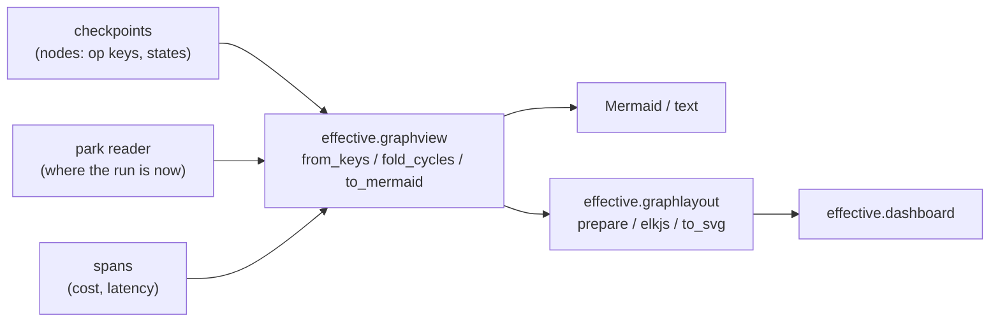
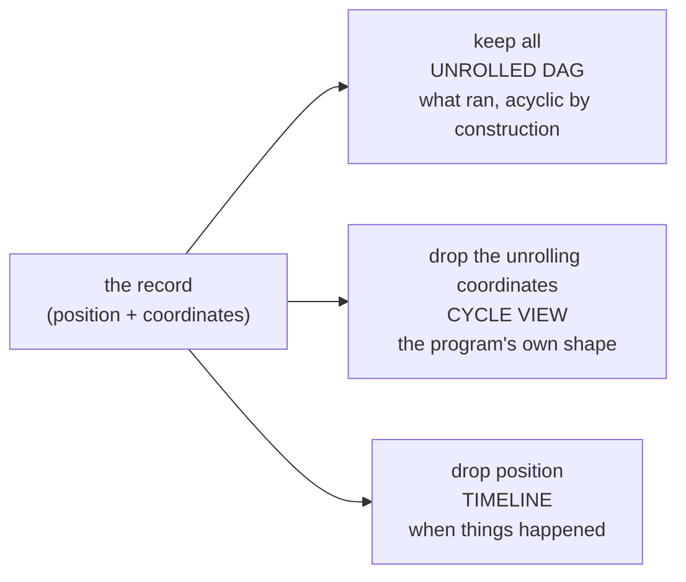
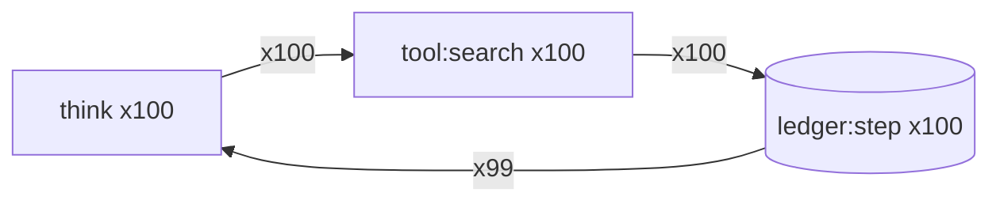

# ADR-0022: Dashboard projections: the read side of the graph

- **Date:** 2026-07-25
- **Status:** Accepted. Built: the projector (`effective.graphview`: `from_keys`, `fold_cycles`,
  `project`, `restrict`, `to_mermaid`, `to_text`), the park reader (`effective.parked`), the
  layout seam (`effective.graphlayout`, elkjs sandboxed), the span join
  (`telemetry.measurements`, `telemetry.sidecar_measurements`), and a local page that shows the
  parked fleet, draws one run and answers its park (`effective.dashboard`, hosted by
  `examples/dashboard_demo.py`). Not built: a live feed, the fleet and counterfactual views, the
  authority classifier (§12b), and a fold index (§9c).
- **Relates to:** ADR-0021 (the graph is a projection; this is its read side), ADR-0010 (the
  `CardSpec` IR), ADR-0011 (`render_shiny`), ADR-0008 (watching a run is telemetry, with no op),
  ADR-0020 (key composition, whose coordinate roles the fold reads).

## 1. Context

The chain **ledger → projection → `CardSpec` → render → a board with a decision `Action`** is the
substrate's read side: a projection is a fold over the record, a card is data (ADR-0010, ADR-0011),
and an action on a board is a new ledger event. A domain projection shows the domain's nodes;
none shows the **graph** of a run: which run is where, what it is waiting on, what a fork would
have done. Every ingredient exists: checkpoints
give nodes, the ledger gives the canonical spine, `Forked` and `ForkSealed` give the cross-run
edges, and the key grammar gives the nesting.

## 2. The decision

**A graph view is another projection over the same chain.** The projector is new; everything
downstream of it already exists.



Three properties it inherits by construction, and they are the reason to reuse rather than build
beside:

1. **Derived, never authoritative.** A dashboard cannot be a second declaration of the graph
   (ADR-0021). It is rebuilt from the record; a stale view is a bug in the fold, never a divergence
   in the truth.
2. **Inspect-only, except through an event.** A view that lets an operator answer a parked await
   does it by emitting the event; the substrate resumes the run.
3. **The canonical predicate is a gate.** `effective.lint --ledger-reads` fails a read `FROM
   ledger` that forgets `hypothetical`. A counterfactual view is the one place that predicate is
   inverted on purpose, and it says so with the escape comment.

## 3. Three views

| view | the question it answers | audience | reads |
|---|---|---|---|
| **run** | what happened in this run, and where is it now? | developer and agent, debugging | checkpoints, the park, spans; one task |
| **fleet** | of N runs, which are parked, which failed, on what? | operator of a deployed workflow | tasks and the ledger, many runs |
| **counterfactual** | base against its forks: what would each have changed? | the optimizer, human or agent | base lineage, `hyp:` lineages, marginals |

They share the projector's inputs and differ in the fold. The run view comes first: it is the
smallest, both a human and an agent need it daily, and the other two are aggregations over it.
The dashboard's front page lists the parked fleet (`fleet_page`); the aggregate fleet view and the
counterfactual view are not built.

## 3a. The cycle projection: a view is a projection that drops an axis

A run's graph is dynamic: every step is a new node. A node's name carries a program position and
the coordinates that say which execution of it this was (ADR-0021 §2a): scope frames, a gather
branch, an occurrence, as in `d:1;gather:0,1;ask#2`. A view is a choice of which coordinates to
keep.



The cycle view is ADR-0021 §2's unrolling read right to left: `ask`, `ask#2`, `ask#3` become one
`ask ×3`; four `gather:0,i;fetch` become one `fetch ×4`; a chain `ask → act → ask#2 → act#2` folds
back into the loop `ask ⇄ act` the program contains. It is π on the key's coordinate tuple followed
by a group-by.

The coordinates are not a fixed tuple. The space is as wide as the grammar, one column per
coordinate per term, and two projections read it:

| projection | the axes it drops | what it is for |
|---|---|---|
| `fold_cycles` | declared: each coordinate's role (`keys.marker.Role`) at the site that mints it, read from `build/key-registry.json`; an `Index` drops, a `Name` survives | comparing runs: two runs of one program project the same way |
| `project` | discovered from the tape: an all-integer column that varies is a counter, a column in bijection with a dropped one is the same axis under two names, a constant is no axis | making one run legible, including coordinates no declaration names |

A column merely *determined by* a dropped one survives, which keeps two rubric arms two nodes
while collapsing three identical lanes into one. Both share `regroup`.

Three properties make the fold safe to show an operator.

**It is a lens, not a summary.** Every folded node keeps `members`, the unrolled keys it stands
for, each one a key the checkpoint store answers to, so a view drills from `ask ×100` back to the
hundredth execution. `executions` is invariant across the projection: fewer nodes, never fewer
facts. A declared-graph tool cannot promise this, because there the cycle is the primitive and the
iterations may never have been recorded as distinct things.

**The folded graph is the program, so it inherits the source map.** Each node's key decodes
through `keys.registry.explain` to its named fields and the line that composed it, because
`compose_key` was handed a `Template` and the hole's source expression survived. Fold a run and
you get the program's shape annotated with how often each box ran and what it cost (§4a): a
profiler view, derived, with every box pointing at source.

**The folded graph may be cyclic**, which the unrolled one cannot be; `RunGraph.cyclic` records
which projection you are holding.

## 4. What a graph node carries

From what the record already holds, per node (`graphview.Node`): the op `key` and its decoded
fields, the `kind` (from the key grammar via `kind_of`: step, ledger, artifact, sleep, await), the
`state`, the `cost` and `duration_ns` (from spans, `None` when unmeasured), the branch `path`, the
enclosing scope `frames`, the tape `order`, and in a folded view `count` and `members`. Edges are
commit order within a run, which across concurrent gather branches is one schedule rather than
causation (ADR-0008).

Two states have a producer: `COMMITTED`, the default for a recorded key, and `PARKED`, for the
pending node (§10a). `refused` and `not-reached` are documented and have none; `STATE_PRIORITY`
ranks an unranked state above every ranked one, so they surface when they gain producers.

Nothing here needs a new op or a new column: it is a read.

## 4a. Spans on the graph: a computed join

The spans for a given step are a point lookup, because both sides carry the same address.

Tracing systems that receive spans with opaque ids run a correlation pass to stitch them into a
trace. Here the identity is derived: a node's key is a deterministic function of its position, and
`Span.key` carries the placed key of the op the span observes (frames, own key and occurrence),
which `traced` reads from `layers.current_placement()`. Two computable addresses do not need
correlating; they are the same address.

`telemetry.measurements` (live spans) and `telemetry.sidecar_measurements` (a JSONL sidecar, as
`otlp_jsonl_sink` writes) both produce a `{key: (cost, duration_ns)}` mapping, and
`from_keys(..., telemetry=…)` takes that mapping rather than issuing a query, which keeps the
projection a pure fold. `fold_cycles` sums cost and duration, so the cycle view answers "this loop
cost so much over 100 iterations" per node, attributed to a line of source.
`tests/test_machine_telemetry_joins_the_tape.py` proves the join on both engines.

The storage question is about volume, not capability. The ledger is small and canonical and
belongs in the engine; spans are high-volume and disposable, and can live in a sidecar or a
collector without changing anything above, because the join is a key either way.
`dashboard(engine, spans)` takes the sidecar's path for that reason.

## 4b. Why a key stays normalized

The projection is the reason a key carries identity and nothing else. Worked on the pinned-code
case, where a `run_code` segment has to say which skill pack it ran from:

| where the pin's facts go | relational reading |
|---|---|
| copied into every segment's payload (a provenance string per segment) | denormalized into the row |
| copied into every segment's key (a content hash in the frame) | denormalized into the primary key |
| referenced by a scope frame naming the activation | a foreign key |

The ledger is append-only and a checkpoint is immutable, so the update anomaly that usually
punishes denormalization cannot happen. **A projection is a `GROUP BY`, so π is what punishes it
instead.**
Two occurrences that ought to aggregate to one node stay two, because the copied attribute differs
between them. On two runs of one program with the pack edited in between, the activation key as
the frame folds both runs to identical keys, and a content hash as the frame folds them to
different ones. A hash declares `Subject`, the role every projection keeps, so no caller may drop
it and the quotient is lost permanently.

So denormalizing into the primary key is the worse of the two errors: it makes identity depend on
data, and equal entities acquire unequal identities. That is `handlers.base.artifact_key`'s rule
(the shape of the key cannot depend on the value) applied to frames.

The frame also answers a question no payload could: an activation whose frame no other key runs
under was present but never consulted. The rule governs the durable record; spans are denormalized
on purpose and owe only the join column of §4a.

## 5. The render question

A `CardSpec` is a list of cards; a graph is nodes and edges.

| option | holds |
|---|---|
| **Mermaid text** (`to_mermaid`) | cheap, reviewable in a diff, and legible to an agent reading the projection as text; renders on Markdown hosts that support it. No `Diagram` cell exists in `cards/spec.py`, and `render_html` ships no Mermaid bootstrap |
| **an SVG from the layout seam** (`graphlayout.to_svg`) | what the dashboard draws: Python decides what the graph means, a layout engine decides where to draw it (§11.6) |
| **the `Slot` escape hatch** (ADR-0011) | a host fills the region with its own widget; most capable, least portable, outside the IR |
| **a Vega node-link chart** | fits `VegaChart` with no IR change; poor for deep nesting, and not readable as text |

Mermaid stays the quotable form, for a report or a terminal, and `to_text` is the tree form the
terminal view (`src/tui/`) draws. The drawn form is the SVG.

## 6. Live or polled

A live view reads a run's progress as it happens: inspect-only, never recorded, nothing to read on
replay. That is telemetry, the bookkeeper kept outside the engine, so a live feed is a reader of
spans and no op carries it (ADR-0008).

An interactive surface needs a live feed; polling is not sufficient. The reason is latency: both
engines durably write a park, so a poller can see one, but a human looking at the surface should
not wait an interval to be told. What is built has neither: the dashboard and the terminal view
refresh on load or on request (§12a).

## 7. Placement

The projector reads only substrate records, so it lives in `effective`, beside `cards` (§12c).

## 8. The four decisions

1. **Run view first.** Fleet and counterfactual are aggregations over it.
2. **A layout derived from the record.** The projector emits Mermaid text, and the drawn view is an
   SVG laid out by an engine (§11.6).
3. **The dashboard supports interaction.** The target is concrete: a run parked on an await is
   answered from the view by an event, the same authority rule every board follows. A promoted fork
   parked on `fork.Ask` is the motivating case.
4. **A live feed for an interactive surface** (§6).

All examples are pure substrate.

## 9. The two experiments

Both are `tests/test_graphview.py`, so the numbers cannot rot into anecdotes. The decisions in §8
were taken from these measurements.

### 9a. Legibility at scale: folding is the collapse rule

Three runs on the embedded engine, projected unrolled and folded:

| run | unrolled nodes | folded nodes | Mermaid chars |
|---|---|---|---|
| decision (a step, a ledger row, a gate, a branch) | 4 | 4 | 164 → 164 |
| **agent loop ×100** (think → search → record) | **300** | **3** | **12,234 → 145** |
| gather fan, width 4 | 9 | 6, then 3 after a scrub | 402 → 242 |

The 300-node run is unreadable as a diagram and its fold is three boxes: an 84× reduction in
rendered size with no loss of fact (`executions` is 300 in both). The folded loop renders as:



That is the program, recovered from the trace, including the back edge taken 99 times where the
forward edges were taken 100. No bespoke collapse rule was needed: a long run is a repeated shape,
and the fold recognizes repetition.

**The fan case** folds to 6, not 3, because each branch's ledger row carries a branch-varying
`event_id` its author chose. The branch coordinate folds; a data-dependent name does not, because
as ledger rows those are different rows. The remedy is the one cross-run alignment uses:
canonicalize the varying tokens first (`agent.lineage.canonical(scrub=…)`), then fold. It stays the
caller's choice, because only the caller knows which tokens are scope and which are content.

**Combinator traces fold because the fold reads declared roles.** A fold that dropped only
occurrence and branch would leave a combinator's scope frame standing, and no `recurse`, `descend`
or `improve` trace would fold. Dropping by role:

| trace | keys | folded, dropping occurrence and branch only | folded, dropping `Index` roles |
|---|---|---|---|
| bare gather | 2 | 1 | 1 |
| `recurse` leaves | 2 | 2 | 1 |
| `descend` drill | 3 | 3 | 1 |
| `improve` round | 5 | 5 | 3 |

Each coordinate declares its role where it is composed: an `Index` counts re-executions of one
program position and a fold drops it; a `Name` names a distinct position (`sub:{name}`) and must
survive, since folding those would merge two subagents into one node. `just key-registry` records
the declaration in `build/key-registry.json`, which `fold_cycles` reads, and
`effective.lint --coordinate-roles` fails a coordinate that declares nothing.

A loop that appends one authored `event_id` per iteration has a domain coordinate in its key, and
no projection may drop it. Whether ledger keys should be positional is open.

### 9b. Fold cost: a live fold, no read-model

| ops | `from_keys` | `fold_cycles` |
|---|---|---|
| 99 | 0.1 ms | 0.1 ms |
| 999 | 1.4 ms | 0.5 ms |
| 9,999 | 14.1 ms | 4.9 ms |

Linear, about 19 ms for a 10,000-op run. No indexed read-model and no schema change: the read from
the engine dominates. The test's ceiling is 2 s, which separates a quadratic from noise under load.

### 9c. The index path

A fold index is possible, with one qualification: **the folded key is a function of the recorded
name and of the key registry.** `compose_key`'s injectivity makes the name deterministic, and
`build/key-registry.json` supplies each coordinate's declared role, so the fold is a pure function;
it is not a function of the stored bytes alone, and an index would need rebuilding whenever a mint
site's declaration moves.

It is not an expression over the name: frames interleave in both orders (`gather:0,1;rec:1;…` and
`rec:0;gather:0,0;…`), an alternation over tags in DDL would copy the registry, and
`fold_cycles(drop=…, keymap=…)` takes the role set and the map at run time. An index earns its place
for the aggregate views. A run-view scan is O(one run) and the engine read
dominates it; fleet and learning-curve views scan every op ever recorded. When built it is a
projection (derived, rebuilt from the record), over a column the single Python reader writes, in a
table of its own: Absurd's vendored, co-versioned schema stays untouched.

## 10. The parked await, and the drain

Two facts shape the interaction target.

1. **No engine checkpoints a pending await.** SQLite writes no checkpoint row for an await (the park
   lives in `tasks.waiting_event`), and Absurd freezes `$awaitEvent:{name}` only on delivery. A
   checkpoint reader therefore cannot produce the node a user would click; §10a is how the view
   gets it.
2. **Emitting an answer does not resume the run.** Something has to drain the queue in a process
   that holds the task registry. The dashboard answers and then drives the task in the same request
   (`parked.answer`, then `SqliteApp.run_until_result`), off the event-loop thread, because a
   `DurableHandler` runs a concurrent `gather` through `asyncio.run`.

The checkpoint readers' default `exclude=ENGINE_INTERNAL` suits the seed reader a fork uses
(nothing replays an await through `ctx.step`, so a seeded one would never be consumed) and is wrong
for a view: same record, two projections. The dashboard reads with `exclude=()`.

## 10a. The pending node comes from the park reader

`checkpoints.read_sqlite_conn` and `bridge_absurd.read_absurd_task` take `exclude`, which separates
the seed's projection from the view's. That does not produce the pending node on either engine,
because the row is not written while the run is parked. The park reader does:
`parked.read_sqlite_parked` and `parked.read_absurd_parked` return `ParkedTask` records with the
raw wake registration, and `parked.pending_key` turns one into the graph key `event;{wake_event}`,
which `from_keys(..., pending=…)` appends as the one synthesized node, in state `PARKED`, through
its own parameter rather than smuggled into the recorded key sequence.

An `exclude=()` view is not comparable across engines (on the same resumed workflow, Absurd holds a
delivered `$awaitEvent:` row that SQLite never writes), so it stays out of the conformance suite.

## 11. Build order

### 11.0 The shortest path

Park reader, pending-node bridge, a minimal local page that draws the run and posts an answer with
a drain. Built: `effective.parked`, `from_keys(pending=…)`, `effective.dashboard`.

### 11.1 to 11.5

1. **The live feed** (§6). Not built; §12a says what specifies it.
2. **The interactive surface**, a Shiny `Slot` or comparable, and the choice of which graph shapes
   are worth showing. One candidate lifts a coding-agent session into an Effective program on the
   control axis, as `agent/session_telemetry.py` lifts a transcript's token counts into `Usage` and
   `Span` on the cost axis. Not built.
3. **Node states.** Two of four have producers (§4).
4. **The telemetry mapping.** Built (§4a). It needed no seam change: once `traced` read
   `layers.current_placement()`, the work was a fold.
5. **The interaction target**, answering a park from the view. Built on the local page and in the
   terminal view (`src/tui/`), both through `parked.answer`.

### 11.6 Layout

An interactive dashboard has to draw a graph well, and that means automatic layout, which nobody
should hand-roll. `effective.graphlayout` is that seam:

```text
RunGraph --prepare--> LayoutGraph --to_elk--> ELK JSON --elkjs--> Geometry --to_svg--> SVG
```

Python decides what the graph means: `prepare.classify` resolves which edge is a loop a fold
recovered, which two nodes are adjacent only by commit order inside a gather, and which node the
run is parked on, and `validate.forward_is_acyclic` checks that it did. The engine decides where
to draw it. elkjs is pinned in `infra/elkjs/PIN.txt`, runs in a container with `--network=none`
(`just elk-image`, `just elk-setup`), and is one interpreter of the `LayoutGraph` description;
graphviz or a native layout is a swap rather than a rewrite. A node's `id` is its semantic key, an
op key or a folded class of them, and is the only identity that crosses to a browser and back.

**The layout is derived, never hand-placed.** A saved node position is a second source of truth
about shape, the same defect as a declared graph one level down: the run changes what ran, the
stored coordinates do not, and the picture stops describing the execution. So there is no position
store, no canvas state, no "arrange" button. If a graph is unreadable, the fix is the projection
(fold it) or the layout algorithm.

This is affordable because retry, budget, permission, park and refusal are not nodes; they are
interpretations of one node by the handler and the layer stack. The node count is roughly one per
effect the author wrote, the shape a chain with occasional fan-outs, which layered layout handles
without tuning, and the cycle fold covers the long loop (§9a).

**Where layout will get hard:** a fleet view, N runs on one canvas. The likely answer is many small
graphs, a card per run, decided when the fleet view is built.

## 12. Dispositions

The criterion: as simple as possible, and no simpler. A disposition puts a seam where later
exploration can enrich it without relocating it, and a deferred item carries a trigger rather than
a date.

| # | decision | disposition | why |
|---|---|---|---|
| 1 | the pending node's key | **`event;{wake_event}`** (`parked.pending_key`) | it is `op_key(AwaitEvent)`'s own spelling, so nothing new enters the grammar; `event` is an arm tag, so an author `Step` cannot forge it; engine-neutral. `$awaitEvent:{wake_event}` is one engine's row, written only after delivery, and filtered by `ENGINE_INTERNAL` |
| 2 | `ParkedTask.state` vocabulary | **normalized** to `graphview.PARKED` | a field whose meaning depends on which engine answered cannot enter conformance |
| 3 | where the dashboard code lives | **`effective`** | it reads only substrate records (§7) |
| 4 | the page's shape | **one local FastAPI app, one process, SQLite** | `SqliteApp` holds engine, registry and connection together, so a click drains in-process. An injected-drain seam would be a parameter with one legal argument |
| 5 | fork placement | **`effective.fork`**, with `effective.sandbox`; `SPAWN_TOOL` and `SpawnResult` in `effective.domain` beside the `CallTool` they type | the view and the fork read the same runs |
| 6 | the preregistered latency experiment | **void by design change** | §12a |
| 7 | park-kind classification | **shape decided, code deferred** | §12b |
| 8 | `parked_since` on SQLite | **`None`** | the engine records no park timestamp, and a column is engine schema for a field no consumer has asked for. Trigger: the first consumer that wants elapsed time |
| 9 | the `KINDS` vocabulary | **`event;` and `$awaitEvent:` both map to `await`** | one shape, one word, and the word matches the domain; mapping both keeps an `exclude=()` view from drawing a delivered await as a rectangle |
| 10 | moving the branch coordinate outermost in a pending key | **no** | `pending_key` is a pure function of the raw registration; reshaping mints a second identity function. The engines prefix the coordinate onto the event name (`_PrefixedCtx.await_event`), so a parked branch's key is `event;gather:0,0;{name}` |
| 11 | `decision_wf`'s await scoping | **scope it on a subject the fork inherits** | §12d |
| 12 | the exemplars of `test_graphview.py` and the fork tests | **aligned: fork-clean** | the run you look at and the run you fork are the same run |

### 12a. The latency experiment is void

Two predictions were preregistered for the shortest path: the answer-to-resume gap would dominate
felt latency, and a run parking while the page is open would not show until the next poll.
Disposition 4 voids both: emit-then-drain in one process has no answer-to-resume gap, and with no
polling a page load is the refresh. Whatever feels dead on an interactive surface is the live
feed's specification. The instrument invariant: the page renders the run's actual current
position on every load, never a cached one.

### 12b. The authority classifier: shape decided, code deferred

The park reader is unfiltered by design. A consumer that filters parks will need one question
answered: *which authority namespace is this park in?* It is computed from
`keys.RESERVED_AUTHORITY_TAGS`, the tags an author may not name an await (`approve`, `govern`,
`budget-grant`, `fork`, `hyp` and the other grants). That reads an existing structural fact rather
than adding a denylist. It does not answer what a park means, who may answer it, or what payload it
takes.

**Trigger:** the first board that narrows the parks it offers. Not before: a board narrowed by a
prefix match that offers a `budget-grant:` park is the bug this prevents.

### 12c. Where the read side lives

What yields an op is substrate and lives in `effective`; what answers one is an interpreter in
`effective.interpreters`; consumers import the substrate and never the reverse. The read side is
substrate: `graphview`, `parked`, `graphlayout`, `dashboard` and `runview` read records and import
no workflow. A host that supplies workflows is a consumer, which is why `effective.dashboard` ships
no entry point and `examples/dashboard_demo.py` is the host: the task registry is domain code.
`run_agent` yields ops, so it is substrate (`effective.react`), and `agent` is the bench and
evaluation half.

### 12d. Await names are fork-stable

Everything a workflow authors (step keys, ledger `event_id`s, and await names) must be
fork-stable, because all three are matched against base-derived values. Measured on the embedded
engine, three exemplar shapes identical but for how they scope names:

| shape | result |
|---|---|
| ledger ids run-scoped, await run-scoped | `SeedBoundaryError`: a ledger step ran live during the seeding phase |
| ledger ids fork-stable, await run-scoped | `ForkedPrefixAwait`: the fork awaited `review:r-fork`, which is not the fork point `review:r-base` |
| ledger ids fork-stable, await scoped on a subject the child inherits | `completed` |

Run-uniqueness of the on-the-wire event name is an outer property the workflow does not supply: the
base gets it from a fresh subject per run, the child from `RenamedAwaitCtx`, which parks at
`fork:{child_run_id};{name}`. So an exemplar's parameter is the run's subject (a message id), fresh
per base run and stable across forks. `api.await_event`'s docstring states the rule, and
`run_fork_as_task` hands the workflow `forked_from`, the base's run id, so a workflow that scopes on
its argument stays forkable. A fresh base run must still park rather than inherit a stale answer,
because on Absurd an answer is permanent; `tests/test_fork_sweep_absurd.py` pins that.

No lint or conformance case gates await scoping, and SQLite, which does not make an answer
permanent, cannot catch a violation.

`agent_loop_wf` and `fan_wf` in `tests/test_graphview.py` contain no await, so they have no fork
point, and `run_fork` refuses them whatever they name their rows.

## 13. Selection: what a view draws

The key is the spine of replay, the dashboard and the formal semantics: replay binds to keys, the
dashboard projects them, and `formal/lean/Effective/Keys.lean` proves the injectivity
`compose_key` provides. A key that is not injective breaks all three, and asking a view where a run
is surfaces collisions (`graphview.ledger_collisions` is the dashboard's alarm).

Not every key is interesting at every zoom. That is **selection**, the other relational operation:
π chooses which coordinate columns to collapse, selection chooses which rows to draw.
`graphview.restrict(graph, where)` is built, and both orders are meaningful and pinned:
`restrict(project(g), …)` filters the program's shape, `project(restrict(g, …))` folds what
survived.

- **Kind is the handle**, and `where` is a predicate the caller brings. The interesting keys are
  not a fixed set: a parked await is interesting when you are answering it, a ledger row when you
  are auditing. So there is no `Node.salient` field.
- **Filtering is a projection, never a redaction.** No key stops being recorded because it is
  uninteresting; it stops being drawn. `RunGraph.hidden` records what was not drawn, and edges
  contract rather than delete: hiding the tool calls between two ledger rows still draws the edge
  between them. A contracted edge carries the flow along its path (the minimum count on the way,
  summed over the paths that arrive), exact on a chain or a fan and approximate on a diamond.

`executions` is invariant under `fold_cycles` and `project` and smaller under `restrict`: fewer
nodes, never fewer facts, is π's contract, and `hidden` is selection's.

## 14. Which folds survive a schedule

The ledger observable is a labelled partial order, and a run records one of its linear extensions
(`docs/effective-design.md` §3.5). A reader claiming a schedule-independent answer owes
$s \sim t \Rightarrow F(s) = F(t)$, and the default projection idiom does not pay it. Pinned in
`tests/test_reader_quotient.py`, with the schedule forced:

| the fold | survives a schedule |
|---|---|
| a set, or a count | yes, and nothing is owed |
| keys disjoint across rows | yes |
| last write wins over a key several rows share | no |

This ADR's own algebra is in the safe class: `fold_cycles` is a group-by over the checkpoint tape,
and `project` and `restrict` regroup or remove rows. The ledger readers in
`effective.runview` dedup with `dict.fromkeys` and read a per-row list only when its count matches.

The obligation falls on whoever writes a projection, and the substrate cannot discharge it. Its
identity machinery (`compose_key`, the key registry, coordinate roles) makes rows distinct, and a
projection folds on a domain key the substrate never sees, so two rows with distinct `event_id`s
can land on one cell. Identity disjointness is not behavioral independence. A fold declaring its
key, the read-side analogue of coordinate roles, is the shape a check would take, and is unbuilt.
