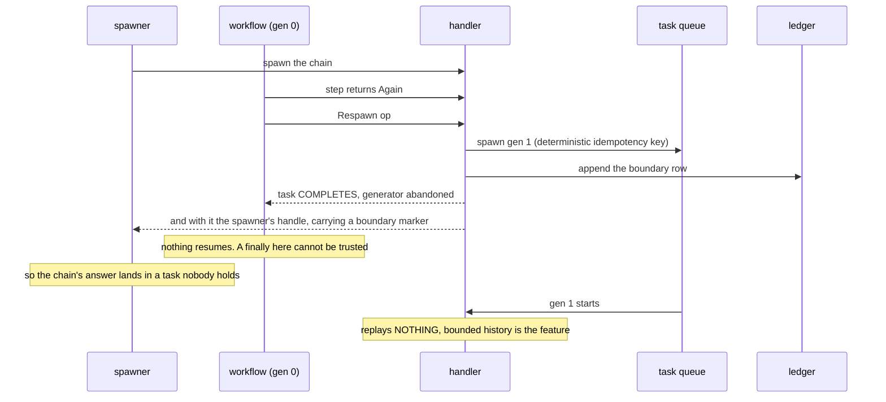
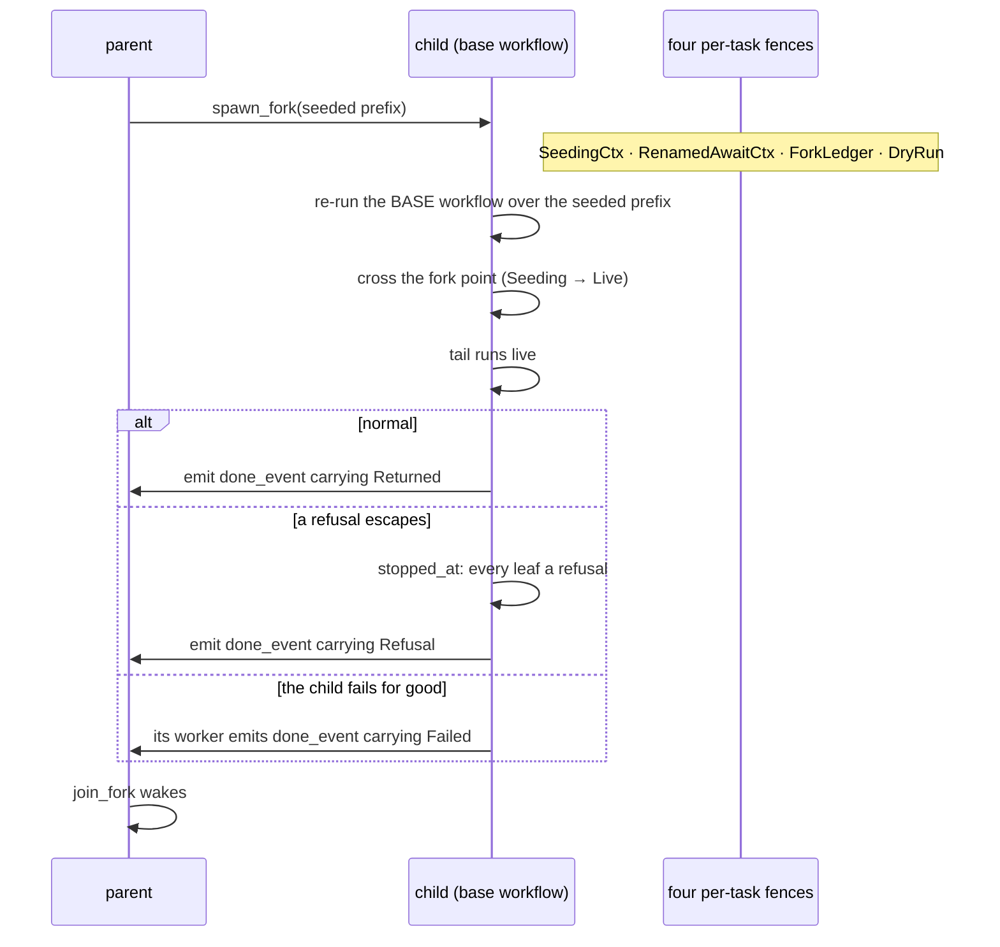
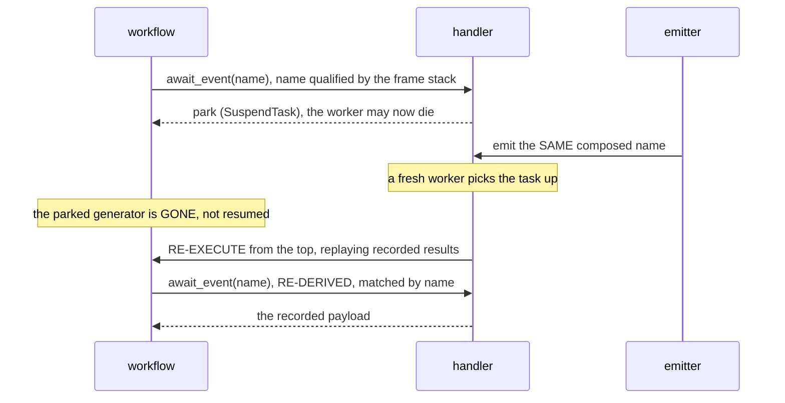

# Effective 101: the core concepts

**Read this first.** The wiki tells you *where* things are; this tells you *what they
are*. Its sections are the concepts the rest of the estate hangs off, so a claim
here that disagrees with source is a bug (see the currency contract in
`docs/README.md`).

**Want to run something first?** `docs/first-workflow.md` records and replays a workflow in one
command; this page is the concepts behind it.

Written for two readers at once. A human skims the tables and diagrams; an agent
greps the names. So every concept gets **a name, a one-line contract, and a
greppable symbol**, and structure is carried by classification tables (flat
choices), ASCII decision trees (branching ones), and Mermaid sequences (temporal
ones) rather than by prose you have to hold in your head.

---

## 1. The two seams

A workflow is an ordinary Python generator that **yields typed op descriptions**. It
performs no I/O. A swappable **handler** interprets the op stream, and the same
generator therefore has as many meanings as you have handlers: record, replay,
durable.

Two axes are reified, deliberately:

| axis | what it reifies | where | the payoff |
|---|---|---|---|
| **control** | *what the workflow does*: ops as inert frozen data | `src/effective/ops.py`, `src/effective/api.py`, and `src/effective/domain.py` for the step payloads `AskLLM` and `CallTool` | swap the interpreter: tests replay without an LLM; production runs durably |
| **data** | *the I/O boundary*: a prompt is a `t"..."` whose interpolations are typed channels | `src/effective/channels.py` | inputs render in, `Field`/`Gated` outputs declare the parse schema and run guardrails |

The design goal is **reasonable, not just readable**: a reader, human or agent,
should be able to *reason about* what a workflow will do without running it,
because the op stream is data and the handler is the only thing with effects.

**Function coloring is the partition, and it is the algebraic-effects payoff.** The
workflow is **colorless**: no `async`, no `await`. Sync/async color lives in the
*handler*. Coloring propagates through the interpreter, never through the
interpreted. This is why a `gather` inside a workflow needs no `async def`, and why
a web framework picking the color for you is a hazard rather than a convenience.

---

## 2. The op set: the whole abstract syntax

Nine members. `type WorkflowOp` in `src/effective/ops.py` is the complete alphabet;
everything a workflow can ask for is one of these.

| op | one-line contract |
|---|---|
| `Step` | run a named unit of work; its result is checkpointed and replayed |
| `AwaitEvent` | park until a named event arrives; resolves by **replay**, not by resuming a captured frame |
| `AppendLedgerRow` | append one row to the canonical, append-only ledger |
| `StoreArtifact` | put a blob in content-addressed storage, get back a reference |
| `SleepUntil` | park until a wall-clock time |
| `Gather` | run branches concurrently; the applicative shape: parallel reads, serialized writes |
| `Race` | run branches concurrently, record which `want` of them succeeded first, and stop the rest at their next op |
| `Scoped` | run a body under a name scope; the handler applies the prefix, not the author |
| `Respawn` | end this task and start the next **generation** with a bounded replay history |

That is the whole syntax. If you find yourself wanting a tenth, treat it as a
falsification attempt on the closed set: a forced op is a boundary finding and
earns its own design decision, not a quiet addition.

---

## 3. The author surface: what you actually call

`src/effective/api.py` is the **smart-constructor layer**: the module that mints the
author-surface ops with a bare `yield`, which every workflow-role module then
`yield from`s. It is deliberately *not* in `WORKFLOW_ROLE_SRCS`, because it is what those
modules call into. (Layers are a different role with different rights: an op-layer
forwards `yield op`, and may also *inject* substrate ops of its own, such as the permission
cascade's `AwaitEvent`, `src/effective/permission.py`.) The callables:

| you call | you get | note |
|---|---|---|
| `step(name, op)` | the step's result, replayed on re-execution | the workhorse. `op` is an inert `DomainOp` **value**, not a callable, which is what makes it recordable. Optional `idempotency_key`. The name is an **identity**, so it must be deterministic. An op stopped while it ran raises `OpCancelled` here; catch it in the scope that yielded the step |
| `ask_llm(name, messages, schema)` | the model's response, parsed to `schema` | the first argument is the step **name** (an identity), not the prompt; `messages` carries the channel template, the data axis |
| `call_tool(name, args, schema)` | the tool's result | accrues no spend today: the cost layer meters only `AskLLM`, so a budget test asserting a carry must use `ask_llm` |
| `store_artifact(value, content_type)` | an artifact reference | for anything too big or too binary to sit in a checkpoint |
| `sleep_until(when)` | resumes after `when` | durable; the worker may die meanwhile |
| `await_event(name, schema, addressing)` | the event's payload | the suspension primitive (§5.3). `addressing` defaults to RELATIVE (§4.12) |
| `append_ledger(row)` | nothing | idempotent by `event_id` |
| `judge(name, template, output)`, `select(name, template, candidates)` | typed answers to the questions a t-string asks | a `Judge` op; `select` picks one candidate or none |
| `await_until(name, schema, *, deadline)` | the payload, or that the deadline passed | a wait with a deadline, answered as a `WaitOutcome` |
| `gather(branches)` | all results | **one sequence of thunks**, not varargs: `gather(a, b)` is a `TypeError`. Each branch gets its own frame |
| `quorum(want, branches, *, deadline)`, `race(branches, *, deadline)` | the first `want` winners (one for `race`), as an `Answer` | the rest stop at their next op; `race` is `quorum(1, ...)` |
| `scoped(scope, body)` | the body's result | `scope` is a **`Key`**, composed by `compose_key`, never a string (§6). The handler applies the prefix, not the author |
| `respawn_generation(*, task, generation, state, params, run_id)` | does not return here | **not the author surface**: you call `combinators.respawn`, which `yield from`s this. Ends the task; the next generation replays nothing |
| `qualified_event_name(...)` | a completed event name | what an emitter uses to address a scoped await |

**Determinism boundary.** Between two yields there is no I/O, no clock, no random.
All of it goes through a yielded op. `just lint` enforces this over the registered
workflow-role files (`WORKFLOW_ROLE_SRCS` in `src/effective/lint.py`); keep it passing.

---

## 4. The combinator algebra

The core of this document. A combinator composes workflows, and the algebra says
which compositions are safe, which are refused, and why.

### 4.1 Composition is substitution into an Effect-hole

There is no `Workflow` protocol. There is only:

```python
type Effect[T] = Generator[WorkflowOp, Any, T]
```

Every combinator is `Effect[T]`-valued with holes of shape
`Callable[..., Effect[T]]`. So **`A ∘ B` means "B substituted into A's hole"**: the
algebra is over *ordered pairs*, not a wrapper stack, and order is the whole
subject. `A ∘ B` and `B ∘ A` are different questions with different answers.

### 4.2 A member is a HOLE, not a combinator

`recurse` is **two** registry members, because it has two holes and a body sees a
different frame path in each:

| member | a body in it sees |
|---|---|
| `recurse` (its `leaf` hole) | `gather:0:{i}:rec:{i}` |
| `recurse@fold` (its `combine` hole) | `gather:1,{k};fold:{lv},{k}` |

A table indexed by *combinator* cannot state that difference, which is exactly how
the fold frames went undeclared and unexercised for a while. Index by hole.

### 4.3 Three registries, because the algebra has three shapes

| registry | members | why it is its own registry |
|---|---|---|
| **holes** (the frames grid) | 7: `gather`, `scoped`, `recurse`, `recurse@fold`, `route`, `descend`, `hoisted` | value-returning: can be a row *and* a column |
| **terminals** | 2: `fork`, `respawn` | no hole. `fork` **leaves** the task; `respawn` **ends** it. Column only |
| **respawn-as-outer** | 1: `generation_outer()` | contributes no frames; row only |

All three live in `tests/_composition.py`: `BUILDERS`, `TERMINALS`, and `generation_outer()`
(a builder function rather than a mapping, because it has exactly one member).

Teach *why the wrong registry is dangerous*: a `Done`-shaped `respawn` placed in the
frames grid composes cleanly **in the very cells that are actually refused**, green
and wrong. The registry split is what makes the refusals expressible at all.

### 4.4 The frame law, with its precondition

```
frames(A ∘ B) = frames(A) · frames(B)
```

A monoid homomorphism into the free monoid on frame atoms, and it holds over
**strictly-nested spines**, which is the precondition that matters. A `GatherBranch`
ordinal is *positional within its enclosing scope*, so one sibling gather ahead of
`recurse@fold` moves its fold from `gather:1:0` to `gather:2:0`. The law is stated
once in `enclosing_frames` and every expectation is composed from it.

### 4.5 One law, two measurement points

Checkpoint keys **and** park names. The park path travels by a different mechanism,
and **that is where every historic frame defect actually lived**, so a green
key-law says considerably less than it looks. Measure both.

### 4.6 Depth buys shapes a pair cannot reach

Measured over the current 7-member hole registry. Counting **by frame type**, the
basis the law cares about, since the ordinals are positional:

| | combinations | distinct shapes | max frames |
|---|---|---|---|
| pairs | 49 | **12** | 4 |
| triples | 343 | **33** | 6 |

**21 shapes exist only at depth three.** (Counting raw frames *including* ordinals
instead gives 32 / 168 / 136: same conclusion, different granularity. Name the
basis whenever you quote the number.) Reproduce:

```
uv run python -c "import sys; sys.path[:0]=['.','src']
from tests._composition import pairs, triples, enclosing_frames
t=lambda f:tuple(type(x).__name__ for x in f)
print(len({t(enclosing_frames(*c)) for c in pairs()}),
      len({t(enclosing_frames(*c)) for c in triples()}))"
```

Do **not** repeat the retired claim that a pair cannot reach
`gather(scoped(gather(…)))`: `recurse ∘ gather` does.

### 4.7 Dispositions, and the absence that is the law

| disposition | meaning |
|---|---|
| `OK` | composes; the key is exactly `frames(A) · frames(B) · name` |
| `LOUD` | raises at the seam, with a message naming the culprit **and the fix** |
| `COSTLY` | composes, but pays a price worth stating |

There is **no `SILENT`, by construction**. A pair that composes, is wrong, and says
nothing is a *defect*, not a classification, so its absence from the enum is the
law. (`Disposition` in `tests/_composition.py` says this in its own docstring.)

### 4.8 The diagonal

`A ∘ A`. All **seven** hole-diagonals are `OK`, which is what makes "the diagonal is
dangerous" a claim about **task-addressing members specifically**, not about
self-composition in general. Both of the estate's remaining silent defects lived
there:

- **`fork ∘ fork`**: a counterfactual spawning a counterfactual, parked forever on
  its done event renamed into the child's event world while the grandchild emitted the bare
  name.
- **`respawn ∘ respawn`**: the inner chain's identity silently becoming the outer's.

**Neither was expressible until `fork` and `respawn` became registry members.** The
diagonal is the argument for having terminals in the table at all.

### 4.9 Transitivity, and the two mechanisms that deliver it

A refusal must hold *through* intervening combinators. Both do; they get there
differently, and the difference is the instructive part.

| chain | how it is transitive |
|---|---|
| `fork ∘ A ∘ fork` | **by construction.** The fence lives on the **ctx** (`RenamedAwaitCtx`), `_root_ctx` retains it, and `scoped`/`route`/`descend` reuse the same handler |
| `respawn ∘ A ∘ respawn` | **by a `ContextVar`, `ops.CHAIN_DEPTH`, set and checked by the combinator.** A handler never sees "we are inside a respawn": the combinator is ordinary workflow code until its step returns `Again`, so the interpreter observes exactly one `Respawn` op, the *inner* one. (The variable is *declared* in `ops.py` so a handler need not import a combinator; the guard is the combinator's.) |

That `ContextVar` also makes the two *gather* cells work, because `asyncio.to_thread`
copies the context where a plain global would race.

### 4.10 The general rule those two instantiate

**A fact lives where it is KNOWN.**

| fact | lives in | because |
|---|---|---|
| "we are in a gather branch" | the **handler** | it maintains the frame stack |
| "we are inside a respawn" | the **combinator** (via `ops.CHAIN_DEPTH`) | no op carries it; the interpreter sees only the inner `Respawn` |
| "we are in a fork child" | the **ctx** | the fences are per-task and the ctx is the task |

This is the reusable principle, and it is why the three guards live in three
different places rather than being unified into one.

### 4.11 How a spawned child ends

**A parent hears how its child ended, in the kind it ended in.** The answer is a `ChildAnswer`,
and its arm names the child task's final state:

| the child's task ends by | its state | its parent hears | `join_answer` raises |
|---|---|---|---|
| returning | completed | `Returned` | nothing: the value |
| a runtime refusal: `spawning.REFUSALS`, and `fork.REFUSALS` for a fork child | completed | `Refusal` | `ChildRefused` |
| an `ops.Unretryable` error: a `CompositionRefused`, or an uncaught `ChildFailed` | failed, on one attempt | `Failed` | `ChildFailed` |
| a crash on its last attempt | failed | `Failed`, unless the child answered first | `ChildFailed` |
| a crash with attempts left | retried | nothing yet | |
| its worker dying on its last attempt | failed | nothing | |

`run_child` (or `run_fork_as_task`) answers a value or a refusal. The worker that fails a task for
good answers `Failed`, since it is the one place a park is told from a crash: SQLite's `work_batch`,
and on Absurd the hook `absurd_worker` installs. An uncaught `ChildFailed` is unretryable too, so a
failure climbs to the root, each task naming the child it joined; a parent that catches it
supervises. The last row is the ending no parent hears: the engine fails the task where it claims
it, and no body runs there.

**The type decides which row an error takes.** A bare `ValueError` is a crash. A refusal a retry
re-derives, which the child should complete on, joins `REFUSALS`; a programming error subclasses
`CompositionRefused`. Its members are what `ast-grep -p 'class $C(CompositionRefused): $$$' src`
finds, and the `refuse_*` functions in `src/effective/ops.py` raise the base itself.

### 4.12 What can stand between composing a name and awaiting it

```
a name is composed here … and awaited there.
What frames stand between?

├── a GATHER BRANCH ──────► REFUSE
│      a branch coordinate is a concurrency slot.
│      There is nothing to reroute to.
│
├── a SCOPE ─────────────► REROUTE
│      a scope completes RELATIVE names; an absolute
│      one needs no completing. Same ruling as budget-grant.
│
└── a FORK CHILD's event world ──► REFUSE
       both frames are load-bearing and they disagree.
```

One discriminator (`is_branch`), two mechanisms: a fork's join is refused because a
branch coordinate would rescope an ABSOLUTE name away from the task that emits it; a
`Respawn` is refused because a generation boundary ends the whole task, and a branch
that respawned would end its siblings' task too.

**`Addressing`** (`src/effective/ops.py`) names the distinction, and it transfers from
filesystem paths without adaptation:

```
Is the whole address already in the string?
├── no  → RELATIVE   (the default; covers everything an author writes)
│           completed by the handler's frame stack, exactly as a relative
│           path is completed by the current directory
└── yes → ABSOLUTE   (the emitter is outside the frames, e.g. a fork's
            done_event). Prepending to one is precisely the defect
            Addressing exists to stop.
```

### 4.13 The rulings, each naming what the author actually wanted

This is where the DX doctrine gets concrete instead of asserted.

| composition | ruling | the message names |
|---|---|---|
| `fork ∘ respawn` | **LOUD** | **promotion**: every fence that makes a counterfactual a counterfactual is per-*task*, and a respawn ends the task |
| `respawn ∘ respawn` | **LOUD** | the **product carry**: one task, one lifecycle; nesting is mis-factored, not missing |
| `respawn ∘ fork` | **OK**, *ruled, not yet exercised* | the order that composes. The three LOUD cells each have an executed refusal; this one is backed by the ruling in `src/effective/ops.py` and by the refusal message that names it, not by a test that runs a fork inside a generation |
| `fork ∘ fork` | **LOUD** | the parked grandchild (§4.8) |

The pattern to imitate: **a refusal that only says "no" has failed at its job.**

### 4.14 Two corollaries that each cost real defects

**Per-run control state resets at the task run, never in a `finally`.** A generator
here is *abandoned*, not resumed, when a park, a generation boundary, or a branch
refusal unwinds it, and abandonment is **normal**, it is how both a park and a
generation boundary work. `CHAIN_DEPTH` leaked across runs exactly this way, which in
a long-lived worker means task B refusing because task A left it dirty. Reset in
`ops.enter_task_run`, and note a gather branch is *not* a task boundary.

**Check that a refusal's recommended remedy is reachable from where the author
stands.** This rule was broken twice in a row, the second time *after* the first had been
found and written up. A message naming an escape hatch the author cannot reach is a
defect, not a courtesy.

---

## 5. The temporal shapes

Three diagrams for the things a table cannot show.

### 5.1 `respawn`: the generation boundary



The fact worth drawing loudly: **the spawner's handle completes at generation 0**
with a boundary marker, so the chain's answer lands in a task nobody holds. That is
the open gap the chain-done work exists to close.

`effective.smol` is the shape in use: one generation per user turn, the transcript the carry,
and the wait for the next line a park named `user:{n}`. A replay walks only the turn in progress,
however long the conversation has run.

### 5.2 `fork`: the counterfactual



Two beats worth drawing: the **phase crossing** (`Seeding → Live`), and the
**answer paths**: a refusal and a failure each **still emit**, which is what keeps the parent from
hanging forever.

### 5.3 park / resume: why "resume is replay"

The invariant readers most often import wrongly from other engines.



**There is no captured continuation.** The await is re-derived by re-running the
deterministic computation and matched *by name*, which is why the name must be an
identity, and why `call/cc` is refused on principle (see §8).

---

## 6. The four t-string grammars

PEP 750 `t"..."` is used at four boundaries, and they share one rule.

| grammar | module | what the interpolations are |
|---|---|---|
| **SQL** | `src/effective/sql.py` | query parameters: Bobby Tables proper |
| **prompts** | `src/effective/channels.py` | typed I/O channels; `Gated` runs a constraint and returns `Repair` |
| **keys** | `compose_key` in `effective.keys` | identity segments, injective by construction |
| **markup** | `src/effective/graphlayout/svg.py` | escaped text nodes, on tdom |

**The shared rule: the static spans are delimiters, the interpolations are data, and
a processor that can still tell which is which does not need escaping as a patch.**

A `Template` has **no `__str__`**, by design, so you cannot flatten it by accident.
Immediate flattening (`"".join(...)` on arrival, asking only "static or hole?") throws
away position, arity, and each hole's source `expression`, and it is the same defect
as string-concatenated SQL one grammar over. An f-string is the right *rendering
backend* underneath a processor; it is the wrong thing at the boundary where the
structural decisions still have to be made.

---

## 7. The read side

A run graph is a **projection** of recorded op keys, never a declared structure.

| piece | module | contract |
|---|---|---|
| the graph | `src/effective/graphview.py` | folded from op keys; acyclic *because keys are injective* |
| cycle projection | `graphview.fold_cycles` | drop occurrence + branch + scope → the program's own shape |
| parks | `src/effective/parked.py` | a generic park reader, on both engines |
| checkpoints | `src/effective/checkpoints.py` | disposable execution state |
| layout | `src/effective/graphlayout/` | **Python decides meaning, ELK decides placement** |

**Projections are derived.** Admin and UI over a projection are *inspect-only*; an
authoritative change is a new ledger event, never an edit.

---

## 8. The invariants, with their reasons

| invariant | why |
|---|---|
| **Determinism boundary** | no I/O, clock, or random between yields: replay must re-derive the same computation |
| **No first-class continuations** | durable suspend is *replay*, not capture. `yield from` is the tame, delimited, one-shot sliver of continuations, with none of `call/cc`'s arbitrary-capture hazards |
| **Two bookkeepers** | checkpoints are disposable execution state; the **ledger** is the canonical append-only record. Never derive one from the other |
| **Keep the core DB-free** | SQLModel lives only in the ledger, the projections, and the app, never in the recording/replay core |
| **Projections are derived** | append events and rebuild; do not mutate state in a workflow |

---

## Where to go next

| you want | read |
|---|---|
| where something lives | `wiki/concepts/architecture.md` |
| the arguments behind a design rule | `wiki/index.md`, which catalogs the concept pages |
| the semantics, whole | `docs/effective-design.md` |
| the composition table as executable truth | `tests/_composition.py`, `tests/test_composition.py` |
| the read side, as an argument | `wiki/concepts/graph.md`, `wiki/concepts/tapes.md` |
