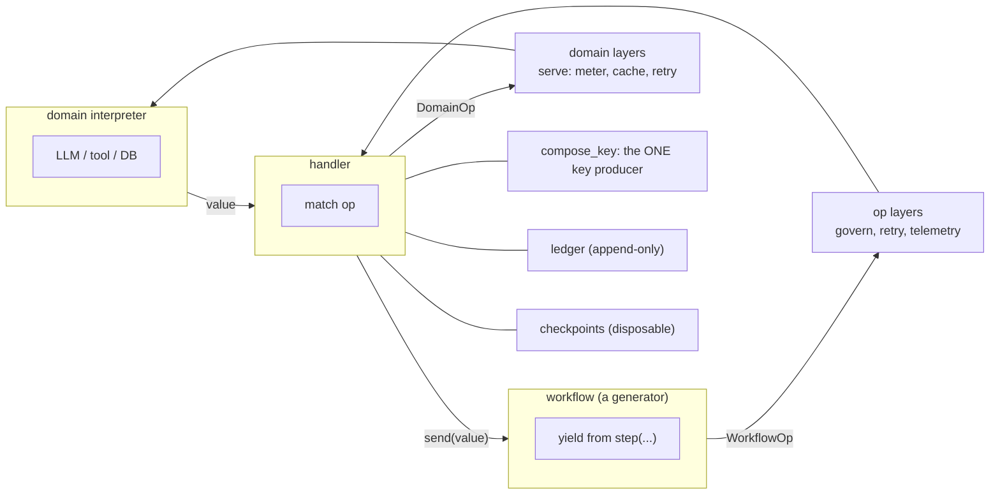
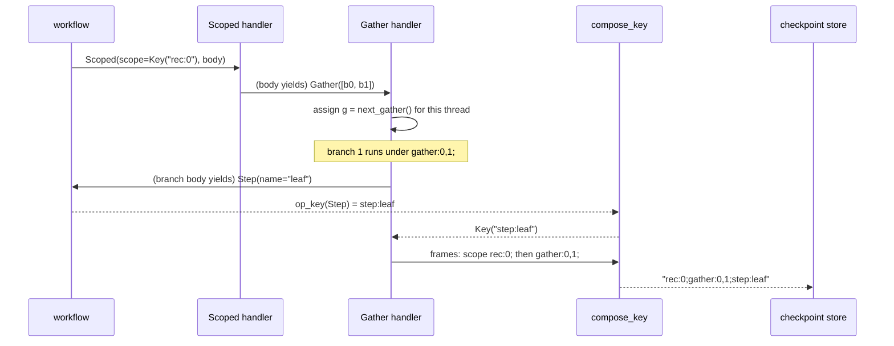
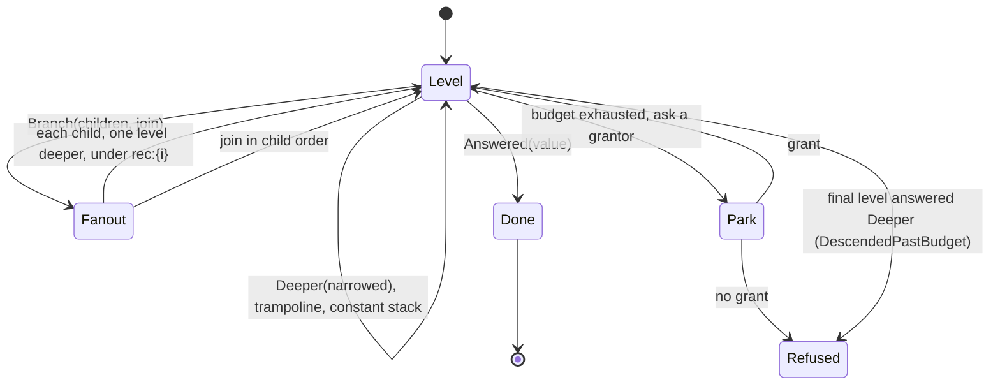
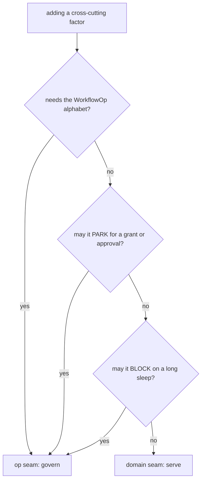
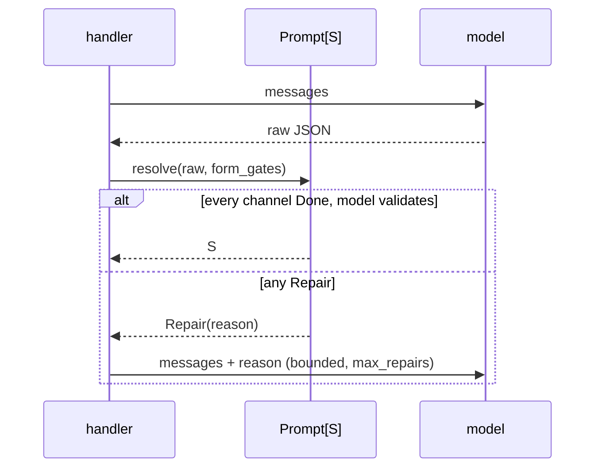

# Effective: a design note

**Audience:** a language model or an engineer who wants to reimplement the core ideas ·
**Math:** MathJax `$…$` / `$$…$$` · **Contract:** maintained in place, so it says what is true
now. When it disagrees with source, that is a bug.

**What this note is not.** It describes the tree, so a forward-looking proposal belongs in a
design brief rather than here.

Effective is a durable-workflow substrate built on algebraic effects. A workflow is a plain Python
generator that **yields typed op descriptions**; a swappable handler interprets them. The same
generator runs live, records, replays, or drives a Postgres task queue, because the generator
commits to no interpretation of what it yields.

This note is written to be sufficient for a clean-room reimplementation. It gives the op
alphabet, the small-step operational semantics the handlers must refine, the identity grammar that
makes the semantics' side conditions hold, the combinator algebra layered over it, the data-axis
processor, and the formal estate that checks the whole.

**Reading order for a reimplementer:** §2 (ops) → §3 (opsem) → §5 (keys) → §4 (generators) → §6
(combinators) → §7 (channels) → §9 (formal). §6.6 and §7 are independent of each other.

---

## 1. Two axes, one thesis

A model call is non-deterministic; a durable run must be reproducible. Everything below is that
tension resolved twice, on two orthogonal axes.

| axis | what it reifies | mechanism | the injection it forecloses |
|---|---|---|---|
| **control** | what the workflow DOES | ops as data, yielded from a generator | a side effect that replay cannot re-serve |
| **data** | what goes INTO and OUT OF a model | PEP 750 `Template` read by a processor | prompt injection, unvalidated model output |

Both axes are the same move: **reify the boundary as a structure, and let a processor decide, so
the decision happens once and can be checked.** An op is a decision about control that a handler
will make later. A `Template` hole is a decision about data that `render` or `compose_key` will
make later. Flattening either one early throws the decision away.



---

## 2. The op alphabet

A workflow yields a closed union of inert frozen dataclasses (`effective/ops.py`). They perform no
I/O. This is the reified term that makes the embedding **deep**: the same stream can be run,
recorded, replayed, or re-interpreted.

$$
o \;::=\; \mathsf{step}(n,\tau)
 \mid \mathsf{await}(e,S,\alpha)
 \mid \mathsf{ledger}(\rho)
 \mid \mathsf{artifact}(v,c)
 \mid \mathsf{sleep}(t)
 \mid \mathsf{gather}(\langle b_0..b_{k-1}\rangle)
 \mid \mathsf{race}(k,\langle b_0..b_{n-1}\rangle)
 \mid \mathsf{scoped}(s,b)
 \mid \mathsf{respawn}(\gamma)
$$

| op | carries | identity | what a handler owes it |
|---|---|---|---|
| `Step[T]` | name, `DomainOp[T]`, idempotency key | **by name** | checkpoint, dispatch to the domain, replay-serve |
| `AwaitEvent[T]` | event name, schema, addressing | **by name** | park durably, resume with the payload |
| `AppendLedgerRow` | a `LedgerRow` whose `event_id` is a `Key` | **by `event_id`** | append once, idempotent |
| `StoreArtifact[T]` | value, content type | **by content type and digest** | store, return a handle |
| `SleepUntil` | deadline | **positional** (the n-th sleep) | schedule, release the worker |
| `Gather` | branch thunks | **positional** (the g-th gather) | run concurrently, join by index |
| `Race` | `want`, branch thunks, `deadline` | **positional** (the r-th race) | run concurrently, save the choice, stop the losers |
| `Scoped[T]` | a `Key` scope, a body thunk | **none**: pure structure | prefix every key the body mints |
| `Respawn` | task, generation, state, params, run_id, granted | **none**: it ends the task | cut the task, spawn the next generation |

**Five arms raise if asked for a content key, for two different reasons.** Three are
**positional**: a gather, a race and a sleep are identified by where the walk found
them, so returning any content function would make two distinct ops share a key, and the walk
assigns the coordinate instead. Two have **no key at all**: `Scoped` is pure structure whose
effect is entirely on the names inside it, and `Respawn` ends the task.

**The authoring rule.** Workflows never `yield` a raw op. They `yield from` typed wrappers in
`effective/api.py`, which is the one module where a bare `yield` is legal; an ast-grep rule in
`just lint` enforces it everywhere else.

```python
type Effect[T] = Generator[WorkflowOp, Any, T]

def step[T](name: str, op: DomainOp[T], idempotency_key: Minted | None = None) -> Effect[T]:
    raw = yield Step(name=name, op=op, idempotency_key=idempotency_key)
    return cast(T, raw)
```

The `cast` is contained: the send-channel is `Any`, and one cast per wrapper restores `T` so every
call site infers. That is the entire type-safety trick for the control axis.

---

## 3. Operational semantics

The handler *is* the transition relation. Writing it down is what makes "reimplement this" a
checkable instruction rather than an invitation.

### 3.1 Configurations

$$
\kappa \;=\; \langle\, W,\; C,\; L,\; E\,\rangle,\qquad
C : \mathsf{Name} \rightharpoonup \mathsf{Val},\quad
L \in \mathsf{Row}^{*},\quad
E : \mathsf{Event} \rightharpoonup \mathsf{Val}.
$$

$C$ is the checkpoint store (disposable execution state). $L$ is the ledger (canonical,
append-only). $E$ is delivered events. **Two bookkeepers, and the relation never reads one to
produce the other.** That is invariant I5, and it is why an Absurd checkpoint may be garbage
collected while a ledger row may not.

### 3.2 The rules

Replay is the same relation re-run with a populated $C$. There is no second mechanism.

$$
\frac{\,n \notin \operatorname{dom}(C) \quad \tau \Downarrow v\,}
     {\langle \mathsf{step}(n,\tau);W,\; C,\; L,\; E\rangle \rightarrow
      \langle W[v/\bullet],\; C[n\mapsto v],\; L,\; E\rangle}\;\textsf{(Step-Run)}
\qquad
\frac{\,C(n) = v\,}
     {\langle \mathsf{step}(n,\tau);W,\; C,\; L,\; E\rangle \rightarrow
      \langle W[v/\bullet],\; C,\; L,\; E\rangle}\;\textsf{(Step-Replay)}
$$

**Step-Replay does not evaluate $\tau$.** That single premise is exactly-once-under-replay, and it
is the whole of durability.

$$
\frac{\,E(e)=v\,}{\langle \mathsf{await}(e,S);W,C,L,E\rangle \rightarrow \langle W[v/\bullet],C,L,E\rangle}
\;\textsf{(Await-Resume)}
\qquad
\frac{\,e \notin \operatorname{dom}(E)\,}{\langle \mathsf{await}(e,S);W,C,L,E\rangle \rightarrow \mathsf{Parked}(e)}
\;\textsf{(Await-Park)}
$$

$$
\frac{\,\mathsf{eid}(\rho)\notin \mathsf{ids}(L)\,}{\langle \mathsf{ledger}(\rho);W,C,L,E\rangle \rightarrow \langle W,C,L\cdot\rho,E\rangle}
\;\textsf{(Ledger-Append)}
\qquad
\frac{\,\mathsf{eid}(\rho)\in \mathsf{ids}(L)\,}{\langle \mathsf{ledger}(\rho);W,C,L,E\rangle \rightarrow \langle W,C,L,E\rangle}
\;\textsf{(Ledger-Idem)}
$$

### 3.3 Gather, where injectivity lives

Let $\rightarrow_p$ be the relation with every checkpoint name prefixed by $p$. Branch $i$ of the
$g$-th gather runs under $p_{g,i} = \texttt{gather:}g\texttt{,}i\texttt{;}$:

$$
\frac{\displaystyle \forall i<k.\;\; \langle b_i, C, \varepsilon, E\rangle \rightarrow^{*}_{p_{g,i}} \langle v_i, C_i, L_i, E\rangle}
     {\langle \mathsf{gather}(\langle b_0..b_{k-1}\rangle);W,C,L,E\rangle \rightarrow
      \langle W[\langle v_0..v_{k-1}\rangle/\bullet],\; C \uplus \textstyle\biguplus_i C_i,\; L\cdot L_0\cdots L_{k-1},\; E\rangle}
\;\textsf{(Gather)}
$$

Two properties are load-bearing:

1. **The result binds by branch index**, never by completion order. That is what makes the rule
   deterministic and replay-stable.
2. **$\biguplus_i C_i$ is well-defined only if the per-branch checkpoint domains are disjoint**,
   across siblings *and* across different gathers $g \neq g'$. That side condition **is** the
   injectivity invariant, and §5 is entirely about making it hold by construction.

**The $L \cdot L_0 \cdots L_{k-1}$ in that rule is the RECORDER's guarantee, and it is not
universal.** The recorder merges at the barrier in branch-index order, so its committed record is
independent of completion and wake timing (`recording.py:704-719`). A durable handler appends
inside a `ctx.step` thunk (`absurd.py:1528`), and the thunk runs lock-free
(`absurd.py:931-939`), so cross-branch commit order is whatever the OS scheduler produced.

**Which behaviour you get is a property of the CTX, not of the engine**, and the distinction is
easy to get backwards. A ctx advertising `concurrent_safe` runs branches under structured
concurrency, where *"tools overlap, writes serialize (sequential consistency, a partial order on
the ledger)"*; otherwise branches run sequentially and the order is branch-index
(`absurd.py:1874-1879`). As shipped, the SQLite engine passes its write lock and so **is**
concurrent (`sqlite.py:890`, `:439`), while a worker that hands the handler the raw SDK ctx is
**not**, because a raw ctx does not advertise `concurrent_safe` (`absurd.py:2570`). The conformance harness wraps both, which is why a claim about
"the durable path" has to say which wiring it means.

So read the rule as **a quotient**, and one that composes recursively. What a handler owes is the
multiset of rows plus the **required precedence**: sequential composition preserves precedence, and
parallel composition introduces none between siblings merely because one committed first. Saying
"each branch's internal order is total" is **false for a branch that itself contains a gather**
(measured on both engines), and that shape ships: `unfold`
hands `grow` to `_grow_children`, which gathers over it, so any two-level `Branch` tree nests
(`combinators.py:489-540`). The suite asserts the multiset half and says why: the ledger holds both
branches' events, their relative order is a race, and so it is asserted as a set
([`tests/test_conformance.py:532-541`](../tests/test_conformance.py#L532-L541)). Whether the concurrent path should be
canonicalized up to the recorder's guarantee is open, and §3.6 states it as such.

**There are two ordered stores under a gather and they are separate questions.** The checkpoint
sequence has its own race and its own quotient, asserted over `checkpoint_keys` rather than over
rows ([`tests/test_conformance.py:1737-1776`](../tests/test_conformance.py#L1737-L1776)), and it is the checkpoint order, not the ledger, that
a `fork_seed` cut walks (`fork.py:727-747`). Canonicalizing one settles nothing about the other.

Two branches with disjoint checkpoint namespaces can still both touch one database row, cache key,
queue message or authorization cell. **Identity disjointness is not behavioral independence**, and
the key grammar speaks only to the first.

The historical bug is exactly this: a prefix of $p_i = \texttt{gather:}i\texttt{:}$ dropped $g$, so
a different gather's Step-Replay fired on a stale checkpoint. It is reproduced as a Lean
`decide`-checked fact (`keyBad_not_injective`).

A scope composes with the same machinery: $\mathsf{scoped}(s,b)$ runs $b$ under $\rightarrow_{s/}$,
and nesting is nesting.

### 3.4 Crash and replay

Model worker death as truncation: a crash at step $j$ keeps the committed $C, L$ and discards the
in-flight frame. Resume re-runs $W$ from the start against the surviving $C, L$.

$$
\Downarrow_H(W) \;=\; \Downarrow_H\!\big(\mathrm{crash}_j(W)\ \text{then resume}\big)\qquad\text{for every } j
$$

Side effects fire exactly once because every committed $n$ takes Step-Replay on the re-run. The
suite checks this at **every** $j$ over a hand-matched range of fault positions, on both
engines. That sweep is the single highest-value test in the repo.

### 3.5 Handlers as refinements

Recording $\rightarrow_R$, Replay $\rightarrow_P$, Absurd/Postgres $\rightarrow_A$ and embedded
SQLite $\rightarrow_S$ are four implementations of one $\rightarrow$. With $L(\kappa)$ the
committed ledger as observable:

$$
\forall W.\quad L(\Downarrow_R(W)) \approx L(\Downarrow_P(W)) \approx L(\Downarrow_A(W)) \approx L(\Downarrow_S(W))
$$

**Read $\Downarrow_H$ as "driven to completion, wakes included."** Without that the quantifier is
false for a workflow that sleeps inside a gather branch: the durable engines park the task and the
recorder runs straight past it, because `SleepUntil` is a no-op there (`recording.py:841-842`). The
two relations then disagree on more than order, which is a real hole rather than a notational one.

**The relation is $\approx$, and saying $=$ here is the mistake this paragraph exists to stop.**
For a workflow with no gather the two coincide. Under a gather with a `concurrent_safe` ctx they do
not, because commit order across branches is then a race (§3.3). The observable is the quotient:

$$
L(\kappa) \;=\; (V, \prec, \lambda) \qquad\text{events, required precedence, payloads}
$$

a labelled partial order. A recorded sequence is one **linear extension** of it, and keeping both,
$(P, s)$, beats keeping either: portable equivalence compares $P$, while an audit reader may still
want $s$.

**Read $P$ as a specification of required precedence rather than as the reachable language.** What a
handler realizes can be strictly smaller, and it need not be the linear extensions of any partial
order at all. Measured on both engines: three branches through a domain turnstile, where the first
entrant picks the direction, commit exactly $\{abc, cba\}$. Every pair appears there in both
relative orders, so a partial order admitting both constrains nothing among the three and its linear
extensions would be all six permutations.
Strictness costs a reducer nothing by itself, since it may keep reachable representatives. It costs
anyone who reads $\mathsf{Lin}(P)$ as a list of executions that occur.

**And $s$ is stored `seq` order, which is not commit order.** On Postgres the sequence value is
allocated at INSERT while the transaction commits later, so a reader observes $[b]$ with $a$ still
uncommitted and $[a, b]$ afterwards: the visible set does not grow by prefix (measured, same report;
SQLite's autocommit does grow by prefix). A live or incremental reader treating `ORDER BY seq` as an
always-extending prefix reads a guarantee the storage does not give.

**A reader that folds the record owes $s \sim t \Rightarrow F(s) = F(t)$, and the default projection
idiom does not pay it.** Measured on both engines, with one shape written by `fix` and by `unfold`
and two schedules forced through the op-layer seam of §3.6: the rows as a set agree, a fold whose
keys are disjoint agrees, and last-write-wins over one shared key answers the schedule
([`tests/test_reader_quotient.py`](../tests/test_reader_quotient.py), `test_last_write_wins_over_a_shared_key_reads_the_schedule`). The
substrate supplies no defense, since the key grammar makes every `event_id` distinct while the
reader folds on a domain key it never sees, which is §3.3's identity-is-not-independence made live.

The same quotient is taken over
the checkpoint sequence, in
a test that records how it was learned: *"a first draft pinned one total sequence and the SQLite run
matched it while Absurd interleaved the branches … pinning a total order would pin a schedule"*
([`tests/test_conformance.py:1737-1776`](../tests/test_conformance.py#L1737-L1776)).

**Only the multiset half is pinned for the ledger.** The precedence half is asserted for checkpoints
and for nothing in the ledger, so the quotient above is the intended contract rather than a defended
one. One exception: [`tests/test_gather.py:137`](../tests/test_gather.py#L137) does assert branch order on the recorder, over one
row per branch.

**And the quotient alone does not buy the metatheorem**, which is the trap to avoid here. Two
things survive it. Schedule-dependent *payloads* differ across handlers whatever the order, and a
repeated `event_id` diverges by **outcome**: the recorder completes with two rows, while both
durable engines refuse the run with `PlacedWriterCollision` and keep the one row that won (measured,
both engines, [`tests/test_conformance.py:2305`](../tests/test_conformance.py#L2305)). No permutation of rows repairs that. So the
statement needs a **well-formedness quantifier** over workflows with distinct authored identities,
and that quantifier is necessary without being sufficient: an installed layer is a shared cell two
distinct identities both touch, and it moves the payloads themselves (§9.4).

The runtime `ReplayMismatch` check is this theorem for one trace. The conformance suite
([`tests/_conformance.py`](../tests/_conformance.py)) checks it by example: **one workflow set, identical assertions, driven
through the same handler against both engines.** A reimplementation that skips cross-engine
conformance will ship an isolation its production engine cannot provide; that exact defect is what
forced the discipline here.

**A note on citations.** A bare basename below is under `src/effective/`, with the handlers under
`src/effective/handlers/` and the two engines, `sqlite.py` and `absurd.py`, under
[`src/effective/engines/`](../src/effective/engines/).

### 3.6 Concurrency as it stands

The rules above are silent about *which* branch advances when, and the substrate does not choose.
Four facts, each measured, because a reimplementer who assumes otherwise will build against a
capability that is absent, or miss one that is already there.

| | fact | where |
|---|---|---|
| 1 | **Nothing chooses a schedule, and the seam to choose one is already there.** No enabled-set and no `advance(branch_i)` exist in `src/`, and branches run on OS threads via `asyncio.to_thread` under a `TaskGroup`, so CPython picks. An `op_layer` that blocks before its `yield op` picks instead, on both handlers and with no change to a drive loop, because one layer object is re-injected into every child | `recording.py:679-681`, `absurd.py:2001-2007`, `:1822`, `layers.py:329` |
| 2 | **Concurrency is a property of the ctx**, whose wiring §3.3 states. What that account leaves out is the reach: every `ConcurrentAbsurdCtx` construction is in `tests/`, so the concurrent durable gather described anywhere below is the harness's | `absurd.py:1881-1888` |
| 3 | **"Serialized writes" serializes access, not order.** The lock wraps `begin_step` and `complete_step`; the thunk, which is where a ledger append rides, runs lock-free | `absurd.py:931-939`, `:1528`, `effective/engines/sqlite.py:461-483` |
| 4 | **An author's `await_event` inside a branch works**, given a ctx with `peek_event`, and parks the whole round. A *spawn done-event* await is refused, because it is `ABSOLUTE` and nothing may complete it. A branch **sleep** parks on the durable path and is a silent no-op on the recorder | `absurd.py:1704-1722`, `ops.py:666-697`, `recording.py:841-842` |

**What fact 1's seam reaches, measured over a two-level nested gather.** Four arms arrive at the
layer on both handlers: `Step`, `StoreArtifact`, `SleepUntil` and `AppendLedgerRow`, with
`AwaitEvent` a fifth on the durable path alone, since the recording core decides an await before
its layers (`layers.LAYERED_OPS_DURABLE_ONLY`, `recording.py:440`, `absurd.py:1469`). `Gather` and
`Scoped` reach it never, so the nesting boundaries themselves stay unschedulable. **The layer has
to release on completion rather than on admission**, for fact 3's reason: the append rides below
the seam inside the step thunk, so gating entry leaves commit order a race while gating completion
pins the durable sequence exactly. Under either discipline every per-branch chain held, and the
recorder's barrier merge erased the schedule entirely, which is §3.3's quotient seen from the other
side.

**The completion discipline buys that control by forbidding overlap.** Two domain calls that
rendezvous inside their thunks complete on both engines when the thunks overlap, and time out when
whole step completions are serialized (measured). So a schedule at this seam explores **effect
boundaries**, and what happens inside an opaque `Step` is out of its reach: serializing there can
manufacture a deadlock the production path does not have. The recorder also publishes no placement
to a layer (`layers.py:293`), so two sibling `Step("same", …)` ops are indistinguishable there while
both durable engines show `gather:0,0;step:same` and `gather:0,1;step:same`. A portable scheduler
needs uniquely labelled fixtures until that asymmetry closes.

The only enabled-set in the repo is in a model rather than in the code: `gather.qnt` picks
`oneOf(activeBranches)` and explores every interleaving, and it declines to impose the recorder's
branch order, saying that branch rows append *in completion order* and that the index-ordered
concatenation is not re-imposed there ([`formal/quint/gather.qnt:123-134`](../formal/quint/gather.qnt#L123-L134), `:126-130`).

**Branch-index ledger order is owned by nobody.** `gather.qnt` refers it outward to Lean's T2, and
`Step.lean:25-29` defers gather back as compound, "inheriting determinism from the sub-relation".
No composition lemma connects the two, so the referral closes a circle around an empty middle.

§3.5 has taken the partial-order arm, which leaves two questions sharper than the fork they
replace. A schedule chosen by a harness is a *held generator frame*, the mechanism §4.2 refuses
across a crash, so a recorded schedule has to be a function of program order rather than of arrival
time. And a reduction of the schedule space needs an independence relation that nothing supplies:
§9.4 names it **(A-independence)** and no tier discharges it.

---

## 4. Delegated generators

`yield from` is the implementation technique and also the semantic commitment.

### 4.1 What the delegation buys

A workflow is a tree of generators. `yield from sub()` transparently forwards every yielded op
outward and every sent value inward, so a sub-workflow is written exactly like a top-level one and
the handler sees one flat op stream. Composition costs nothing at the call site and nothing in the
handler.

```python
def process_request(request_id: str) -> Effect[Decision]:
    request = yield from call_tool("fetch_request", {"id": request_id}, Request)
    label = yield from ask_llm("classify", prompt_for(request), Classification)
    route = route_for(request, label)                 # pure, between yields
    approval = yield from await_event("approval", Approval)
    decision = decide(route, approval)                # pure, between yields
    yield from append_ledger(LedgerRow(event_id=..., kind="request_decided", **decision.row()))
    return decision
```

The rule that makes this sound: **no I/O, clock, or randomness between yields.** Everything
non-deterministic goes through a yielded op. Pure computation between yields is free, because
replay re-executes it and gets the same answer.

### 4.2 The refusal: no first-class continuations

Durable suspend/resume is done by **replay**, never by capturing and resuming a continuation. The
generator surface is chosen precisely because it is the tame sliver of `call/cc`: a **delimited,
one-shot, explicitly marked** suspension.

| what a generator gives | what `call/cc` would add | why it is refused |
|---|---|---|
| suspension at a marked `yield` | capture anywhere | a durable engine cannot serialize an arbitrary Python frame |
| one resumption | multi-shot | two resumptions of one checkpoint is two histories for one name |
| a delimited extent | the whole stack | the extent is what a scope prefixes and a crash truncates |

A layer-injected suspend (a permission park) therefore resolves **on replay**, threading state in
from *recorded* state, rather than by resuming a captured layer stack.

### 4.3 Depth, and what a tail transition buys

`yield from` composes machines hierarchically, and each delegation with work left after its child
returns holds a frame. So what bounds depth is whether a transition is a tail call.

| transition | combinators | live state as depth grows |
|---|---|---|
| tail, in-task | `Deeper` in `descend` and `unfold`; `tree_search` rounds | constant |
| tail, across tasks | `respawn`, whose generation boundary ends the task | constant per task |
| continuation kept | `Branch` and its join; `recurse`; plain `yield from` recursion; nested `scoped` | a frame per level, a thread per `Branch` level |

At the default recursion limit of 1000, a one-child chain raises `RecursionError` within a few
hundred levels, and raising the limit raises the depth. The depth reads the host's recursion
limit with the thread budget behind it, so it is a property of neither the engine nor the shape;
tuning a budget to the depth one host reaches learns a false invariant. **Rewriting
a recursion buys no depth; cutting its continuation does.** `Deeper(narrowed)` is a tail call
returned as data, which is what lets the driver drop the level and loop.

---

## 5. Keys: identity as a language

The Gather rule's side condition says checkpoint domains must be disjoint. A key grammar is how
that becomes true by construction rather than by care.

### 5.1 The grammar

```
key        := term (';' term)* ('#' integer)?
term       := tag (':' coordinate (',' coordinate)*)?
tag        := [a-z][a-z0-9-]*  |  '$' [A-Za-z][A-Za-z0-9]*      # the second is engine-minted
coordinate := (name '=')? atom ('/' atom)*                      # named => optional
atom       := integer | uuid | digest | name
integer    := 0 | [1-9][0-9]*                                   # no leading zero
uuid       := canonical lowercase 8-4-4-4-12
digest     := ('sha256'|'sha512'|'blake3') '-' [0-9a-f]+
name       := [A-Za-z][A-Za-z0-9_.@-]*
```

**An atom is a positive whitelist, not "anything without a separator".** That distinction is what a
reimplementation gets wrong: a negated character class accepts `2024abc`, `01`, `_x`, `-x`, `héllo`
and `depth=2`, and every one of them is refused here (`grammar.py:111-128`, `Atom.of`). A whitelist
is also what makes the kind of an atom readable from its bytes.

Each metacharacter carries **exactly one** meaning: `;` sequence, `,` arity, `/` path, `:` tag,
`=` the name of an optional coordinate. Two sigils sit outside every atom charset by design: `#`
marks an occurrence (`…#2`, a suffix qualifying the whole key rather than a term) and `*` marks a
coordinate a projection dropped. The `$` tag alternative is the engine's own bookkeeping
(`$awaitEvent:…`), which an author may not mint but a reader must parse.

**The property the design exists for: the parse needs no registry.** An atom cannot contain a
separator, so arity is countable from the bytes and a reader always knows where a field ends. That
is what lets one reader serve every consumer. A grammar whose fields are findable only via a
registry forces each consumer to carry a partial reader, and partial readers disagree.

A leading term is a **frame**, and a frame sequence narrows left to right:

```
d:0;state:draft;gather:0,1;govern:r1
│   │           │          └ the op itself
│   │           └ which gather branch within that
│   └ which state within that level
└ which level of the trampoline
```

### 5.2 Markers: the promise a call site makes

`compose_key` reads a `Template`. The interpolated values are **markers** that declare what a hole
means. Construction-time checks on the marker are what the composer then relies on.

| marker | means | position | is a `str`? |
|---|---|---|---|
| `Tag` | a namespace terminal | leading | yes |
| `AuthorityTag` | a namespace whose names ARE the authorization | leading | yes |
| `Segment` | delimiter-free, so unambiguous mid-string | interior | yes |
| `Name` | a coordinate naming a distinct position | interior | yes |
| `Run` | a coordinate identifying an execution | interior | yes |
| `Index` | a coordinate counting repetitions | interior | an `int` |
| `Subject` | a coordinate carrying the domain's value | interior | yes |
| `Key` | a finished composition | terminal | **no: opaque** |

The four coordinate roles declare what a coordinate MEANS, which is what a projection reads: a fold
keeps a `Name` and drops an `Index`; a cross-run comparison drops a `Run`; every projection keeps a
`Subject`.

`Key` is the output. It travels, it is stored, and replay binds to it, so it is **opaque** and
reached through named exits (`.stored()`, `.display()`) instead of a `str`-ness anyone can pick up.
The ledger's `event_id` is typed `Key`, which both `ty` and Pydantic refuse to fill from a bare
string: the ledger is `UNIQUE(event_id)` and append-only, so a wrong id commits silently and
permanently. That is the one identity position where a mistake neither raises nor can be repaired.

### 5.3 `compose_key` as a t-string processor

```python
compose_key(t"tool:{Name(name)}")
compose_key(t"gather:{Index(g)},{Index(i)};{qualified:domain=any}")
compose_key(t"search:{Index(k)}")
```

The processor reads the **statics as syntax** and the **holes as values**. Every refusal is a case
the grammar cannot represent, caught while the template still has structure to inspect:

| refusal | the aliasing it forecloses |
|---|---|
| adjacent interpolations with no static between | `(a, 12)` vs `(a1, 2)` |
| a value carrying a metacharacter | a forged delimiter, so a forged frame |
| a scope opening with an op arm tag | a scope that composes the path of a different nesting |
| a template with no leading tag | a key with no namespace |
| an author naming a reserved authority tag | a forged approval or grant |

Two `format_spec` directives are owned by the DSL rather than by the author: `{depth:default=0}`
declares an optional coordinate's fallback, and `{name:domain=address}` declares what a splice
admits. Both carry what a *type* cannot say. A splice's value is a `Key`, which is to say any key,
so only the position knows whether it is an await's address or an op's own identity, and only the
template knows the position.

`compose_key` flattened immediately for months, as `"".join(map(_key_segment, template))`. That is
how it shipped the adjacent-interpolation hole. A `Template` gives position, arity and each hole's
source `expression`; a processor that ignores all three kept the syntax and threw away the feature.

### 5.4 Who assigns what

The author writes the op's own name and nothing else. Frames are handler-side.



`op_key` is the single injective producer that **all three handlers share**, which is why a
recorded key and a durable checkpoint key are the same string by construction rather than by
agreement. Every arm opens with its own tag (`step`, `event`, `ledger`, `artifact`, `sleep`,
`gather`, `race`), each a member of the closed `ARM_TAGS`, so `step;ledger:X` and `ledger:X` are
disjoint regions **structurally**. There is no denylist: a denylist is bounded by what it
enumerates, and a tag is bounded by nothing.

An emitter that needs to wake a park composes the same path with `qualified_event_name`, because
emitting the bare name does not resolve a framed park. The conformance suite pins that edge on both
engines.

### 5.5 The source map

Registering each template's shape once turns a key from an opaque string into a decodable record:

```
fork:r-fork;review:m1  ->  handlers/durable.py:182
                           {'child_run_id': 'r-fork', 'name': 'review:m1'}
```

The map is built **statically, by the lint** (`effective.lint --key-registry`), so `file:line`
comes by construction and costs nothing in production. The same scan is what detects two shapes
claiming one tag, so enforcement and the source map are one artifact rather than two projects.

Decodability depends on the no-escaping design. With escaping you could still decode mechanically,
but `fork:r-fork:review%3Am1` defeats the *glance*, and the glance is the point.

---

## 6. Combinators

Everything in `effective/combinators.py` is sugar over `gather` + `scoped` + caller-supplied
effects. **The combinators add no replay machinery.** Durability, checkpoint keys, crash-resume and
gating are carried entirely by the ops underneath, so a new combinator inherits the whole
correctness story instead of re-proving it.

### 6.1 The two base combinators

| combinator | signature | semantics |
|---|---|---|
| `gather` | `Sequence[() -> Effect[T]] -> Effect[list[T]]` | applicative: branches are independent, results bind by index |
| `scoped` | `(Key, () -> Effect[T]) -> Effect[T]` | every key the body mints is namespaced under the scope |

Both take **thunks**, not started generators. The handler owns when a body runs, which is what lets
replay re-enter a scope by re-execution rather than by resuming a captured frame. That one API
choice is the no-`call/cc` invariant expressed as a type.

Branch errors surface as one `ExceptionGroup` in branch order; when every leaf is a refusal the
group is thrown back into the workflow, so `except* Refused` around a gather is the routing idiom.

**`quorum` is a third structural op, and it is not sugar.** It lives in `effective/ops.py`,
`effective/api.py` and `effective/choice.py` rather than in `combinators.py`, because its barrier
is a different one: a gather waits for every branch, and a quorum saves a choice as soon as one is
available and stops the branches that lost. `quorum(k, branches)` is the primitive; `race` is
`quorum(1, …)`.

| | `gather` | `quorum` |
|---|---|---|
| the barrier waits for | every branch | `k` successes, proof that `k` is unreachable, or a deadline |
| a branch that refuses | joins the `ExceptionGroup` | counts as a loss |
| the losers | there are none | stop at their next op admission, and the race returns once every one of them has |
| a branch that parks | parks the round | refused by the op's kind |

A quorum may name a **deadline**, an absolute instant the workflow read through a `step` and
handed in, as `await_until` takes one; a naive datetime is refused, since it names a different
instant on a worker in another zone. It is a third way for the same choice to be decided rather
than a second authority: reaching it makes the parent decide, `TimedOut` names what it decided,
and the losers stop through the checks they already had. A success at the instant itself is late,
so `Chosen` means every winner landed strictly before it.

The deadline is read before the first branch runs, so a race whose deadline is already behind it
starts nothing. What a ctx whose branches cannot overlap can promise after that is weaker, and it
is the path a deployed Absurd worker takes: the deadline is read between branches, so a branch
already running when it arrives finishes rather than stopping at its next admission.

### 6.2 `unfold`: one driver, three decisions

The general recursion driver. A **node** looks at a context and a level and returns a decision.

```python
type Decision[C, T] = Answered[T] | Deeper[C] | Branch[C, T]
type Node[C, T]     = Callable[[C, Level], Effect[Decision[C, T]]]

def unfold[C, T](root: C, node: Node[C, T], *, budget: int,
                 promote: Callable[[int], str] | None = None,
                 run_id: str | None = None,
                 grantor: Grantor | None = None,
                 crossing: Crossing[C, T] = IN_TASK) -> Effect[T]: ...
```



Each level runs inside `scoped(compose_key(t"d:{Index(depth)}"))`, so a node names its ops plainly
and the handler places them. `Level.final` tells the node the budget is spent, which is the
"answer now" nudge lifted from a ReAct loop's max-iters to arbitrary depth. A node that returns
`Deeper` at its final level raises `DescendedPastBudget`, a **composition refusal**: deterministic,
so replay serves the same verdict to every retry.

**`run_id` is load-bearing.** Event names are global on the durable engine, so a budget park needs
a globally unique one; pass `run_id` **or** `grantor`, never both, and the combinator raises if
given both (`combinators.py:439-450`).

`crossing` decides where a `Branch`'s children grow. `InTask` makes them gather branches.
`AcrossTasks` spawns each as its own durable task, because a done-event await inside a gather
branch is refused; children are spawned under `rec:{i}` in a loop and joined in a loop.

### 6.3 The derived shapes

| combinator | shape | the rule it encodes structurally |
|---|---|---|
| `hoisted(skills, body)` | pin-hoisting | skill activation is value-independent, so it happens ONCE above any fan-out |
| `recurse(ctx, decompose, leaf, combine)` | map-reduce | `decompose` checkpoints BEFORE the fan-out, so branch count recovers on replay; `combine` is a balanced tree-fold, never a flat reduce |
| `route(classify, handlers)` | uniform dispatch | the classifier is a sealed op, so the taken path is recorded and replay re-dispatches identically |
| `descend(judge, budget)` | linear drill | `unfold` with a node that never branches; termination is the confidence gate OR a budget park |
| `tree_search(root, node_for, update)` | repeated bracket | round $k$ is an `unfold` under `search:{Index(k)}`; `update` is pure backpropagation over recorded values |
| `respawn(...)` | outer loop | ends the task and continues the chain in a fresh one |

`recurse`'s two rules are worth stating as the general pattern. The overflowing flat combine is
**not writable through the sugar**: the correctness rule is encoded in the shape rather than
documented beside it. That is the design test for adding a combinator here.

`respawn` is the one that is not like the others. `recurse`, `route` and `descend` compose *inside*
a task; `respawn` cuts it. Its column in the composition table is full (anything can sit inside a
generation) and its row is empty (it sits inside nothing), which is the structural signature of an
outer loop. Its state carries as spawn params, validated back off the wire with a `TypeAdapter`,
because it crossed as JSON.

### 6.4 Composition

The combinators nest freely, and the nesting is the point: each contributes its frame, the handler
applies it, and a leaf's key is the path.

```
tree_search round 2, branch 1 of its gather, at depth 3, a tool call:
  search:2;gather:0,1;d:3;tool:grep
  └────────┘└────────┘└──┘└───────┘
   combinator  handler  combinator  author
```

**No callback receives, threads, or splices a namespace.** No checkpoint key is hand-built. No call
site decides a delimiter. That is the invariant the whole combinator layer is designed to preserve,
and it is why a shape like `fix` can be dropped in from outside without special support.

### 6.5 `govern` and `serve`: the two composition seams

Cross-cutting factors (retry, cost, permission, telemetry, compaction) are generator middleware:
`result = yield op`, the `contextmanager` shape with one productive divergence, a layer **may yield
more than once**, so a `while` around `yield op` *is* retry. `drive_through` is the trampoline that
pumps a layer stack down to a base.

There are **two seams**, deliberately not unified.

| | op seam (`@op_layer`, `govern`) | domain seam (`@domain_layer`, `serve`) |
|---|---|---|
| alphabet | `WorkflowOp` | `DomainOp` |
| scope | stream-scoped | call-scoped |
| may park | **yes** (exclusive authority) | no |
| may raise | yes | yes |
| may alter control flow | yes | no |



The discriminator is precise: **only PARK is the op seam's exclusive authority.** Raising is
available at both. Op-seam retry re-forwards the op at its placement, so the durable engines
checkpoint a retried success where its first try would have been; `retry_domain` is its domain
twin, whose tries are one op to the trace and the ledger.

**`govern` is built, conformance-tested and unadopted**, and a reimplementer should know that
before copying it. Its *types* are used throughout (`permission.py` and `budget.py` both import
`Ask`, `GateState`, `Policy`, `park`, `refuse`), but the constructor has one caller in `src/`,
and production routes through `permission.cascade`. Adoption is a DX question rather
than a capability one: `cascade` does not carry `govern`'s legibility, and the name is the
deliverable. What follows is therefore a design that holds, exercised by conformance rather than
by load.

**It composes policies as peers, not as a cascade.** Every policy answers the same question about
one op, and the answers fold:

$$
\mathsf{combine}(\vec{v}) =
\begin{cases}
\mathsf{Refuse}(\textstyle\bigcup \mathsf{reasons}) & \exists v_i = \mathsf{Refuse} \\
\mathsf{Park}(\textstyle\bigcup \mathsf{asks}) & \text{else if } \exists v_i = \mathsf{Park} \\
\mathsf{Proceed} & \text{otherwise}
\end{cases}
$$

Three properties, each machine-checked in Lean (`Govern.lean`):

- **Order-free ruling.** A permutation of the policies gives the same constructor
  (`combine_kind_perm_invariant`), while the fused payload preserves argument order so a merged
  prompt stays deterministic and legible.
- **Refuse dominates Park**, the fail-closed direction: a gate never asks a human to grant past a
  policy that already said no.
- **Classification is by constructor**, so a `Refuse(())` that forgot to say why still refuses
  (`empty_refusal_still_refuses`). Deciding on "did any reason arrive?" would let an
  under-populated verdict fall through to a park, and a guard must not be silenceable by an empty
  tuple.

**One park, merged.** Several policies wanting to block fuse into one `AwaitEvent` and one
resolution carrying a grant *and* an approval, keyed by the asking policy. Two sequential parks
would price two unrelated questions and make a human answer twice for one decision.

`serve` is the domain-seam sibling. Order is the semantics, first come first served:
`serve(retry, cache, meter)` retries the whole cache-plus-call, and a cache hit skips the meter.
Put `meter` inside `cache` for free hits, outside to bill saved cost. Composition-time it rejects
an `@op_layer` service by its marker, with an error naming the domain twin.

Cost accumulates per branch and folds into the parent **in branch-index order**
(`absurd.py:1899-1900`), which is what makes the meter a pure function of the per-branch results.
`Usage` is a monoid over its integer token counts; `cost` and `latency_s` are floats, so `+` is not
associative and **order is what makes the fold deterministic**, rather than any algebraic law. The
Lean permutation lemma nearby is over $\mathbb{N}$, and §9.2 says what it does not cover.

### 6.6 `fix`: the Y combinator as a test instrument

**The combinator.** Open recursion takes its recursive call as an argument, so a shape is written
once and the recursion is supplied where the shape is closed.

```python
def fix[**P, T](
    open_body: Callable[[Callable[P, Effect[T]]], Callable[P, Effect[T]]],
) -> Callable[P, Effect[T]]:
    def recur(*args: P.args, **kwargs: P.kwargs) -> Effect[T]:
        return open_body(recur)(*args, **kwargs)
    return recur
```

The untyped combinator this spells is $Z$, the call-by-value $Y$:

$$
Z \;=\; \lambda f.\,(\lambda x.\, f\,(\lambda v.\, x\,x\,v))\,(\lambda x.\, f\,(\lambda v.\, x\,x\,v))
$$

$$
Y \;=\; \lambda f.\,(\lambda x.\, f\,(x\,x))\,(\lambda x.\, f\,(x\,x)),
\qquad Y\,f \;=\; f\,(Y\,f)
$$

The $\eta$-expansion $\lambda v.\,x\,x\,v$ is what stops $x\,x$ from diverging under eager
evaluation. **The closure ties the knot by name, which `ty` checks and the self-application
cannot**: the literal $Z$ form has no Python type, so the version that ships is the one a type
checker can see, and the $\lambda$-calculus form stays in the docstring as the derivation.

**Why it earns its place in the testing strategy.** A classic shape run through the substrate is a
**semantic probe**. It makes identity, replay, governance, spend and joins answer the same question
at every node, so a boundary that does not compose shows up as a disagreement. Recursion is the
forcing function; the defects it finds are rarely recursion bugs.

[`tests/_shapes.py`](../tests/_shapes.py) is the pattern, and [`tests/test_shape_conformance.py`](../tests/test_shape_conformance.py) its first table. Each
shape is spelled **twice**: once by its combinator, once as open recursion closed with `fix`. The `fix` spelling is the reference, written
directly with each level's ops scoped under `d:{depth}` and the recursive call outside that scope.
`unfold` then has to reproduce its answer, its checkpoint names **and** its ledger rows, on both
engines, under a crash at every op.

$$
\forall\,\text{shape}\ s,\ \text{budget}\ b,\ \text{engine}\ H.\quad
\Downarrow_H\big(\mathsf{unfold}(s,b)\big) \;=\; \Downarrow_H\big(\mathsf{fix}(\mathsf{open}_s)(b)\big)
$$

A differential oracle written in the substrate's own vocabulary, with no mock and no golden file.

**What it found.** [`tests/test_coder_under_fix.py`](../tests/test_coder_under_fix.py) runs a coding state machine that runs itself,
each level handing the level below as its delegate. Three disagreements surfaced, none a recursion
bug:

| disagreement | what was actually wrong |
|---|---|
| a child could not tell its parent anything | `Session` carried a verdict and an artifact, and no account |
| two runs in one task wrote one ledger address | the second run had no way to say how it differed |
| one coordinate pair addressed depth 1 and collided at depth 2 | a machine that runs itself reads the same state and the same visit every time |

The third is the sharpest lesson about probes. **A probe reports only what its inputs leave
honest.** The first draft passed its depth counter in the visit slot and recursed cleanly; read off
the `Ctx` instead, the same coordinates collided at depth 2. The collision `fix` is credited with
was found first by two plain nested calls. `fix` is the showcase because it makes the shape cheap
to write and hard to fudge, and the credit belongs to the nesting.

**The assertions are spelled whole, not built.** A literal pins the bytes
([`tests/test_coder_under_fix.py:124-133`](../tests/test_coder_under_fix.py#L124-L133)):

```python
assert placements(ids) == [
    "under:work,0;under:work,0;under:work,0;commit",
    "under:work,0;under:work,0;commit",
    "under:work,0;commit",
    "commit",
]
```

An f-string in an identity position inside a test reintroduces the very composition the test exists
to check. A gate says so.

**Generalization.** A shape earns a combinator when a caller needs one; until then it stays a row
in a catalogue and a probe in the suite. The catalogue is two-axis: the **topology** a shape adds
to the induced graph (sequence, branch-and-join, repeated bracket, cycle, sharing, cancellation,
reversal, cross-task) and the **error kinds** it forces the substrate to distinguish (runtime
refusal, transient crash, deterministic programming error, child failure). Cancellation is the
axis a quorum's losers travel, and the substrate stops them cooperatively rather than preempting
one: a loser checks a published flag at each op admission and again where the op reaches the
engine, so a stop is a value at the barrier and never an unwound stack. What that leaves open is
listed in §10, of which a branch that parks is the case a caller meets first.

---

## 7. The data axis: channels and t-strings

Effects reify control. PEP 750 t-strings reify data. A prompt is a `t"..."` whose interpolations
are **typed I/O channels**: inputs render in, outputs declare the schema and parse the response
back.

### 7.1 The processor

```python
def render[S](template: Template, *, output: type[S],
              registry: SkillResolver | None = None) -> Prompt[S]: ...

@dataclass
class Prompt[S]:
    messages: list[Message]
    channels: dict[str, Channel[Any]]
    seams:    dict[str, str]
    output:   type[S]

    def resolve(self, response: object, *,
                form_gates: Sequence[FormGate] = ()) -> S | Repair: ...
```

`render` walks the statics as prose and the interpolations as typed channels, and reduces the
stream to ordered message segments, collision-checked channels and a seams surface. It is **pure**
and runs in the handler, so the determinism boundary holds.

**The interpolation's `expression` is the field name.** This is the PEP 750 feature that makes the
whole design work: a local named `total_amount` interpolated into the template declares a JSON key
`"total_amount"` with no repetition and no mapping table.

```python
total_amount = Amount          # Annotated[float, Ge(0), Output]
confidence   = Conf            # Annotated[float, Ge(0), Le(1), Output]
return t"""Respond with a JSON object with EXACTLY these keys:
  "total_amount" (number, grand total paid): {total_amount}
  "confidence" (0..1): {confidence}
"""
```

`check_channels` then asserts the declared `output` model's fields and the template's channels are
the **same set**, in `render`, early and located. The signature is the spec.

### 7.2 The channel protocol

```python
class Channel[T](Protocol):
    def render(self) -> str: ...
    def write(self, name: str, response: Mapping[str, Any]) -> Resolution[T]: ...

type Resolution[T] = Done[T] | Repair
```

| channel | the guard rides on | use |
|---|---|---|
| `Field[T]` | nothing: plain deserialization | the default |
| `Gated[T]` | a per-site predicate | a genuinely dynamic constraint (a per-call allowed set) |
| `TypedField[T]` via `Annotated[..., Output]` | the **type** | a reusable contract: `Money = Annotated[Decimal, Ge(0), Output]` |
| `FormGate` | a cross-field predicate | `Form.clean`: an approval must name an approver AND a positive amount |

The `Output` marker is the preferred form: the schema, the constraint and the direction are
declared **once, on the type**, and the repair reason is Pydantic's. Constraints ride the type
rather than a per-site lambda, so two prompts that ask for the same field share one vocabulary
with no duplication.

### 7.3 Repair: the guardrail as a loop

A missing field, a bad shape, a violated constraint and a model-level validator breach all become
one thing: `Repair(reason)`, uniformly re-promptable.



Returning a typed `Resolution[T]` rather than a correlated tuple is what keeps `T` flowing: a
write-back is provably `Done[T]` and the gate sees a real `T`. An answer that is not a mapping is
a `Repair` too, so the loop has no crash arm.

**This is the product thesis in one object.** A guardrail *is* a `Gated` channel. It is a named,
typed, swappable point with a measurable cost, quality and latency, which makes it an optimizable
seam rather than a comment.

### 7.4 Templates compose

`render` recurses into nested templates and merges their channels, so a sub-prompt is a value:

```python
def reasons_block() -> Template:
    reasons = Annotated[list[Reason], Output]
    return t"""  "reasons" (rule + evidence): {reasons}"""

def reasoned_classify_template(body: str) -> Template:
    return t"""{_template(body)}
{reasons_block()}"""
```

`Prompt[Classification]` becomes `Prompt[ClassificationWithReasons]` by composition, with one signature
check covering the merge.

### 7.5 The flatten rule

**A `Template` has no `__str__`.** PEP 750 designed that in: `str(template)` and `f"{template}"`
both give the repr, so you cannot flatten by accident and every flatten is an explicit act. Code
that flattens immediately has opted out of the protection the language handed it.

Accepting a `Template` and collapsing it right away, asking only "static or hole?" and never
*which* hole, how many, what is beside it, or what the author wrote, destroys the delimiter/data
distinction. Escaping then becomes a patch over the loss rather than a property of the structure.
One defect, four grammars:

| grammar | the injection it invites | its processor |
|---|---|---|
| SQL | Bobby Tables proper | the psycopg t-string boundary |
| prompts | prompt injection | `effective.channels` |
| keys | delimiter forging, checkpoint and approval aliasing | `compose_key` |
| HTML / SVG | markup injection | `tdom.html` |

**It is a layering rule.** An f-string is eager format-then-concat, exactly right once the
structural decisions are made, so f-strings belong *below* a processor as its rendering backend and
t-strings belong *at the boundary* where the decisions still have to be made. The defect is never
the f-string; it is putting the flatten where the decision should be.

The backend position is a positive choice. Measured here, 2M iterations on a 3-segment key:

| | ns/op | rel |
|---|---|---|
| f-string, fixed shape | 26.6 | 1.00x |
| `str.join`, variable arity | 27.6 | 1.04x |
| `%`-format, `+` concat | 37.8 | 1.42x |
| `str.format` | 72.1 | 2.71x |

f-string when the processor knows the shape, `str.join` when arity is variable. A bare f-string in
an identity, SQL, prompt or markup position reads as *"a decision was skipped here."* A gate
enforces it (`scripts/fstring_sweep.py --gate src`), with a baseline that can only shrink.

---

## 8. What a reimplementation needs

The minimal viable core, in dependency order. Each row is a checkable milestone.

| # | build | done when |
|---|---|---|
| 1 | the op union as frozen dataclasses, and `Effect[T] = Generator[WorkflowOp, Any, T]` | a workflow type-checks with full inference at call sites |
| 2 | typed `yield from` wrappers, one contained `cast` each | no module outside the wrapper layer contains a bare `yield` |
| 3 | the key grammar: parse, render, atom charset, metacharacter fences | `parse(render(k)) == k`, and an atom carrying a separator raises |
| 4 | `compose_key` as a `Template` processor, with the adjacent-hole refusal | two distinct call sites cannot mint one key |
| 5 | a recording handler: `match` over the union, in-memory `C` and `L`, canned responses | a workflow runs with no I/O and produces a trace |
| 6 | a replay handler over that trace, raising on divergence | replay re-serves every recorded op and calls no model |
| 7 | `gather` with positional `gather:{g},{i};` frames, joined by index | two same-arity gathers get distinct keys |
| 8 | `scoped`, taking a `Key` and a thunk | nesting composes; the handler owns the join |
| 9 | a durable handler over a task-context protocol | the crash-at-every-op sweep converges to one answer |
| 10 | an append-only ledger with a `UNIQUE(event_id)` and an UPDATE/DELETE trigger | a second append of one `event_id` is a no-op |
| 11 | the layer trampoline, both seams | `retry` is a `while` around `yield op`, and it lives at the seam that is sound |
| 12 | `render`/`resolve`/`Repair` over `Template` | a constraint breach re-prompts instead of crashing |
| 13 | `unfold` over `Answered` / `Deeper` / `Branch`, trampolining on `Deeper` | a `Deeper` chain runs past the process recursion limit while a `Branch` chain meets it |
| 14 | `fix`, and one shape spelled twice | the differential oracle in §6.6 passes on every engine |

Steps 1 through 8 are the substrate. Step 14 is what tells you steps 1 through 13 are right.

Nothing here makes a gather concurrent, and that ordering is deliberate: a serial gather satisfies
every rule in §3, and the concurrency this substrate ships is narrower than its API suggests
(§3.6). Add it when a workload needs it, and read §3.3 first, because the observable changes.

**Cross-cutting rules a reimplementation should adopt on day one:**

1. One key producer. Every handler calls it. No second spelling anywhere.
2. Thunks, never started generators, at every deferred-body seam.
3. Positional identity raises rather than guessing, for the ops that have no content key.
4. Two bookkeepers, and neither derived from the other.
5. Frames are handler-side. An author names the op and nothing else.

---

## 9. Formalization

### 9.1 Three tiers, each where it is strongest

Formalization is a **partition across tools**, not a pipeline.

| tier | owns | why there |
|---|---|---|
| **Lean 4** | algebra by induction: key injectivity, ledger monotonicity, step determinism, verdict folds | proved once over abstract structure, over infinite domains a checker cannot enumerate |
| **Quint / Apalache / TLC** | the reachable state space: branch interleavings, suspend-in-gather totality, liveness under fairness, accrual confluence, and the park protocol across worker death | reachability and temporal properties over crashes and interleavings, which a prover handles badly |
| **parameterized tests** | the correspondence boundary: serialization injectivity, cross-process determinism, cross-backend conformance, and the crash sweep at every op | an enumerable product (op shape × value shape × delimiter × hash seed × backend × crash point) that induction cannot see |

The division is classical: the skilled one-time analytical work collapses the bulk mechanical
search. `key_injective` lets Quint *assume* disjoint namespaces instead of re-deriving them per
state; `step_deterministic` lets it use a deterministic action instead of racing guards. **The
proof is what turns an intractable check into a button.** Two honest caveats: it inverts the
economics (state explosion is exponential, so the reduction makes the bulk work possible at all),
and it is a partition, so Lean hands Quint a precondition that shrinks an *independent* search.

### 9.2 The Lean estate

| file | theorems | what they discharge |
|---|---|---|
| `Keys.lean` | `keyBad_not_injective`, `key_injective`, `branch_disjoint`, `gather_naming_injective` | the Gather rule's $\biguplus$ side condition, plus a keying that drops the gather id, refuted as a `decide`-checked regression |
| `Scopes.lean` | `flatten_injective_on` | the scope string layer, in a model whose separator is `/` (the code's is `;`, [ADR-0016](adr/0016-formalization-and-operational-semantics.md) names the gap): split at the last `/` uniquely recovers $(s,n)$ |
| `Step.lean` | `step_deterministic` (T2), `replay_stable` (L2.5) | the same op in the same state yields the same outcome, for a fixed oracle |
| `Ledger.lean` | `ledger_monotone` (T3), `ledger_idem`, `advance_nodup`, `L_not_function_of_C`, `C_not_function_of_L` | append-only, idempotent by `eid`, and the two bookkeepers' non-derivability |
| `Govern.lean` | `refuse_dominates`, `park_asks_fuse`, `no_silent_proceed`, `combine_kind_perm_invariant`, `empty_refusal_still_refuses`, `combineBad_diverges` | the verdict fold's fail-closed direction, order-freedom and constructor-based classification |
| `Decide.lean` | `allow_wins`, `deny_wins`, `escalate_defers`, `misconfigured_default_denies`, `decideBad_diverges` | the permission cascade's tier semantics |
| `EnforceMeasured.lean` | `park_when_no_grant`, `zero_grant_refuses`, `run_overshoot_bound`, `run_overshoot_is_tight` | the measured ceiling, including how far one in-flight call can overshoot |
| `Budget.lean` | `operational_run_eq_executedB`, `operational_confluent`, `step_preserves_finalFrom`, `executedB_perm_invariant`, `shared_gate_order_dependent`, `shared_lock_insufficient` | **schedule-independence of accrual**, and the two negative results that bound it |

**`Budget.lean` is the concurrency tier and deserves reading before anyone proposes a reduction.**
`Step` is a genuine nondeterministic relation over a *multiset* of branch states, with `run`,
`halt` and `drained` arms, so "which branch steps" is the schedule.
`operational_confluent` says two runs from one initial config that both drain reach the same
executed bag, **under any schedule whatsoever**. It is obtained from a conservation law,
`step_preserves_finalFrom`, one lemma per step rule and no enumeration.

Three qualifications the theorem's own file insists on, and they are what make it usable:

- the observable is a `Multiset ℕ` of executed ids, so the result says **nothing** about row
  order, the branch-index join, or total spend;
- `executedB_perm_invariant` is self-described as hollow alone ("a function of a multiset ignores
  its input's list order") and earns weight only composed with the operational theorem;
- `shared_gate_order_dependent` and `shared_lock_insufficient` are **proved negatives**: a
  mid-fold gate reading one shared meter is not a function of the bag, and **a lock does not
  rescue it**. The Lean model is already atomic, so the divergence survives atomicity. That is a
  theorem about the exact resource class a reducer would most want to commute.

What is absent is as load-bearing as what is present: there is **no local-confluence or diamond
lemma**, no confluence for anything but budget accrual, and no theorem for the branch-index join.

Two patterns recur and are worth stealing:

- **`*Bad_diverges`.** Every module carries a deliberately wrong implementation and a theorem that
  it differs from the right one. The historical bug becomes a machine-checked regression rather
  than a comment.
- **`conformance_vectors_hold`.** Lean owns a `conformanceVectors` table in the file, a theorem
  proves it agrees with the transition by `decide`, and `lake exe` **emits** it to
  `formal/{decide,govern,enforce}_vectors.json`. Python is the only reader, and it runs the table
  against the live implementation. So the flow is one-directional: Lean writes, Python checks.
  This is what keeps extraction cheap; the models must stay a transcription of the handler's
  `match`, and the moment they become a hand-maintained parallel artifact, stop.

  **The regeneration is in no gate.** `just formal-vectors` is manual; if a Lean table changes and
  nobody re-runs it, the theorem still proves (against the Lean list) and the Python tests still
  pass (against the stale file). The drift is silent, and a reimplementation should gate the
  emitted artifact against its source.

### 9.3 The Quint estate

| model | what it owns |
|---|---|
| `effective.qnt` | the base relation, `ledgerNodup`, and a `buggyLedger` toggle |
| `gather.qnt` | branch interleaving through an explicit enabled-set, totality, `noDeadlock`, fairness-conditional liveness, and `handlerFixed=false` reproducing suspend-in-gather |
| `budget_confluence.qnt` | the two accrual designs side by side under nondeterministic scheduling; Model S's shared meter is a committed counterexample |
| `govern_park.qnt` | the park protocol across worker death: fail-closed, exactly-once in-order absorption, and the no-`call/cc` claim as an invariant |

Three kinds of entry are registered and all are enforced: checks that must pass, non-vacuity
guards that must *fail*, and **teeth**, which flip a toggle and must fail. A tooth is what stops a
model from passing because it stopped modeling anything.

**The list lives in [`scripts/formal_checks.sh`](../scripts/formal_checks.sh) and nowhere else.** Read that file for the count and
the bounds. This is not fastidiousness: both gate scripts once carried independent hand-lists, the
host ran a subset and printed *"all four checks passed"*, and **four doc sites disagreed about the
count**. [`formal/quint/README.md:139-141`](../formal/quint/README.md) states the rule that follows, *"do
not re-list them here, because a second list is a list that drifts"*, and this note obeys it.

The fast gate (`just formal`: `lake build` + quint typecheck) runs in seconds and is in CI. The
slow gate (`just formal-verify`) is sandboxed, is deliberately not per-push, and prints its own
cost.

### 9.4 The named assumptions

Where a tier stops, it stops at a **named assumption handed to the next tier**, never a silent
hole. Two are live and both concern serialization. A third is named below and discharged nowhere.

**(A-serialize).** Factor the naming map:

$$
\mathsf{name} = \mathsf{serialize}\circ\mathsf{key},\qquad
\mathsf{key}:\mathsf{Key}\to\mathbb{N}^{*},\qquad
\mathsf{serialize}:\mathbb{N}^{*}\to\Sigma^{*}
$$

$$
\underbrace{\mathsf{key}(x)=\mathsf{key}(y)\Rightarrow x=y}_{\text{Lean: }\texttt{key\_injective}}
\;\wedge\;
\underbrace{\mathsf{serialize}(u)=\mathsf{serialize}(v)\Rightarrow u=v}_{\textbf{(A-serialize)}}
\;\Longrightarrow\; \mathsf{name}\ \text{injective}
$$

Lean discharges the left conjunct by list induction. The right conjunct is discharged **in the
codebase**, two ways. By construction: `compose_key` is the single producer, statics are *parsed*
rather than checked, a value reaching a hole must be a well-formed atom, an atom may not contain a
separator, every key opens with its own arm term, and `op_key(Gather)` raises. By sampling: an
injectivity grid that iterates `METACHARACTERS` itself, so adding a metacharacter without adding
its fence reddens immediately.

$\mathsf{serialize}$ is a parsed grammar with a t-string processor in front of it, so
(A-serialize) rests on no escape discipline and no reserved-tag denylist. The discharge is
structural: **nothing is escaped, delimiter-bearing values are refused**, and the disjointness of
`step;ledger:X` from `ledger:X` is structural rather than enumerated.

**(A-canon).** `canonical_form` maps a value to bytes by recursively sorting sets:

$$
\mathsf{canon}(v)\ \text{is a deterministic function of}\ v,\ \text{stable across process, } \texttt{PYTHONHASHSEED} \text{, and backend.}
$$

Determinism, and no claim of injectivity. A value has no structural key to induct over, so this has
**no Lean node by nature** and is discharged by cross-process tests under a differing hash seed.

**(A-independence), named and undischarged.** Any reduction of the schedule space rests on a
relation $I$ over events with the property that swapping two adjacent $I$-related events leaves the
run indistinguishable from there on. **Preserving the observable and what is enabled next is too
weak to say that**, and the witness is one continuation away: two events can agree on both and still
leave residual state a later op reads, so the same enabled $c$ answers 1 under $ab$ and 0 under $ba$.
The condition is equivalence of the
residual state under every continuation.

Nothing supplies such a relation. The estate offers a global conservation law instead,
`step_preserves_finalFrom` (`Budget.lean:129-172`), so there is no local-confluence or commutation
lemma anywhere of the form *these two ops commute*, and a reducer holding only what is proved must
treat every pair as dependent.

**And the obligation is over the crash-inclusive transition system**, which is the part easiest to
drop. Two events that commute for a completed run can still leave different surviving sets when a
crash lands between them, so an independence relation proved against completed observables licenses
no pruning of the crash sweep. The two negatives below are therefore necessary and not sufficient.

Its acceptance test is already committed, in the negative. `shared_gate_order_dependent` and
`shared_lock_insufficient` (`Budget.lean:181`, `:195`) exhibit two branch orders that diverge on
one shared meter, and the second shows a lock does not repair it. A candidate $I$ that would
license swapping that pair is refuted before it is read. The trap the design makes easy is to reach
for the key grammar as the vocabulary: it names **identities**, and §3.3 records that identity
disjointness is not behavioral independence, since two branches with disjoint coordinates still
reach one database row.

**The measured witness for that is the layer stack, and it prices what $I$ has to range over.** Two
appends with distinct `event_id`s took different tickets under opposite schedules on all three
handlers, because an installed layer is a shared cell the footprint omitted, and the same probe
moves the rows' payloads with the schedule. So the read and write sets have to cover every installed
layer and interpreter component, with an unknown `DomainOp` conflicting universally. Nothing
consumes such a footprint today, which is why it is priced here rather than carried as work.

**The V1 meter sits on the proved side of that pair, and the arrangement is the reason. The V0
path does not, and it is what ships today.** `Budget.lean` carries two models: Model B accrues a
subtotal per branch and folds at the barrier, Model S reads one shared meter mid-fold.
`executedB_perm_invariant` and `operational_confluent` prove Model B's aggregate is a function of
the branch multiset, while `shared_gate_order_dependent` is a statement about Model S. V1's
barrier fold is the Model B arrangement. A run's spend is published once at its walk
entry and gather branches inherit the root's reader (`layers.py`'s `_metering`), so a branch's
subtotal reaches what a gate reads only when the barrier folds it (`absurd.py:1899-1900`), and a
parked branch's partial subtotal is never folded at all. Measured on both engines: every leaf of a
nested gather reads the \$1 committed before the outer gather, and the ask after the barrier reads
\$5 ([`tests/test_gate_meter.py`](../tests/test_gate_meter.py), `test_a_gate_in_a_branch_reads_the_root_spend`).

**And measured under a schedule chosen to break it**, which is the §3.6 seam used as an instrument
rather than described. That test runs three arms: one takes whichever interleaving the run gives,
and two put a turnstile above the gate to commit the four leaves in a named order, in both
directions, so the k-th leaf's gate is asked with exactly k sibling dollars already committed. The
test asserts that profile as $[0,1,2,3]$ rather than intending it. Under the reversed order
`leaf-0a`'s gate reads last, with three siblings spent, and reads \$1. So Model S is refuted for
**the V1 meter** by a schedule rather than only avoided by an argument.

**V0 is Model S, and V0 is still constructible.** The measured-spend design makes the handler the
enforcement bookkeeper and leaves `MeteredInterpreter.meter` as telemetry, which means
constructing it with `budget=None`: otherwise its pre-forward `exceeded()` refusal is a second
enforcement point racing the handler-owned trip. A worker that constructs it with a `CostBudget`
ships that second enforcement point, and `cost.py:262` is the refusal. Measured on both
engines, three asks at \$6 under a \$10 ceiling: the schedule decides which two execute before the
refusal, `[a0,a1]` under one order and `[a0,b0]` under the other. `CostBudget`'s own docstring calls
itself a telemetry accumulator (`cost.py:148`) and says a lock cures the *total*, which is the
distinction `shared_lock_insufficient` draws, one clause short of the finding. A workflow that does not
gather never meets it; a gather added to one would make the refusal schedule-dependent, with no
gate and no test going red.

**And the Model B theorem is not a proof of either gate.** Model B enforces against each branch's
own accrued subtotal (`Budget.lean:103`), a partition into per-branch sub-budgets, while a V1 branch gate reads the root's snapshot, since branch-local
measured enforcement is disabled (`absurd.py:1247`). So V1 took the aggregate half of Model B and
not the enforcement half. Three \$6 asks inside one branch
all complete under a \$10 gate, on both engines and both schedules, where Model B's `ranIds 10`
would run two. The theorem covers the aggregate the barrier computes; the gate's verdict is a
separate claim, discharged by the tests above rather than by Lean.

The price is the other half of the same distinction: branches can collectively overspend inside one
gather, since nothing shared is consulted until they join. The negative stands, and the design
avoids it by declining to read a shared meter continuously, which is a ruling to state rather than a
defect to fix. It also discharges nothing about (A-independence), since it arranges one shared cell
out of a reducer's way and supplies no relation.

The asymmetry between the first two is the organizing thesis: **one invariant, serialize to a
deterministic normal form, split by which ambiguity you fight.** The value axis fights order and needs only determinism. The
key axis fights grammar and identity, and additionally needs injectivity.

Proving either in Lean would drag the kernel into the behavior of Python's `str`. The refusal is
deliberate: *not turtles all the way down, but we have turtles.*

### 9.5 Invariant fit, honestly

| inv | claim | formal node | state |
|---|---|---|---|
| I1 | injectivity | Lean `key_injective`, `branch_disjoint`, `gather_naming_injective`, `flatten_injective_on`; Quint imports the gather one | **discharged**, with (A-serialize) named and discharged in code. The composed gather × scope node stays open |
| I2 | totality | Quint `gather.qnt total`, `noDeadlock` | **totality by rejection, in one place only.** An await in a branch under a ctx with no `peek_event` is a loud `NotImplementedError`. Await and sleep inside a branch otherwise **park** (fact 4) rather than being refused |
| I3 | liveness | Quint `gather.qnt liveness` under fairness | **partial.** Covers the suspend-in-gather instance; lease reclaim is unmodeled formally, though [`tests/test_absurd_lease_reclaim.py`](../tests/test_absurd_lease_reclaim.py) covers it on the deployed engine |
| I4 | observer termination | none | **out of scope.** No op carries an observer: watching a run is telemetry, outside the op set |
| I5 | two bookkeepers | Lean `ledger_monotone`, `ledger_idem`, `L_not_function_of_C` | **partial by design.** The architectural seal (a DB trigger plus a sealed inspect view) is out of model and held by tests |
| I6 | determinism | Lean `step_deterministic`, `replay_stable`, `operational_confluent`; Quint assumes T2 | **partial, and the split is the useful part.** Schedule-independence of the executed *set* is proved for accrual; the *order* of the branch-index join is not, on either tier. The split runs along concurrency rather than along order: `ledger_monotone` proves a positive `List`-valued prefix order (`Ledger.lean:59`), over `Advances`, a **sequential** relation with no branch in it. Where a schedule exists, in `Budget.Step` over a bag of branches, every positive result is `Multiset`-valued and the two `List`-valued ones are the negatives `shared_gate_order_dependent` and `shared_lock_insufficient`. So order is proved where nothing interleaves, and refuted where something does |
| I7 | a race's choice and its losers | Quint `race.qnt` `safe` and `liveness`, over the whole state graph, with eleven toggles that each break the invariant they name | **discharged for what the model carries**, and the model carries one check and no layers. So the choice, the flag, the horizon's effect and one global crash are checked, and the second check at the engine, the input digests, the batch, the layer divergence table and the lock order are held by tests |

Stating the holes is part of the artifact. A formalization that reports only its theorems is a
claim about coverage that nobody can audit.

---

## 10. Where the design is open

| edge | the shape of the gap |
|---|---|
| cancelling a loser's own work | a quorum stops its losers at op admission, which is not the same as stopping a request already sent: an op past admission runs to its end and records its result, and its spend reaches the meter at the barrier. Stopping an op mid-stream exists for an op a face stops, recorded as a `Cancelled` result; a loser does not use it, and whether a provider stops billing on disconnect is unmeasured |
| a race's alternatives parking | an await or a sleep inside a race branch is refused by the op's kind, so a race today is among branches that are running. Lifting it reuses a gather's park-and-replay path, and racing several alternatives parked on DISTINCT events needs an engine wait-any, which neither engine has |
| a deadline over branches that PARK | a race's deadline is built and so is a bounded wait, both taking an absolute instant. Neither reaches a race whose branches are parked, since a race branch may not park at all. The ctx surfaces also still differ: `await_until` answers a `WaitOutcome` on SQLite alone |
| compensating what a stopped loser committed | cancellation's residue is reversal, and forced: a committed row is undone only by a later row, and a cancel that unwound a captured stack is what the no-`call/cc` invariant refuses. The cut is voluntary, so no enumeration over cuts is owed, and the signal races the loser, so the footprint to compensate is the one the barrier sees. [`wiki/concepts/recursion-shapes.md`](../wiki/concepts/recursion-shapes.md) |
| sharing | memoization and dynamic programming need two paths to reach one durable result. A naming rule where placement always separates footprints cannot express it, so a sharing combinator must name its subproblem by a semantic key the author supplies |
| `monitor` | the name is reserved for evaluation over outside arrivals, which waits on a bridge that delivers them. Watching a run while it goes is telemetry, with no op |
| await inside a `gather` branch | an author's relative `await_event` works and parks the round, given a ctx with `peek_event`; a spawn *done-event* await is refused because it is `ABSOLUTE` and no frame may complete it, which is why `AcrossTasks` exists |
| sleep inside a `gather` branch | the durable path parks; the recorder makes it a silent no-op, a named divergence between the two |
| a schedule DERIVED rather than named | a named schedule is test data now ([`tests/_schedules.py`](../tests/_schedules.py) blocks at the §3.6 seam and releases on completion), and nothing in `src/` chooses one. [`tests/_shapes.py`](../tests/_shapes.py) derives two per shape row from a first run, its innermost branches in index order and reversed. What is missing is enumeration: a suite tests those two and the interleavings someone thought of, and none of them survives a crash |
| an independence relation | (A-independence) is named in §9.4 and discharged nowhere. Until something supplies it, a reducer treats every pair of events as dependent and prunes nothing |
| a reduction that survives a crash | reducing schedules and then sweeping crashes needs a theorem nobody has. Keep $ab$ of a commuting pair and crash at every boundary, and the surviving sets are $\varnothing$, $\{a\}$, $\{a,b\}$: never $\{b\}$, which a crash during $ba$ reaches. Equivalence on completed runs licenses nothing about recovery |
| `gather` determinism in Lean | the index-ordered join is argued in a docstring and pinned by test. Quint refers the order outward to Lean and `Step.lean:25-29` defers gather back, so the referral closes a circle |
| what orders a cross-run fold | the shipping readers were censused against §3.5: a set and a count are order-free, and three last-write-wins folds are not. `workflow_run_id` is the message's immutable id, so a run-scoped fold spans every revision of that message, and a workflow yielding no `gather` saves none of the three. All three rest on one precondition outside the fold, that a revision is spawned only after the decision it revises committed, which the spawning worker enforces by reading the committed count before it spawns. Nothing states it as an invariant |
| recovering $\prec$ from the record | the observable is a partial order, and a reader holding only rows cannot rebuild one: `LedgerRow` carries no branch provenance and `writer_placement` is nullable by contract (`ledger.py:58-64`) |
| a URL-path or data-URI processor | the flatten table has a row with no processor, which is a gap rather than a licence |

---

## 11. The short version

- A workflow is a generator yielding a closed union of inert typed ops. A handler interprets them.
- Durability is Step-Replay: a committed checkpoint means the thunk does not run. There is no
  second mechanism, and no captured continuation.
- Composition is frames. A gather contributes `gather:{g},{i};`, a race `race:{r},{i};`, a scope an
  atom, and the handler applies each, so an author names the op and nothing else.
- A quorum is the other barrier: it saves its choice, then stops the branches that lost, at their
  next op admission and again where an op reaches the engine. Nothing is preempted, so a stop is a
  value at the barrier rather than an unwound stack.
- Identity is a language with one meaning per metacharacter, composed by one t-string processor
  that refuses what the grammar cannot represent. A parse needs no registry, so one reader serves
  every consumer.
- Combinators are sugar over `gather` + `scoped` that encode their correctness rules in their shape.
  They add no replay machinery.
- Cross-cutting factors are generator middleware at two seams, divided by whether the factor may
  park. `govern` folds peer policies into one verdict and one merged park; `serve` composes
  call transforms.
- The data axis is the same move on the other boundary: a `Template` whose holes are typed
  channels, with a `Repair` that makes a constraint breach a bounded re-prompt.
- `fix` is the Y combinator as a differential oracle. Write a shape twice, once by its combinator
  and once by open recursion, and require the same answer, the same keys and the same ledger rows
  on every engine under a crash at every op.
- Formalization is three tiers with three named assumptions. Two are discharged in code by
  construction and by grid, because the alternative is proving things about Python strings; the
  third is an independence relation, and nothing discharges it.
- Concurrency is the honest gap. Nothing in `src/` chooses a schedule, and a test now does, through
  the op layer that was always the seam; concurrency is a property of the ctx, so SQLite ships
  concurrent and the Absurd worker ships serial; the committed ledger is a labelled partial order
  and a run records one linear extension of it; and confluence is proved by a conservation law
  rather than by any commutation lemma a reducer could reuse.

---

## References

Source: `src/effective/{ops,api,layers,govern,cost,channels,combinators}.py`,
`src/effective/keys/{grammar,marker,processor,frame,registry}.py`,
`src/effective/handlers/{base,recording,replay,absurd}.py`, [`examples/first_workflow.py`](../examples/first_workflow.py).
Tests: `tests/{_conformance,_durable}.py`, [`tests/test_shape_conformance.py`](../tests/test_shape_conformance.py),
[`tests/test_coder_under_fix.py`](../tests/test_coder_under_fix.py), [`tests/test_op_key_injectivity.py`](../tests/test_op_key_injectivity.py).
Formal: `formal/lean/Effective/*.lean`, `formal/quint/*.qnt`; gates `just formal`,
`just formal-verify`.
Wiki: `wiki/concepts/{architecture,flatten,recursion-shapes,machine,evidence}.md`.
