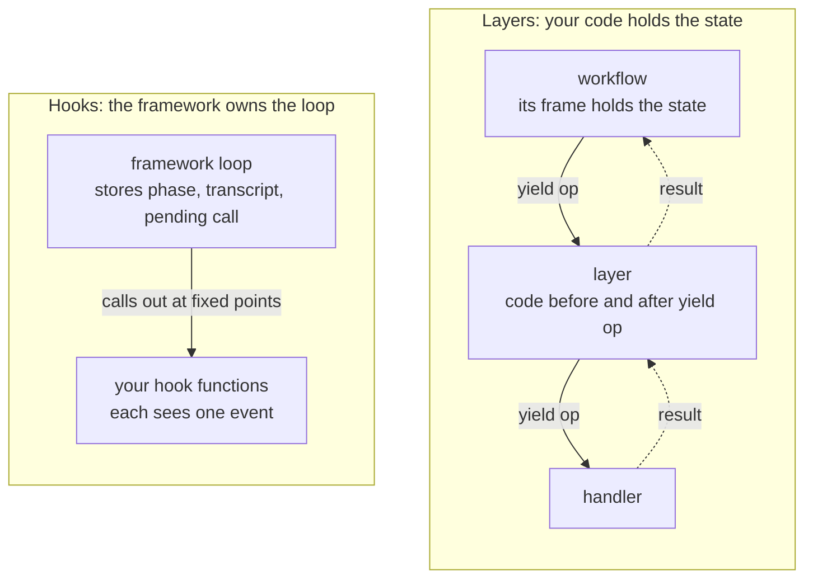

# Effective in ten minutes

Effective rests on one idea: an agent loop is a state machine, and a Python generator already
holds a state machine's state. This page builds the model in five steps: the workflow, the
handler, the tape, layers and combinators. Steps 1, 2 and 4 have code you can run.
[`docs/effective-101.md`](effective-101.md) takes the same concepts in depth.

## 1. A workflow is a generator that asks

A ReAct loop reasons, then acts, then reasons about what it observed. Written as a generator, each
step is a request it yields, and whatever is sent back becomes the value of that `yield`:

<!-- source: examples/react_toy.py -->
```python
def react(goal: str) -> Generator[Request, str]:
    observation = None
    while True:
        action = yield Reason(goal, observation)
        observation = yield Act(action)
```

`Reason` and `Act` are frozen dataclasses. The loop never calls a model or a tool, so it has no
I/O to mock and nothing to make deterministic: it is deterministic already. Its state is its
frame: `goal`, `observation`, `action`, and the line it is paused on.

## 2. A handler is the only code that calls `send`

Something has to answer the requests. In [`examples/react_toy.py`](../examples/react_toy.py) that is a loop over a script:

<!-- source: examples/react_toy.py -->
```python
def drive(loop: Generator[Request, str], answer: Callable[[Request], str], steps: int) -> None:
    """The only code that calls `send`: each answer becomes the value of the paused `yield`."""
    request = next(loop)
    for _ in range(steps):
        reply = answer(request)
        print(f"{request} -> {reply!r}")
        request = loop.send(reply)
```

`next` runs the generator to its first `yield`. Each `send` resumes it with an answer and returns
the next request. This is a trampoline, and swapping `answer` changes what the workflow means
without changing the workflow.

Effective's `DurableHandler` is this trampoline, grown up. A workflow yields typed ops through
wrappers such as `ask_llm` and `call_tool`; the handler answers each from the tape first, then from
the world, and makes each model call, tool call and ledger append a checkpointed step of a task.
[`docs/first-workflow.md`](first-workflow.md) runs one on the embedded SQLite engine. For tests, two in-memory handlers
answer from canned responses and replay a recording: [`wiki/concepts/testing.md`](../wiki/concepts/testing.md).

## 3. Durability is a tape

A durable handler appends each answer to a tape before the workflow sees it. When a worker
crashes, a new one runs the workflow from the top; the tape answers every op it holds, and only the
ops it holds no answer for reach the world. No frame is saved or restored: suspension is replay.

Replay finds each answer by the op's name, so two rules follow:

| rule | why |
|---|---|
| no I/O, clock or randomness between `yield`s | a value read outside an op is not on the tape, so replay sees a different one |
| keep an op's name stable while runs are in flight | a durable handler serves a recorded answer to whichever op carries its name and runs an op it has no answer for; a change in order is caught in a test ([`wiki/concepts/testing.md`](../wiki/concepts/testing.md)) |

Check the first rule with `uv run python -m effective.lint <your workflow files>`; `just lint` runs
it over this repository's workflow modules. The two engines that hold the tape, Absurd on Postgres
and an embedded SQLite file, pass one conformance suite.

## 4. Hooks are layers

Agent frameworks expose hooks at the edges of their loop: before a call, after a call, on a
prompt, before stopping. Each hook is a separate function, and the loop keeps the state between
them in fields. Effective writes a hook as one more generator around `yield op`:

<!-- source: examples/hooks_as_layers.py -->
```python
@op_layer
def audit(op: WorkflowOp) -> Generator[WorkflowOp, Any, Any]:
    print("before a call:", describe(op))
    result = yield op
    print("after a call: ", describe(op), "->", result)
    return result
```



The layer has the `contextlib.contextmanager` shape, with two differences: its `yield` receives the
op's result, which it returns or replaces, and it may yield more than once.

| layer | how it is written |
|---|---|
| retry | `retry_domain` on the interpreter, which retries inside the op's one checkpoint; a `for` around `yield op` would give the retry a new checkpoint name, which a crash runs again |
| a check that refuses | raise before `yield op` |
| a check that waits for a person | yield an `AwaitEvent`, which parks the run until it is answered |
| a budget | before each model call, compare the run's metered spend with the cap; past it, park for a grant or refuse |
| several checks as one gate | `govern`: every policy rules, and the gate proceeds, parks or refuses once |

Layers are installed on a handler (`DurableHandler(ctx, domain, op_layers=[audit])`), so the
workflow never names them. A layer runs again when a run replays, seeing each replayed op and its
recorded result, so a side effect that must happen once belongs in an op.

## 5. Workflows compose by `yield from`

A workflow that calls another workflow writes `yield from`, and the callee's ops flow through the
same handler, layers and tape. A workflow can also spawn one as a child task, which runs on its
own; its parent hears how it ended through `join_answer`: the value, or a raised `ChildRefused` or
`ChildFailed` ([`src/effective/spawning.py`](../src/effective/spawning.py)). That is how a subagent runs durably. The combinators
are called with `yield from`: `gather`, `race` and `quorum` are ops the handler runs, and
`recurse`, `route` and `descend` are workflows written with `yield from`, and `recurse` fans out
with `gather`:

| combinator | what it does |
|---|---|
| `gather` | run independent workflows concurrently; results in branch order, so replay does not depend on which finished first |
| `race`, `quorum` | the first one, or the first `want`, to succeed |
| `recurse` | decompose, solve the leaves, combine |
| `route` | classify, then hand to the workflow for that class |
| `descend` | go one level deeper until a judge says the answer is found, within a depth budget |

Each is an ordinary function returning an `Effect`, so a combinator's result is one more workflow:
recorded, replayed, interruptible and durable like the rest.

## Where next

| read | for |
|---|---|
| [`docs/first-workflow.md`](first-workflow.md) | a real workflow with a t-string prompt and a guardrail, run durably and resumed after an outage |
| [`docs/effective-101.md`](effective-101.md) | the op set, the combinator algebra, the temporal shapes |
| `wiki/index.md` | one concept a page, and the index of architecture decisions |
