# Building with Effective

[concepts/recursion-shapes](recursion-shapes.md) asks what topology a combinator exercises. This page asks the
inverse: what application has this topology? The working question for anyone building an agentic
workflow is **what shape does the work have?** Does it fan out over independent evidence, drill
progressively deeper, refine until stable, search alternatives, wait for someone, or compare what
would have happened otherwise? Each of those shapes has an implementation here. The substrate under
it records every effect, survives a crash, enforces budgets and permissions, and draws what ran.

The Python workflow is the program, and the graph is a projection of its recorded execution
(`effective/graphview.py`): a run view can hold only an edge that executed.

## Start with the shape

| shape | vocabulary | import from | applications |
|---|---|---|---|
| sequence, loop | `yield from`, `run_agent` | `effective.react` (`run_agent`) | tool-using agents, case processing |
| parallel fan-out | `gather` | `effective.api` | multi-source evidence, independent checks |
| first useful answer | `race` | `effective.api` | hedged retrieval, redundant providers |
| enough agreement | `quorum` | `effective.api` | corroboration, ensemble checks |
| map/reduce | `recurse` | `effective.combinators` | corpora and repositories beyond one prompt |
| routing | `route` | `effective.combinators` | triage, per-kind pipelines |
| progressive drill | `descend` | `effective.combinators` | diagnosis, escalation, adaptive depth |
| dynamic tree | `unfold`, `AcrossTasks` | `effective.combinators` | planning, AND/OR decomposition |
| repeated search | `tree_search` | `effective.combinators` | search guided by earlier rounds |
| search policies | `mcts`, `beam`, `frontier` | `effective.search` | candidate selection, design search, deep research |
| iterate to convergence | `fixpoint` | `effective.combinators` | refinement, reconciliation, worklists |
| role handoff | `mutual` | `effective.combinators` | writer/reviewer, planner/executor |
| durable child work | `spawn_child`, `join_child` | `effective.spawning` | expensive subagents, isolated jobs, fleets |
| new generation | `respawn` | `effective.combinators` | long-lived cases with bounded history |
| typed decision | `judge`, `select` | `effective.api` | relevance, sufficiency, escalation |
| durable wait | `await_event`, `await_until` | `effective.api` | approvals, customer replies, deadlines |
| counterfactual | `fork_at`, `marginal_sweep` | `effective.fork` | what-if and sensitivity analysis |
| optimization | `improve`, `pareto.frontier` | `effective.improve`, `effective.pareto` | prompt, policy and threshold tuning |

The shapes compose, and a useful application is usually several of them in one generator.

## What the substrate gives every shape

| property | what holds | where |
|---|---|---|
| durable execution | a worker that dies after seventeen ops is replaced by one that replays the seventeen recorded results and continues live, so a fan-out whose width came from an earlier result keeps that width | [concepts/testing](testing.md), [ADR-0009](../../docs/adr/0009-durable-backend-two-regimes-taskcontext.md) |
| replay | a recorded run re-executes against its tape with no model or tool, and a change in what the workflow yields is refused | `effective.handlers` (`ReplayHandler`) |
| typed data boundary | a prompt is a t-string: inputs render in, marked as data where they come from outside; outputs declare a schema, and a `Gated` channel's failure becomes a `Repair` | `effective.channels`, [concepts/flatten](flatten.md) |
| judgment | a model answers a typed question over a state, and the policy reading that answer is code | `effective.api` (`judge`, `select`), [concepts/judgment](judgment.md) |
| governance | a gate around an op proceeds, refuses, or parks durably for a person, outside the workflow's own code | `effective.govern`, `effective.permission` |
| cost | model use is metered, a measured budget trips on replay-derived spend, and `improve` keeps a Pareto frontier over several objectives | `effective.cost`, `effective.budget`, `effective.improve` |
| inspection | the tape projects to a graph, cards, a dashboard, and a terminal viewer | `effective.graphview`, `effective.dashboard`, `src/tui` |

## Deep research

`src/examples/deep_research` runs a question with named **cells**, the facts a satisfactory answer
states, as a `frontier` search over leads. Each step searches, fetches pages in a `gather`, and has
a model read each page for quoted claims and further leads; a `judge` scores how likely a new lead
is to settle its cell.

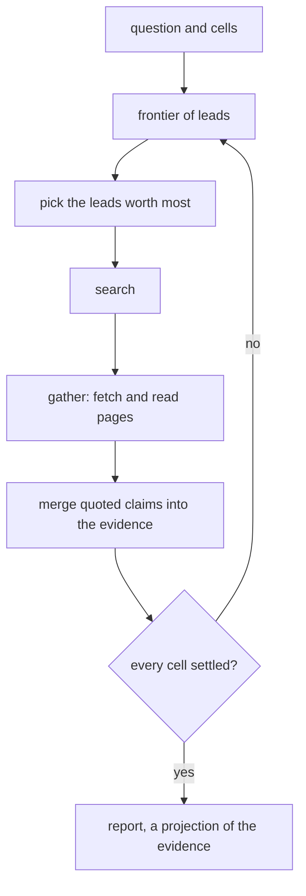

The stopping rule is code (`research.py`, `_settled`): a cell is settled when one value is quoted
by at least two distinct hosts and by more hosts than any rival, and a contested cell sends a
refuting lead to the front of the queue. The model reads and proposes, and it has no say in when
the research is done. Two hosts agreeing is an evidence policy, inspectable and replaceable: a
domain that needs a stronger one replaces `_settled`. `compare.py` compares research policies on one
frozen corpus, where replay spends nothing.

## Scaffolding you can run

`src/examples/startup` holds three workflows a startup would recognize. Each runs on the embedded
SQLite engine against a scripted world, with no keys and no network:

```
uv run python -m examples.startup incident    # likewise: launch, voice
```

The run prints its result, its op keys, the events it parked on, and the world's call counts.
Every park ends an attempt and the next one replays, and the counts show each recorded op reaching
the world once. [`tests/test_startup_examples.py`](../../tests/test_startup_examples.py) pins each run.

### Incident investigator

An alert says checkout latency doubled.

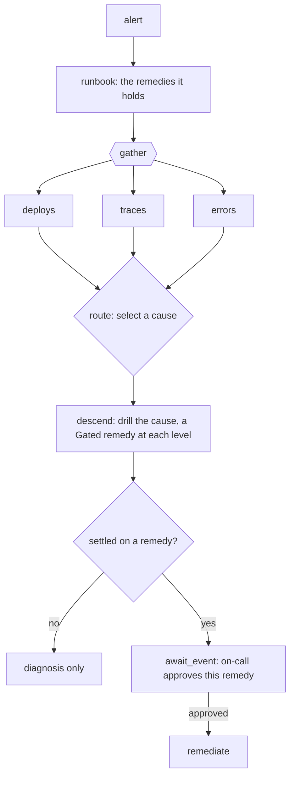

`incident.py`. The remedy is a `Gated` channel over the remedies the runbook tool returned, so a
diagnosis can name only one of them, and a refused answer is asked again with the reason
(`asking.py`). The remediation tool call sits after a durable park named for the incident and that
remedy, so an approval authorizes exactly what it was asked about, and a decision that must be
asked again needs a fresh subject. Finding that a rollback would probably help does not authorize
the rollback.

### Launch readiness

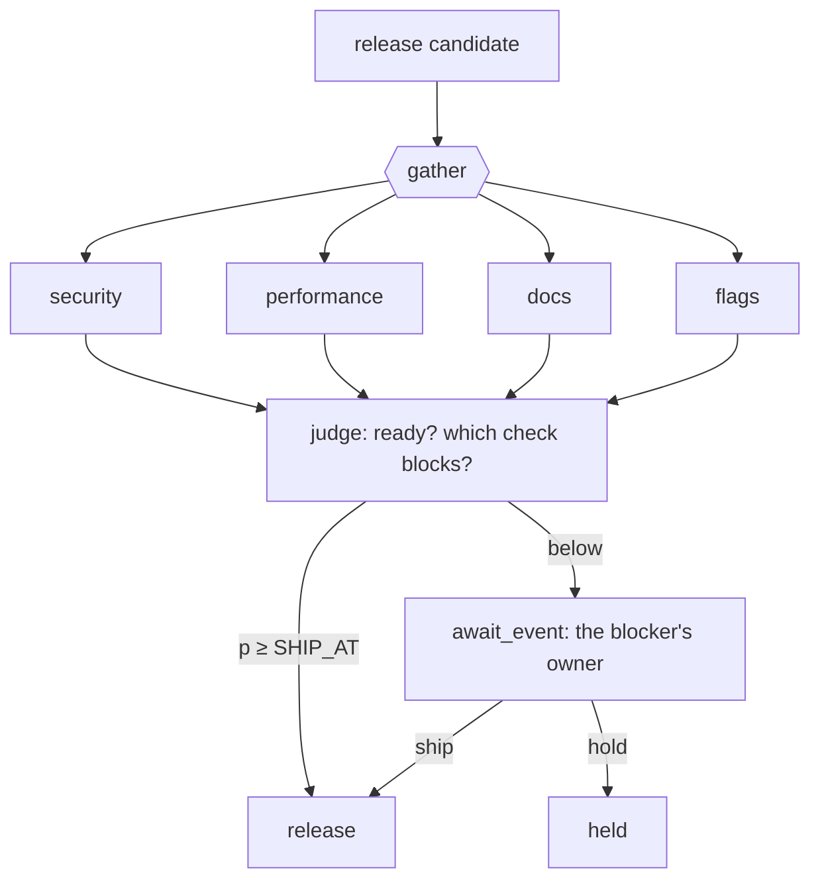

`launch.py`. The judgment answers a probability, and `SHIP_AT` in code turns it into a decision.
A clean launch ships with no person in the loop, and the owner of the blocking check settles the
exception without scheduling the rest.

### Customer-voice radar

A quarter of support tickets is larger than one useful prompt.

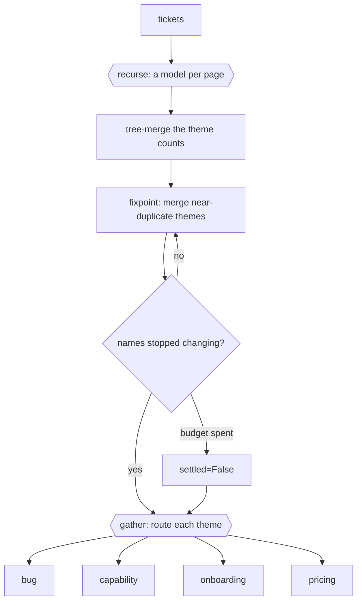

`voice.py`. Convergence is a test in code, so a model that keeps renaming themes spends the
budget and the radar reports `settled=False`. An answer still malformed after its re-prompts fails
the run, since a skipped page would be counted wrong.

## What the runs record

The flowcharts above are the design. What follows is drawn from runs: [`scripts/project_startup_runs.py`](../../scripts/project_startup_runs.py)
runs each scenario once and projects its keys with `effective.graphview`, and `--check` fails
when a block draws a structure a fresh run does not. The embedded store holds no checkpoint for an
await, so each run's timeline places its await where the park reader found the run waiting.

### The incident, as a sequence

<!-- projected:incident:sequence -->
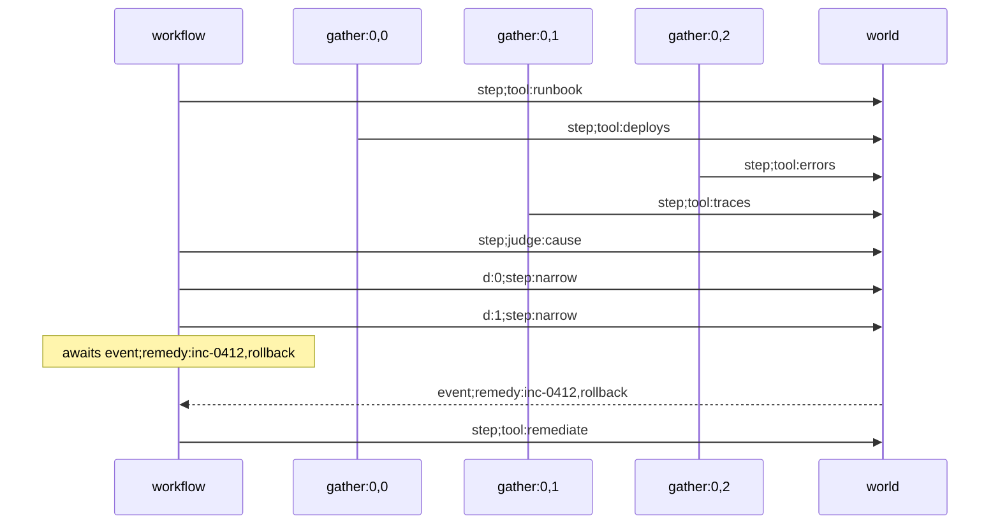
<!-- /projected -->

Each gather branch is a participant, so the three evidence reads stand side by side. They
committed in this order on this run; another run interleaves them differently, and each branch's
own messages stay the same. The drill's `d:0` and `d:1` are scope frames, so they ride in the label
on the workflow's line. The approval sits between the last drill level and the remediation.

### The incident, folded

<!-- projected:incident:graph -->
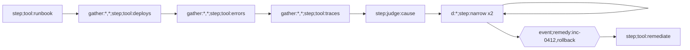
<!-- /projected -->

`fold_cycles` replaces each coordinate that counts executions with `*`. The two drill levels fold
into one node with a self-edge, which is the program's own loop. The three evidence reads stay
three nodes, since each called a different tool, and the edges between them record only the order
they committed in: the folded view draws concurrent branches as a chain.

### Launch readiness

<!-- projected:launch:sequence -->
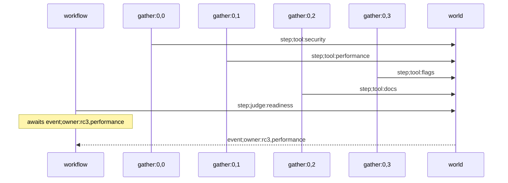
<!-- /projected -->

The four checks run as branches, the judgment reads them on the main line, and the run parks on
the blocking check's owner, keyed by the build and the check.

### The customer-voice radar

<!-- projected:voice:sequence -->
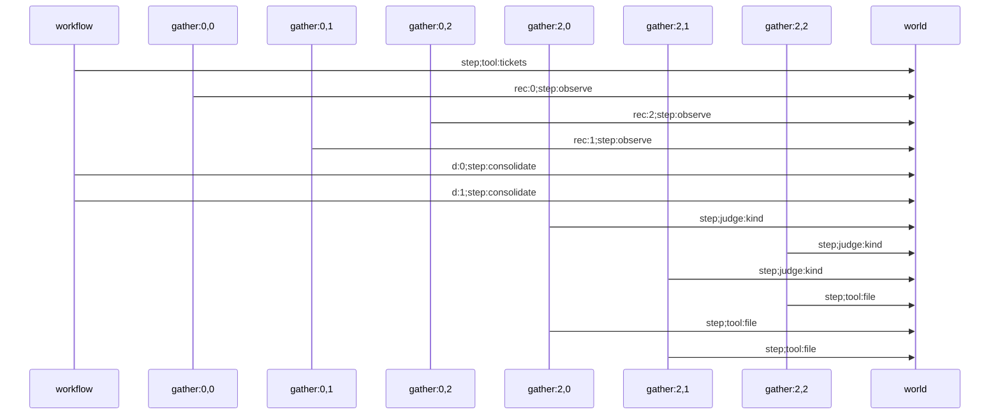
<!-- /projected -->

The pages are read on three branches, and the routing gather runs a branch per theme, each
judging its theme's kind and then filing it.

Every page is the same op, so the fold collapses the three reads into `observe x3`, and the
routing gather's judgments and filings into one node each. The consolidation's self-edge is its
`fixpoint` loop. The self-edges on the three gathered nodes are the same chain as the incident's:
commit order between concurrent branches, folded onto one node.

<!-- projected:voice:graph -->
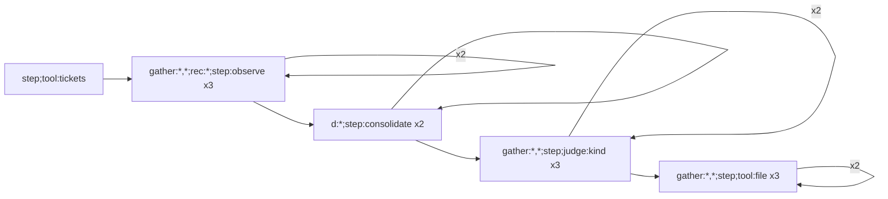
<!-- /projected -->

The tree draws containment, the view the fold drops: each page's read sits inside its gather
branch and its `rec:` page index.

<!-- projected:voice:tree -->
```text
voice
├─ step;tool:tickets
├─ gather:0,0
│  └─ rec:0
│     └─ step:observe
├─ gather:0,2
│  └─ rec:2
│     └─ step:observe
├─ gather:0,1
│  └─ rec:1
│     └─ step:observe
├─ d:0
│  └─ step:consolidate
├─ d:1
│  └─ step:consolidate
├─ gather:2,0
│  ├─ step;judge:kind
│  └─ step;tool:file
├─ gather:2,2
│  ├─ step;judge:kind
│  └─ step;tool:file
└─ gather:2,1
   ├─ step;judge:kind
   └─ step;tool:file
```
<!-- /projected -->

## More applications, by composition

| application | composition | built today |
|---|---|---|
| repository migration | `recurse` over packages, `route` by file kind, `fixpoint` toward green checks, approval before merge | `src/examples/coder`: the test suite, run in a container, decides when the work is done |
| durable case manager | a state machine of `await_event` parks, the ledger for decisions, `respawn` at a generation boundary so replay history stays bounded | `run_machine`, `respawn`; [concepts/machine](machine.md) |
| counterfactual laboratory | `fork_at` replays a recorded run with one answer changed; `marginal_sweep` runs N alternatives as durable children and collects the marginals | `effective.fork` |
| policy tuning | represent a prompt, model choice or threshold as a value, score candidates on recorded cases, keep the Pareto frontier, let an operator promote one | `effective.improve`, `effective.pareto` |
| explicit planning | `unfold` or `mcts`/`beam` with the budget and stopping rule in the program; the model proposes and scores states | `effective.search`, `tree_search` |

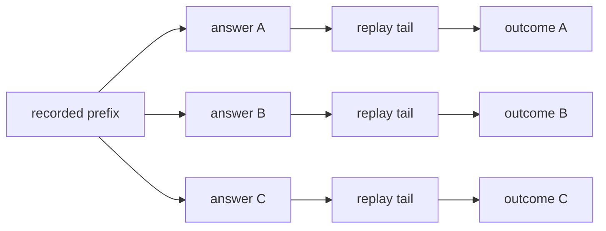

**A counterfactual cannot undo the world.** The durable drivers (`run_fork`, and so
`spawn_fork` and `marginal_sweep`) run a fork's tail under `DryRun`, which admits model calls and
read-only tools and raises `WorldMutation` on any other tool, stopping the fork. `fork_at` runs
the tail under the domain its caller passes, so in-process safety is the caller's `DryRun`. A fork
placed at a ledger append or an artifact write is refused with `ForkPointRefused`: fork at the
decision the write depends on (`effective/sandbox.py`).

**`improve` tunes what is represented as a value.** It proposes candidates of a type `C`, scores
each into an objective vector plus a textual diagnostic, and returns the nondominated set, such as
`(quality, -cost, -latency)`. A prompt, a table, a threshold or a policy can be tuned; a closure
with no representation to change cannot, which is what keeps the tuned part of a system diffable.

## Recipes

| recipe | shapes | gives |
|---|---|---|
| research | `frontier`, `gather`, quoted extraction, `judge`, a settlement rule | answers with their sources and an explicit stop |
| operational agent | `gather`, `route`, `descend`, `govern`, `await_event` | bounded diagnosis with controlled action |
| large-context analyst | `recurse`, `route`, `run_code`, tree-merge | analysis beyond one prompt |
| planner | `unfold`, `mcts` or `beam`, budgets, Pareto scoring | bounded planning with a visible budget |
| long-running case | `run_machine`, `await_event`, the ledger, `respawn` | a workflow that outlives any process |
| workflow laboratory | replay, `fork_at`, `marginal_sweep`, `improve` | counterfactual evaluation and tuning |

**Choose the topology first, and give a node agent-like behavior only where judgment or
open-ended action needs it.** A role name is no reason for another context or task. Sequential
work is function composition, independent work is a `gather`, work for one specialist is a
`route`, and a child task earns its place by isolation or independent durability. A fleet is then
what the execution needs.

## Boundaries

[concepts/recursion-shapes](recursion-shapes.md) carries the status of every shape. The ones an application is most
likely to reach for and not find:

| want | status |
|---|---|
| race losers rolled back | a loser stops at its next op admission; an op already admitted runs to its end and its effects stand |
| branch and bound | the bound threaded through the recursion's own state, as a `frontier` merge or an `unfold`, with no cancellation ([`tests/test_pruned_search.py`](../../tests/test_pruned_search.py)) |
| memoized recursion, generic sharing | classified, waiting on an author-supplied semantic key |
| generic saga / compensation | classified; the ledger forbids UPDATE and DELETE, so a committed row is undone only by a later row, and compensation is domain code |
| best-first search | built as a `frontier` policy (`pick` the top k); deferred only as a race |
| mutual recursion across durable tasks | deferred; `mutual` is in-task |

A composition error that looks like a successful run is the dangerous kind, so the design
preference is to compose correctly, refuse loudly, or state the cost.

## Three layers

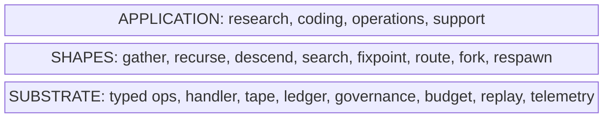

The application vocabulary changes from company to company, the shapes recur, and the substrate
stays fixed.
